## 使用NSIS制作安装包

安装包：[下载链接](http://seafile.wsh-study.com/d/9b0d9827ea484f459623/files/?p=%2F%E6%93%8D%E4%BD%9C%E7%B3%BB%E7%BB%9F%2FWindows%2FNSIS-zengqiangban.rar&dl=1)

### `nsis`使用:

启动`NSIS`程序主界面，选择“可视化脚本编辑器`（VNISEdit）`”菜单，开始制作自己的安装包

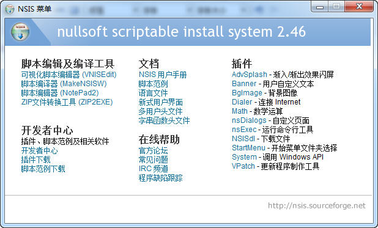

选择“使用脚本向导创建新的脚本文件”，确定

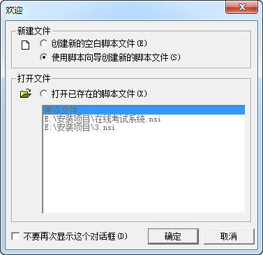

进步脚本向导，下一步

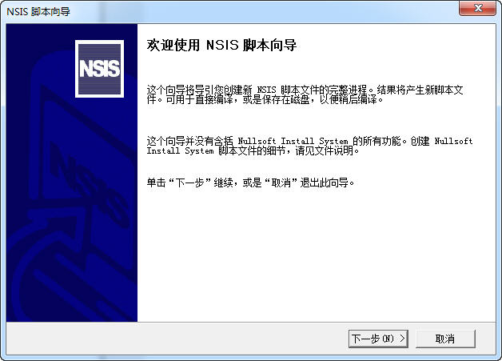

第一步，这里填写应用程序的一些基本信息，下一步

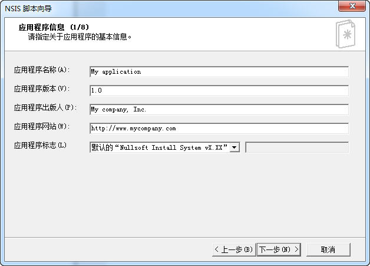

第二步，这里是选择安装包的图标，生成的文件名，程序语言等，使用默认的就可以，不需要修改

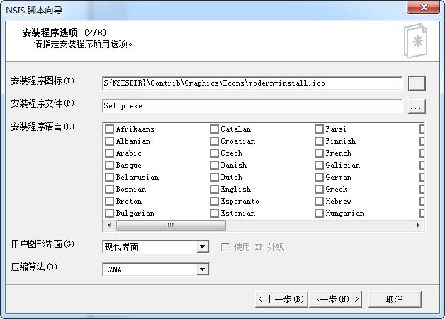

第三步，选择一些效果，安装程序不用搞这么花哨，直接下一步

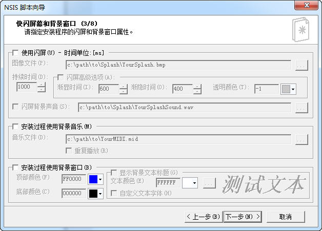

第四步，指定默认目录，授权文件有的话就指定，没有就空着，下一步

![image-20221125222840472]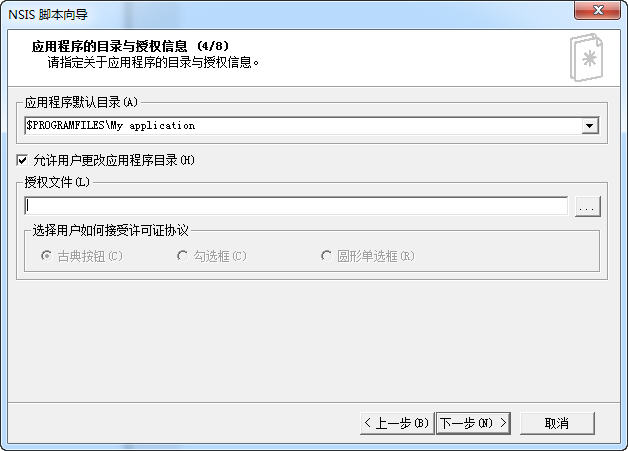

第五步，选择要打包的文件，直接把要打包的目录内容全部添加进来，注意两处*.*，以及勾选“包含子目录”，不要勾选”单独添加每个文件“，编译的时候会把所有的文件打包进来的，下一步

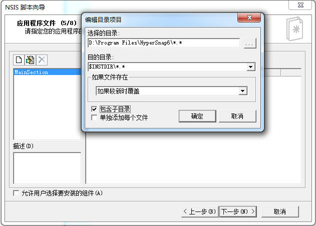

第六步，快捷方式的一些设置，下一步

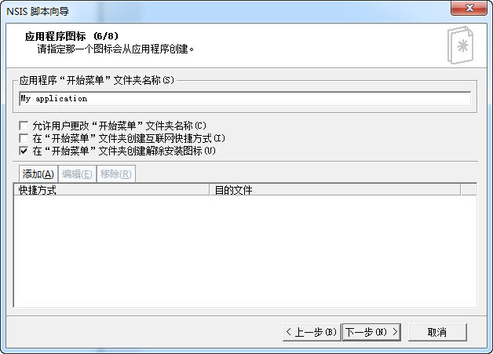

第七步，设置安装程序之后要运行的内容，下一步

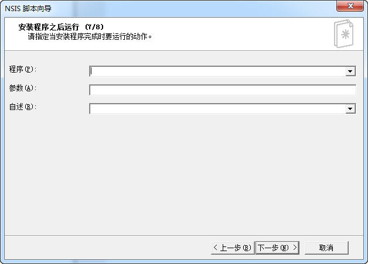

第八步，卸载信息设置，下一步

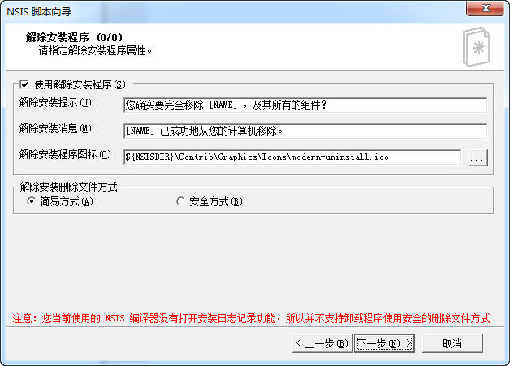

完成向导，勾选”保存脚本“，以及”转换文件路径到相对路径“，完成

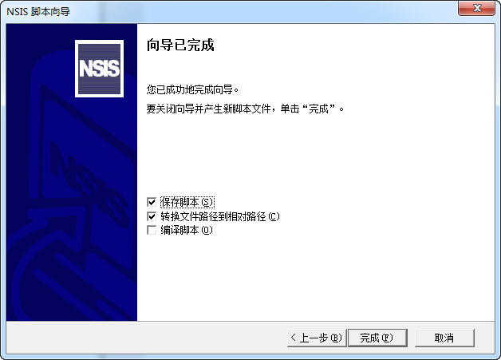

这时就可以看到通过向导生成的脚本，可以在这里继续修改脚本

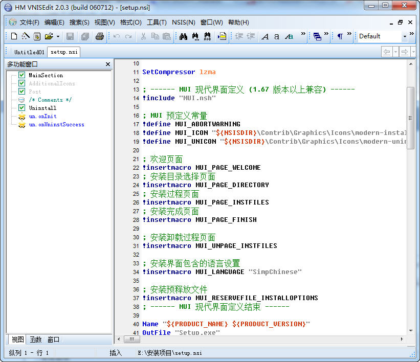

修改完脚本以后，点击菜单”NSIS“-》"编译并运行"，编译成功后，会生成一个exe文件，安装包制作完成！

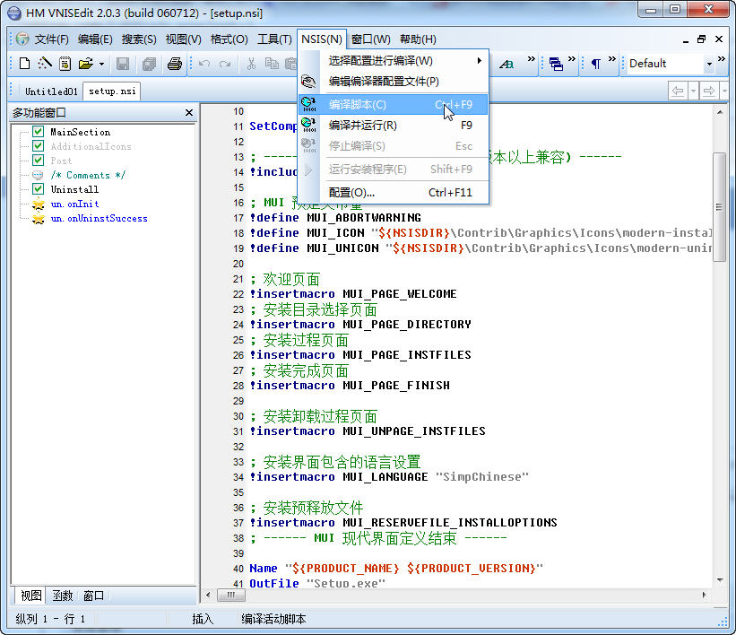

### nsis示例脚本

```shell
;--------------------------------
;;;;;;;;;;;;;;;;;;;;;;;;;;;;;;;;;;;;;;;;;;;;;
; NSIS installer script for BoxSuite ;
; 现版本通过VLC官方插件脚本缩减内容得到 ;
;;;;;;;;;;;;;;;;;;;;;;;;;;;;;;;;;;;;;;;;;;;;;


!define PRODUCT_NAME "主控套件"
;!define PRODUCT_VERSION "1.0.7.20200928"  这里不再使用这个版本，使用读取changelog
!define PRODUCT_GROUP "EGOVA .CO.LTD"
!define PRODUCT_PUBLISHER "EGova Software"
!define PRODUCT_WEB_SITE "http://www.tongtongtingche.com/"
!define INSTALL_DIR "$%homedrive%\Program Files"
;!define PRODUCT_UNINST_KEY "Software\Microsoft\Windows\CurrentVersion\Uninstall\${PRODUCT_NAME}"
;!define PRODUCT_UNINST_ROOT_KEY "HKLM"

;;;;;;;;;;;;;;;;;;;;;;;;;
; General configuration ;
;;;;;;;;;;;;;;;;;;;;;;;;;
Name "${PRODUCT_NAME}"
OutFile ".\主控套件.exe"
InstallDir "${INSTALL_DIR}\EGova\BoxSuite"
SetCompressor /SOLID lzma

RequestExecutionLevel admin

Icon "favicon.ico"

SetOverwrite ifdiff
CRCCheck on
BrandingText "${PRODUCT_GROUP} ${PRODUCT_NAME}"

; !include "languages\declaration.nsh"
!include "MUI2.nsh"
!include "FileFunc.nsh"
!include "logiclib.nsh"
!include "x64.nsh"

;;;;;;;;;;;;;;;;;;;;;;;;;;;;;;;;;;;;;;;;;;;;
; NSIS Modern User Interface configuration ;
;;;;;;;;;;;;;;;;;;;;;;;;;;;;;;;;;;;;;;;;;;;;

; MUI Settings
	!define MUI_ABORTWARNING
	!define MUI_ICON "favicon.ico"
	!define MUI_UNICON "favicon.ico"
	!define MUI_COMPONENTSPAGE_SMALLDESC
	!define MUI_WELCOMEFINISHPAGE_BITMAP "${NSISDIR}\Contrib\Graphics\Wizard\tttc-install.bmp"
	!define MUI_UNWELCOMEFINISHPAGE_BITMAP "${NSISDIR}\Contrib\Graphics\Wizard\tttc-uninstall.bmp"
	!define MUI_COMPONENTSPAGE_TEXT_COMPLIST "主控套件：主控套件运行程序$\r$\n$\r$\n"
	; 自述文件 
    !define MUI_FINISHPAGE_SHOWREADME "readme.txt"
    ; 默认不选中自述文件复选框
    ;!define MUI_FINISHPAGE_SHOWREADME

; Welcome page
    # 安装欢迎页
	!insertmacro MUI_PAGE_WELCOME
	# 安装组件选择
	!insertmacro MUI_PAGE_COMPONENTS
	; 安装路径选择 
    ; !insertmacro MUI_PAGE_DIRECTORY
	; 安装详情
    !insertmacro MUI_PAGE_INSTFILES
	; 安装完成页
    !insertmacro MUI_PAGE_FINISH

    ; Finish page
	; !define MUI_PAGE_CUSTOMFUNCTION_PRE PageFastUpdatePre
	; !insertmacro MUI_PAGE_FINISH
	; uninstall page

	!insertmacro MUI_LANGUAGE "SimpChinese"

;;;;;;;;;;;;;;;;;;;;;;
; Installer sections ;
; The CORE of the    ;
; installer          ;
;;;;;;;;;;;;;;;;;;;;;;

Function .onInit

  ; 检测安装模式是否为静默安装
  push $R1
  ${Getparameters} $R1
  
  ; 检测360、金山、腾讯系列杀毒软件
  ; 检测360卫士
  nsProcess::_FindProcess "360Tray.exe" 
  Pop $R0
  IntCmp $R0 0 running360Tray no_running360Tray no_running360Tray
  running360Tray:
  MessageBox MB_ICONQUESTION "检测到此电脑已安装360安全卫士，请卸载后再安装${PRODUCT_NAME}！"
  Abort
  no_running360Tray:
  
  ; 检测360杀毒
  nsProcess::_FindProcess "360sd.exe"
  Pop $R0
  IntCmp $R0 0 running360sd no_running360sd no_running360sd
  running360sd:
  MessageBox MB_ICONQUESTION "检测到此电脑已安装360杀毒，请卸载后再安装${PRODUCT_NAME}！"
  Abort
  no_running360sd:
  
  ; 检测金山毒霸
  nsProcess::_FindProcess "kxetray.exe"
  Pop $R0
  IntCmp $R0 0 runningkxetray  no_runningkxetray no_runningkxetray
  runningkxetray:
  MessageBox MB_ICONQUESTION "检测到此电脑已安装金山毒霸，请卸载后再安装${PRODUCT_NAME}！"
  Abort	 
  no_runningkxetray:
  
  ; 检测QQ电脑管家
  nsProcess::_FindProcess "QQPCTray.exe"
  Pop $R0
  IntCmp $R0 0 runningQQPCTray  no_runningQQPCTray no_runningQQPCTray
  runningQQPCTray:
  MessageBox MB_ICONQUESTION "检测到此电脑已安装QQ电脑管家，请卸载后再安装${PRODUCT_NAME}！"
  Abort	  
  no_runningQQPCTray:
  
  ;检测主控程序是否正在运行，如果在，就提示卸载
  nsProcess::_FindProcess "BoxController.exe" 
  Pop $R0
  IntCmp $R0 0 runningBoxController no_runningBoxController no_runningBoxController
  runningBoxController:
  ${if} $R1 == "/S"
	ExecWait "$INSTDIR\uninstaller.exe /S" 
	Sleep 8000
	GoTo endding
  ${elseif} $R1 != "/S"
  MessageBox MB_ICONQUESTION|MB_YESNO "检测${PRODUCT_NAME}正在运行，是否进行卸载再安装?" IDYES uninstall1 IDNO stopit1
  uninstall1:
	ExecWait "$INSTDIR\uninstaller.exe" 
	Sleep 8000
	GoTo endding
  stopit1:
  Abort
  ${endif}
  no_runningBoxController:
 
  ;检测BoxWeb是否正在运行，如果在，就提示卸载
  nsProcess::_FindProcess "BoxWeb.exe" 
  Pop $R0
  IntCmp $R0 0 runningBoxWeb no_runningBoxWeb no_runningBoxWeb
  runningBoxWeb:
  ${if} $R1 == "/S"
	ExecWait "$INSTDIR\uninstaller.exe /S" 
	Sleep 8000
	GoTo endding
  ${elseif} $R1 != "/S"
  MessageBox MB_ICONQUESTION|MB_YESNO "检测${PRODUCT_NAME}正在运行，是否进行卸载再安装?" IDYES uninstall2 IDNO stopit2
  uninstall2:
	ExecWait "$INSTDIR\uninstaller.exe" 
	Sleep 8000
	GoTo endding
  stopit2:
  Abort
  ${endif}
  no_runningBoxWeb: 
  
  ;检测P2PClient是否正在运行，如果在，就提示卸载
  nsProcess::_FindProcess "P2PClient.exe" 
  Pop $R0
  IntCmp $R0 0 runningP2PClient no_runningP2PClient no_runningP2PClient
  runningP2PClient:
  ${if} $R1 == "/S"
	ExecWait "$INSTDIR\uninstaller.exe /S" 
	Sleep 8000
	GoTo endding
  ${elseif} $R1 != "/S"
  MessageBox MB_ICONQUESTION|MB_YESNO "检测${PRODUCT_NAME}正在运行，是否进行卸载再安装?" IDYES uninstall3 IDNO stopit3
  uninstall3:
	ExecWait "$INSTDIR\uninstaller.exe" 
	Sleep 8000
	GoTo endding
  stopit3:
  Abort
  ${endif}
  no_runningP2PClient:
  GoTo endding
  endding:
  ;检测有没有安装运行库
  Call InstallVC

  nsProcess::_Unload 
  
FunctionEnd

Var WinPcap
Function InstallVC 
	;先解压文件夹
	Call Unpackage
	Sleep 8000
	ExecWait `"$TEMP\MSVBCRT_AIO_2018.07.31_X86+X64.exe" /SILENT`
	
	
    StrCpy $WinPcap "false"
	IfFileExists "C:\Windows\System32\wpcap.dll" 0 +2 ;不存在则向下跳转到第1行
				StrCpy $WinPcap "true"
				 ${If} $WinPcap == "false"
					   ExecWait `"$TEMP\WinPcap_4_1_3.exe"`
                 ${EndIf}
FunctionEnd

Function Unpackage
    ; 先解压微软常用运行库到安装目录，避免检测到电脑安装vs运行库，找不到文件
    SetOverwrite off
	SetOutPath  $TEMP
	File /r MSVBCRT_AIO_2018.07.31_X86+X64.exe
	
	File /r WinPcap_4_1_3.exe
FunctionEnd


Section "主控套件" SEC01
	; 解压
    SetOverwrite on
	SetOutPath "$INSTDIR"
	File /r *
	
	; 安装过程中Upgrader可能处于运行状态,此时可能是远程升级,不能杀掉Upgrader
	nsProcess::_FindProcess "Upgrader.exe" 
	Pop $R0
	IntCmp $R0 0 runningUpgrader no_runningUpgrader no_runningUpgrader
	no_runningUpgrader:
	Rename "$INSTDIR\Upgrader\Upgrader.Release.exe"  "$INSTDIR\Upgrader\Upgrader.exe" 
	Delete "$INSTDIR\Upgrader\Upgrader.Release.exe"
	
	; 这里不能通过判断"nssm.exe"进程的运行状态来决定是否重命名文件
	; 因为 C:\Program Files\EGova\TttcPlayer 路径下也有可能会存在nssm.exe文件运行
	; 造成误判
	Rename "$INSTDIR\nssm.Release.exe"  "$INSTDIR\nssm.exe"
	runningUpgrader:
	endding:
	nsProcess::_Unload 
	
	Delete "$INSTDIR\nssm.Release.exe"
	
	; 检测"$INSTDIR\data\BoxController"路径是否存在,若不存在则创建
	SetOutPath "$INSTDIR\data\BoxController"
	
	; 检测"$INSTDIR\tmp\BoxController"路径是否存在,若不存在则创建
	SetOutPath "$INSTDIR\tmp\BoxController"
	
	; 检测"$INSTDIR\tmp\BoxController"路径是否存在,若不存在则创建
	
	SetOutPath "$INSTDIR\tmp\testpictures"
	CreateDirectory "$SMPROGRAMS\EGova"
SectionEnd

Section -AdditionalIcons
  	CreateShortCut "$SMPROGRAMS\EGova\uninstaller.lnk" "$INSTDIR\uninstaller.exe"
SectionEnd	

Section -Post
	; 写入卸载执行文件	
  	WriteUninstaller "$INSTDIR\uninstaller.exe"
		
	; 安装主控套件
	; 进入执行文件路径(路径存在,则入该路径,若不存在,则创建该路径,并进去)
	SetOutPath "$INSTDIR"
    nsExec::Exec '$INSTDIR\install.bat'
	
	; 创建主控套件配置工具快捷方式
	CreateShortCut "$DESKTOP\主控套件配置工具.lnk" "$INSTDIR\BoxWeb.exe"  "-m graph"  "$INSTDIR\favicon.ico"
	
	
	; 安装vnc
	nsProcess::_FindProcess "tvnserver.exe" 
	Pop $R0
	IntCmp $R0 0 runningUpgrader no_runningUpgrader no_runningUpgrader
	no_runningUpgrader:
	Rename "$INSTDIR\tightvnc\tvnserver.Release.exe"  "$INSTDIR\tightvnc\tvnserver.exe" 
	nsExec::Exec '$INSTDIR\tightvnc\install.bat'
	runningUpgrader:
	endding:
	nsProcess::_Unload
	Delete "$INSTDIR\tightvnc\tvnserver.Release.exe"
	
	
	; 防火墙规则添加
	ExecDos::exec 'netsh advfirewall firewall add rule name="BoxController" dir=in program="$INSTDIR\BoxController.exe" action=allow'
	ExecDos::exec 'netsh advfirewall firewall add rule name="BoxController" dir=out program="$INSTDIR\BoxController.exe" action=allow'

	ExecDos::exec 'netsh advfirewall firewall add rule name="BoxWeb" dir=in program="$INSTDIR\BoxWeb.exe" action=allow'
	ExecDos::exec 'netsh advfirewall firewall add rule name="BoxWeb" dir=out program="$INSTDIR\BoxWeb.exe" action=allow'
	
	ExecDos::exec 'netsh advfirewall firewall add rule name="Upgrader" dir=in program="$INSTDIR\Upgrader\Upgrader.exe" action=allow'
	ExecDos::exec 'netsh advfirewall firewall add rule name="Upgrader" dir=out program="$INSTDIR\Upgrader\Upgrader.exe" action=allow'
	
	ExecDos::exec 'netsh advfirewall firewall add rule name="Logkit" dir=in program="$INSTDIR\Logkit\Logkit.exe" action=allow'
	ExecDos::exec 'netsh advfirewall firewall add rule name="Logkit" dir=out program="$INSTDIR\Logkit\Logkit.exe" action=allow'
	
	ExecDos::exec 'netsh advfirewall firewall add rule name="P2PClient" dir=in program="$INSTDIR\P2PClient\P2PClient.exe" action=allow'
	ExecDos::exec 'netsh advfirewall firewall add rule name="P2PClient" dir=out program="$INSTDIR\P2PClient\P2PClient.exe" action=allow'
	
	; 恢复备份文件
	CopyFiles  "$TEMP\BoxSuiteBackup\jieshunSdkConfig.json" "$INSTDIR\config\"
	CopyFiles  "$TEMP\BoxSuiteBackup\channelConfig.json" "$INSTDIR\config\" 
	CopyFiles  "$TEMP\BoxSuiteBackup\jieshunSdkFile\*" "$INSTDIR\config\jieshunSdkFile\" 
SectionEnd

; 将BoxWeb,BoxController,Upgrader和P2PClient写入注册表，并且赋予管理员权限
Section
	; 将执行程序添加管理员权限
	WriteRegStr HKCU "SOFTWARE\Microsoft\Windows NT\CurrentVersion\AppCompatFlags\Layers" "$INSTDIR\BoxWeb.exe"  "RUNASADMIN"
	WriteRegStr HKCU "SOFTWARE\Microsoft\Windows NT\CurrentVersion\AppCompatFlags\Layers" "$INSTDIR\BoxController.exe"  "RUNASADMIN"
	WriteRegStr HKCU "SOFTWARE\Microsoft\Windows NT\CurrentVersion\AppCompatFlags\Layers" "$INSTDIR\Upgrader\Upgrader.exe"  "RUNASADMIN"
	WriteRegStr HKCU "SOFTWARE\Microsoft\Windows NT\CurrentVersion\AppCompatFlags\Layers" "$INSTDIR\Logkit\Logkit.exe"  "RUNASADMIN"
	WriteRegStr HKCU "SOFTWARE\Microsoft\Windows NT\CurrentVersion\AppCompatFlags\Layers" "$INSTDIR\P2PClient\P2PClient.exe"  "RUNASADMIN"
	WriteRegStr HKCU "SOFTWARE\Microsoft\Windows NT\CurrentVersion\AppCompatFlags\Layers" "$INSTDIR\tightvnc\tvnserver.exe"  "RUNASADMIN"
	
	; 设置tightvnc开机自启
	WriteRegStr HKLM  "SOFTWARE\Microsoft\Windows\CurrentVersion\Run" "vnc.exe" "$INSTDIR\tightvnc\tvnserver.exe"
SectionEnd

; 安装成功后启动主控套件BoxWeb扫码程序
Function .onInstSuccess
  ExecShell "" "$INSTDIR\BoxWeb.exe" "-m all"
FunctionEnd

Function un.onInit
  nsProcess::_FindProcess "BoxWeb.exe"
  Pop $R0
  IntCmp $R0 0 runningBoxWeb no_runningBoxWeb no_runningBoxWeb
  runningBoxWeb:
  nsProcess::_KillProcess "BoxWeb.exe"
  no_runningBoxWeb:
  GoTo endding
  endding:
  nsProcess::_Unload
FunctionEnd


Section Uninstall 
	
	; 卸载主控套件
   	ExecWait '$INSTDIR\uninstall.bat'
	
	Sleep  2000

	; 删除防火墙规则
	ExecDos::exec 'netsh advfirewall firewall delete rule name="BoxController" dir=in program="$INSTDIR\BoxController.exe"'
	ExecDos::exec 'netsh advfirewall firewall delete rule name="BoxController" dir=out program="$INSTDIR\BoxController.exe"'
	
	ExecDos::exec 'netsh advfirewall firewall delete rule name="BoxWeb" dir=in program="$INSTDIR\BoxWeb.exe"'
	ExecDos::exec 'netsh advfirewall firewall delete rule name="BoxWeb" dir=out program="$INSTDIR\BoxWeb.exe"'
	
	ExecDos::exec 'netsh advfirewall firewall delete rule name="Upgrader" dir=in program="$INSTDIR\Upgrader\Upgrader.exe"'
	ExecDos::exec 'netsh advfirewall firewall delete rule name="Upgrader" dir=out program="$INSTDIR\Upgrader\Upgrader.exe"'
	
	ExecDos::exec 'netsh advfirewall firewall delete rule name="Logkit" dir=in program="$INSTDIR\Logkit\Logkit.exe"'
	ExecDos::exec 'netsh advfirewall firewall delete rule name="Logkit" dir=out program="$INSTDIR\Logkit\Logkit.exe"'

	ExecDos::exec 'netsh advfirewall firewall delete rule name="P2PClient" dir=in program="$INSTDIR\P2PClient\P2PClient.exe"'
	ExecDos::exec 'netsh advfirewall firewall delete rule name="P2PClient" dir=out program="$INSTDIR\P2PClient\P2PClient.exe"'
	
	; 备份配置文件
	SetOutPath  $TEMP
	CreateDirectory  "$TEMP\BoxSuiteBackup"
	CopyFiles "$INSTDIR\config\jieshunSdkConfig.json" "$TEMP\BoxSuiteBackup\"
	CopyFiles "$INSTDIR\config\channelConfig.json" "$TEMP\BoxSuiteBackup\"
	CopyFiles "$INSTDIR\config\jieshunSdkFile\*" "$TEMP\BoxSuiteBackup\jieshunSdkFile\"
	
	; 删除执行文件
	Delete "$SMPROGRAMS\EGova\*"
	RMDir  /r "$INSTDIR"
	
	; 删除快捷方式
	Delete "$DESKTOP\主控套件配置工具.lnk"
	SetAutoClose true
SectionEnd


```

