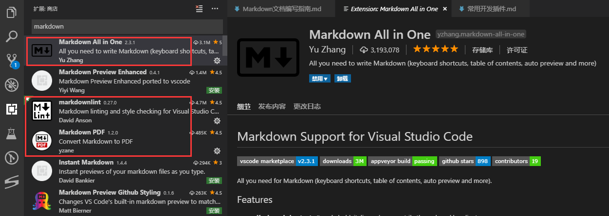
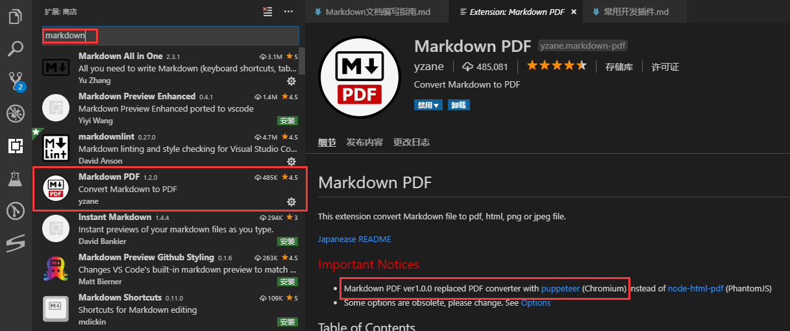
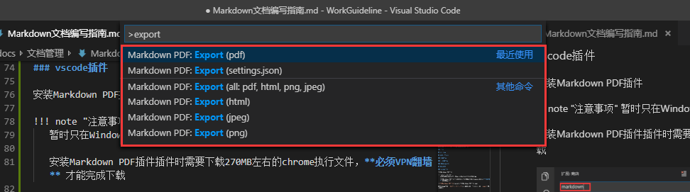

# Markdown文档编写指南

## 参考文档

1. [Markdown 基本语法](https://www.jianshu.com/p/191d1e21f7ed)
2. [中文 markdown 编写格式规范命令行工具](https://github.com/hustcc/lint-md)
3. [markdownlint Node.js 格式校验工具](https://github.com/DavidAnson/markdownlint)

## 概述

Markdown是一种纯文本标记语言，通过简单的标记语法来使普通文本内容具备有一定的格式，例如：

```markdown
### 三级标题
#### 四级标题
```

Markdown相对于Word这种文档编辑器而言有如下优点，从而被广泛使用：

* 语法简单，让文档编写专注于内容本身
* 支持Markdown语法的编辑器非常多，而且可以跨操作系统
* 可以转换为Word/PDF格式
* 支持在线编辑器:CSDN、简书

Markdown在研发工作中的主要应用场景为：

   1. 代码仓库的README.md/CHANGELOG.md等常用文件
   2. 研发项目文档编写
      1. 需求分析文档
      2. 软件设计文档
      3. 接口文档
   3. Gitlab流程相关
      1. 合并请求描述
      2. 标签发布记录
      3. 审查批注

## 基础语法

Markdwn支持如下标记：

   1. 标题
   2. 段落
   3. 区块引用
   4. 超链接
   5. 图片
   6. 无序列表
   7. 有序列表
   8. 分隔线
   9. 字体
   10. 代码块
       1. 单行代码
       2. 多行代码
   11. 表格
   12. 特殊符号

### 标题

在想要设置为标题的文字前面加`#`(#和内容之前需要空一个空格)，markdown一共支持六级标题，如下：

```markdown
# 一级标题

## 二级标题

### 三级标题

#### 四级标题

##### 五级标题

###### 六级标题
```

### 段落

Markdown划分段落非常简单，就是在段落前后保留一个空行即可，例如：

```markdown
这是第一个段落内容

这是第二个段落内容
```

效果如下：

这是第一个段落内容

这是第二个段落内容

### 区块引用

如果我们需要对一段内容进行强调显示时，Markdown提供了一个特殊符号`>`(>和内容之前需要空一个空格)用于段落区块引用：

```markdown
> 这是一段引用段落，将会被高亮显示
```

效果如下：

> 这是一段引用段落，将会被高亮显示

Markdown支持同时强调引用多个段落，可以按照如下方式书写：

```markdown
> 这是一段引用段落，将会被高亮显示
>
> 这也是一段引用段落，也会被高亮显示
```

> 这是一段引用段落，将会被高亮显示
>
> 这也是一段引用段落，也会被高亮显示

区块引用还可以进行嵌套：

> 这是一段引用段落，将会被高亮显示
>
>> 这是第二层引用段落，将会被高亮显示
>>
>>> 这是第三层引用段落，将会被高亮显示

另外多行引用里面可以写其他语法，例如：

> 1. 列表第一项
> 2. 列表第二项
>    1. 二级列表项
> 3. 列表第三项

### 超链接

```markdown
[超链接显示文字](http://www.baidu.com "超链接title")
```

[超链接显示文字](http://www.baidu.com "超链接title")

提示：超链接title为浮动提示文字，一般情况可以不填写

### 图片

```markdown

```


图片和超链接的唯一区别就是在最前方添加一个感叹号

### 无序列表

无序列表使用`*`、`+`、`-`标识，但是一般使用`*`来标识无序列表

单级列表从最左开始(适用于无序列表)

```markdown
* 无序列表项
* 无序列表项
* 无序列表项
```

* 无序列表项
* 无序列表项
* 无序列表项

Markdown支持多级列表嵌套，但是建议一般不使用超过两级列表，另外建议两级列表从缩进3个空格开始(适用于无序列表)，如下所示：

```markdown
   * 无序列表项
      * 第二层列表项
      * 第二层列表项
   * 无序列表项
   * 无序列表项
```

* 无序列表项
  * 第二层列表项
  * 第二层列表项
* 无序列表项
* 无序列表项

### 有序列表

有序列表使用`数字.`标识

```markdown
1. 有序列表项1
2. 有序列表项2
3. 有序列表项3
```

1. 有序列表项1
2. 有序列表项2
3. 有序列表项3

```markdown
   1. 有序列表项1
      1. 有序列表项11
      2. 有序列表项12
   2. 有序列表项3
```

   1. 有序列表项1
      1. 有序列表项11
      2. 有序列表项12
   2. 有序列表项3

### 分隔线

```markdown
***

---
```

***

### 字体

```markdown
*这里包含斜体内容*

**这里包含加粗内容**
```

斜体示例：*这里包含斜体内容*

粗体示例：**这里包含加粗内容**

### 代码块

#### 行内代码

使用单个反引号进行包裹行内代码，例如 `var x = 10`

#### 多行代码

可以通过三个反引号将代码包裹起来，反引号单独占一行，多一行单引号后面可以需要添加编程语言，详细的编程语言见[http://pygments.org/languages/](http://pygments.org/languages/)

```go
package main

import "fmt"

func main() {
    fmt.Println("Hello, World")
}
```

### 表格

```markdown
| 表头 | 表头 | 表头 |
| --- | --- | --- |
| 内容 | 内容 | 内容 |
| 内容 | 内容 | 内容 |
| 内容 | 内容 | 内容 |
```

| 表头 | 表头 | 表头 |
| --- | --- | --- |
| 内容 | 内容 | 内容 |
| 内容 | 内容 | 内容 |
| 内容 | 内容 | 内容 |

### 特殊符号

## 编辑环境

本文推荐使用`VS Code`进行Markdown文档的编辑

### 插件

* Markdown All in One：用于实现Markdown快捷键
* markdownlint：markdown格式校验工具
* Markdown PDF：markdown转换工具



## 增强版本

## 团队编写规范

### 推荐写法

### 不推荐写法

### 持续集成(CI)

## 文档导出

### vscode插件

安装Markdown PDF插件

!!! note "注意事项"
    暂时只在Windows上面验证成功，Ubuntu上使用会出现错误

    安装Markdown PDF插件插件时需要下载[270MB左右的chrome执行文件](https://marketplace.visualstudio.com/items?itemName=yzane.markdown-pdf#install)，**必须VPN翻墙** 才能比较顺利地完成下载，如果确实无法下载chrome可以[直接配置已经安装的chrome程序路径](https://www.jianshu.com/p/f1029409f468)



在VSCode界面输入`Shift + Ctrl + P`打开命令行输入框，接下来输入`export`展开如下命令：



选择你想要转换到的格式的命令即可 **(更简单的方式为在md文档中右键单击也会出现相关的命令)**，转换成功后在同目录下会生成和markdown文档同名的其他格式文档。

通过Markdown PDF插件导出的文档样式比较简单所以需要自定义CSS样式

TODO: 补充自定义CSS样式相关内容

### pandoc

[pandoc](https://pandoc.org/)是一个通用的[标记语言](https://www.cnblogs.com/coding-swallow/p/7890127.html)转换工具，能够在不同的文档格式间进行转换并且支持的格式众多，详见pandoc官网描述。

这里我们使用pandoc将markdown文档转换为word格式，如果有其他转换需求可以参考[pandoc详细使用手册](https://pandoc.org/)。

#### 下载pandoc

因为pandoc官网下载速度，所以这里直接提供文件服务器下载地址

[pandoc客户端官方下载地址](https://github.com/jgm/pandoc/releases)：github界面每个版本发布会提供对应的客户端msi安装程序(windows)和deb安装程序(linux)

[pandoc windows 客户端内网下载地址](http://192.168.210.37:8001:28081/lib/a8de643e-4c99-4709-beb2-b11d8b226483/file/p/pandoc/pandoc-2.7.2-windows-x86_64.msi)

[pandoc linux 客户端内网下载地址](http://192.168.210.37:8001:28081/lib/a8de643e-4c99-4709-beb2-b11d8b226483/file/p/pandoc/pandoc-2.7.2-1-amd64.deb)

#### 安装pandoc

windows版本客户端的安装双击msi程序即可，安装完成可以在cmd(或powershell)中输入如下命令进行安装验证：

```bash
pandoc -v
# 安装正常时将会显示如下内容
pandoc.exe 2.7.2
Compiled with pandoc-types 1.17.5.4, texmath 0.11.2.2, skylighting 0.7.7
Default user data directory: C:\Users\xupeng\AppData\Roaming\pandoc
Copyright (C) 2006-2019 John MacFarlane
Web:  http://pandoc.org
This is free software; see the source for copying conditions.
There is no warranty, not even for merchantability or fitness
for a particular purpose.
```

linux版本双击或者使用dpkg命令都可以安装deb客户端程序，安装完成也可以使用`pandoc -v`命令进行安装验证

#### 使用pandoc

```bash
# 查看帮助，直接查看pandoc命令可以帮助你快速入门
pandoc --help

# 查看支持的输入文档格式
pandoc --list-input-formats

# 查看支持的输出文档格式
pandoc --list-ouput-formats

# 进行格式转换(以markdown转word为例)
# -f 指定源格式(from)，默认为markdown
# -t 指定目的格式(to)，
pandoc .\Markdown文档编写指南.md -f markdown -t docx -o Markdown文档编写指南.docx
```

如果你想通过pandoc直接将markdown转换为pdf文档可以参考[Pandoc 安装与使用心得](http://gnss.help/2017/06/12/pandoc-install-usage)，但是pandoc将markdown格式转换到pdf使用的是latex语法，所以需要安装非常庞大的latex工具。

本文档建议使用vscode插件将markdown转换为pdf，而不是采用pandoc的方式。
