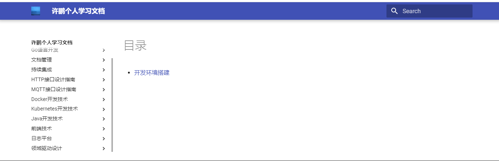

# 系统搭建

## 参考文档

1. [MkDocs官网](https://www.mkdocs.org/)
2. [MkDocs版本发布日志](https://www.mkdocs.org/about/release-notes/)
3. [基于mkdocs-material实现的帮助中心(markdown+中文搜索+图片放大)](https://segmentfault.com/a/1190000018592279)

## 开发环境介绍

* 主机操作系统: Ubuntu 16.04.2 64位
* Python版本: 2.7.12
* MkDocs版本: 1.0
* 安装时间: 2018.8.9

## 软件安装

### 安装pip

```shell
sudo apt-get install python-pip
```

### 安装mkdocs

``` bash
pip install mkdocs
```

安装成功之后将会在系统中注册`mkdocs`命令，可以运行`mkdocs --version`命令来验证mkdocs是否安装成功。

### 升级mkdocs

如果你已经安装了mkdocs现在需要升级可以执行如下命令

``` bash
pip install -U mkdocs
```

!!! warning "可能出現的tornado语法错误"
    执行`mkdocs serve`时的tornado语法错误，如下：

    ```bash
    File "/usr/local/lib/python2.7/dist-packages/livereload/server.py", line 20, in <module>
        from tornado.wsgi import WSGIContainer
    File "/usr/local/lib/python2.7/dist-packages/tornado/wsgi.py", line 51
        def to_wsgi_str(s: bytes) -> str:
                     ^
    SyntaxError: invalid syntax
    ```


    错误原因为tornado版本太新已经去掉了对Python2.7的支持，可以通过`pip show`指令查看：

    ```bash
    root@VM-4-10-ubuntu:~:/opt/DocumentsWorkspace/WorkGuideline# pip show tornado
    ---
    Metadata-Version: 2.0
    Name: tornado
    Version: 6.0.2
    Summary: Tornado is a Python web framework and asynchronous networking library, originally developed at FriendFeed.
    Home-page: http://www.tornadoweb.org/
    Author: Facebook
    Author-email: python-tornado@googlegroups.com
    Installer: pip
    License: http://www.apache.org/licenses/LICENSE-2.0
    Location: /usr/local/lib/python2.7/dist-packages
    Requires: 
    Classifiers:
    License :: OSI Approved :: Apache Software License
    Programming Language :: Python :: 3
    Programming Language :: Python :: 3.5
    Programming Language :: Python :: 3.6
    Programming Language :: Python :: 3.7
    Programming Language :: Python :: Implementation :: CPython
    Programming Language :: Python :: Implementation :: PyPy
    ```

    所以需要将tornado切换到旧的版本：

    ```bash
    pip install tornado==5.1.1
    ```

### 安装主题

```bash
pip install mkdocs-material
```

查看当前已经安装的主题版本可以使用如下命令：

``` bash
pip show mkdocs-material
将会输入如下内容：
Name: mkdocs-material
Version: 4.0.1
Summary: A Material Design theme for MkDocs
Home-page: https://squidfunk.github.io/mkdocs-material/
Author: Martin Donath
Author-email: martin.donath@squidfunk.com
License: MIT
Location: /usr/local/lib/python2.7/dist-packages
Requires: pymdown-extensions, Pygments, mkdocs
```

当你已经安装主题但是需要升级主题版本[完整版本列表](https://squidfunk.github.io/mkdocs-material/release-notes/)时可以进行如下操作：

```bash
pip install --upgrade mkdocs-material
```

## 配置主题

在mkdocs.yml文件中添加主题配置

```yml
theme:
    name: 'material'
```

### 修改Logo图标

在mkdocs.yml文件中添加图标信息

```yml
theme:
    name: 'material'
    favicon: assets/image/favicon.ico
```

### 添加界面Tab

在mkdocs.yml文件中添加界面Tab

```yml
theme:
    name: 'material'
    favicon: assets/image/favicon.ico
    feature:
        tabs: true
```

### 添加定制CSS

在mkdocs.yml文件中添加定制CSS文件的位置

```yml
extra_css:
    - assets/css/extra.css
```

## 安装插件&依赖

```bash
sudo pip install pygments
sudo pip install pymdown-extensions
```

## 创建文档工程

```bash
mkdocs new documents-release
cd documents-release
```

通过`mkdocs new`命令可以创建一个简单的示例文档工程，目录结构如下：

* mkdocs.yml    目录索引配置
* docs          文档存放目录
* index.md      示例文档

### 启动文档系统

先进入文档工程的根目录再执行启动命令

```bash
cd documents-release
mkdocs serve

# 正常启动的话将打印如下信息
INFO    -  Building documentation...
INFO    -  Cleaning site directory
[I 180809 20:01:08 server:292] Serving on http://127.0.0.1:8000
[I 180809 20:01:08 handlers:59] Start watching changes
[I 180809 20:01:08 handlers:61] Start detecting changes
[I 180809 20:01:49 handlers:132] Browser Connected: http://127.0.0.1:8000/
```

按照提示在浏览器中输入地址`http://127.0.0.1:8000`访问

默认情况下`mkdocs`会绑定到8000端口，通过可以选项修改

```bash
mkdocs serve -a 0.0.0.0:80
```



### 添加Copyright

在mkdocs.yml文件中添加Copyright信息

```yml
copyright: Copyright &copy; 2022 <a href="http://docs.wsh-study.com">许鹏的学习文档</a>
```

## 获取帮助

通过`--help`选项可以获取到`mkdocs`的可用命令

```bash
mkdocs --help
```

另外还可以通过子命令 + `--help`选项获取子命令的具体帮助信息

```bash
mkdocs build --help
```

至此MkDocs的基础环境已经搭建完成
