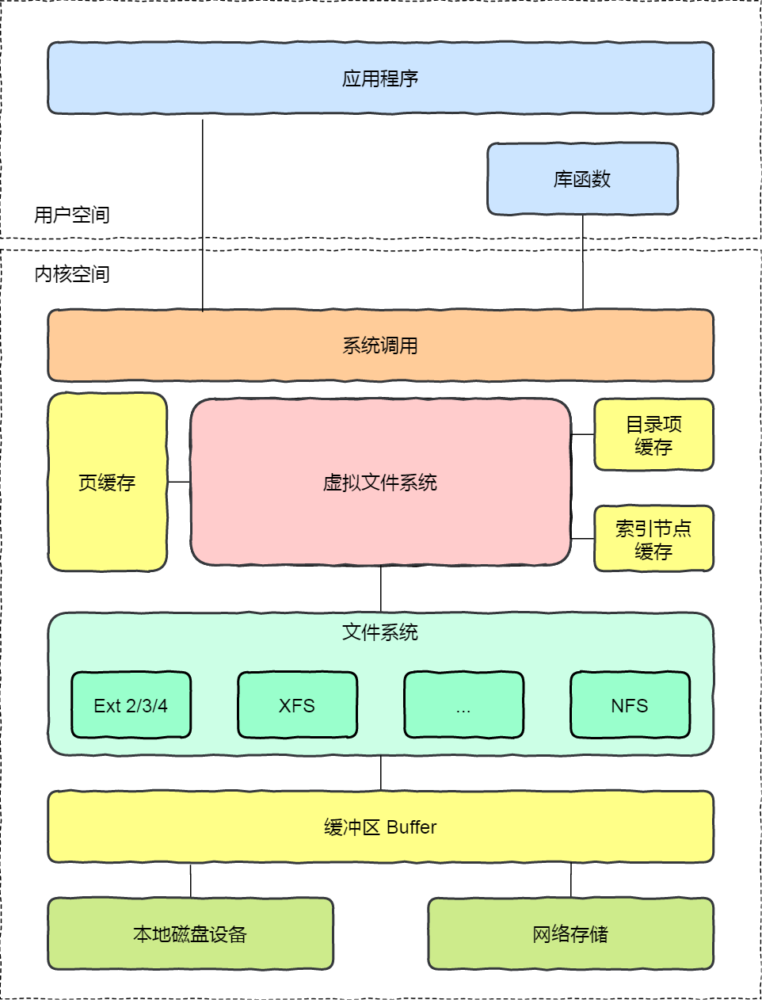
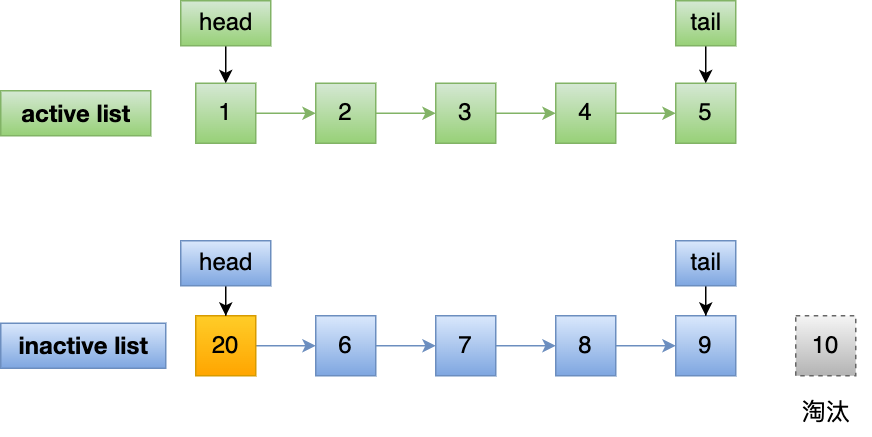

# 如何避免预读失效和缓存污染的问题

## Linux 和 MySQL 的缓存

### Linux 操作系统的缓存

在应用程序读取文件的数据的时候，Linux 操作系统是会对读取的文件数据进行缓存的，会缓存在文件系统中的 **Page Cache**（如下图中的页缓存）。



Page Cache 属于内存空间里的数据，由于内存访问比磁盘访问快很多，在下一次访问相同的数据就不需要通过磁盘 I/O 了，命中缓存就直接返回数据即可。

因此，Page Cache 起到了加速访问数据的作用。

### MySQL 的缓存

MySQL 的数据是存储在磁盘里的，为了提升数据库的读写性能，Innodb 存储引擎设计了一个 **缓冲池** （Buffer Pool），Buffer Pool 属于内存空间里的数据。


有了缓冲池后：

- 当读取数据时，如果数据存在于 Buffer Pool 中，客户端就会直接读取 Buffer Pool 中的数据，否则再去磁盘中读取。
- 当修改数据时，首先是修改 Buffer Pool 中数据所在的页，然后将其页设置为脏页，最后由后台线程将脏页写入到磁盘。

## 传统 LRU 是如何管理内存数据的？

Linux 的 Page Cache 和 MySQL 的 Buffer Pool 的大小是有限的，并不能无限的缓存数据，对于一些频繁访问的数据我们希望可以一直留在内存中，而一些很少访问的数据希望可以在某些时机可以淘汰掉，从而保证内存不会因为满了而导致无法再缓存新的数据，同时还能保证常用数据留在内存中。

要实现这个，最容易想到的就是 LRU（Least recently used）算法。

LRU 算法一般是用「链表」作为数据结构来实现的，链表头部的数据是最近使用的，而链表末尾的数据是最久没被使用的。那么，当空间不够了，就淘汰最久没被使用的节点，也就是链表末尾的数据，从而腾出内存空间。

因为 Linux 的 Page Cache 和 MySQL 的 Buffer Pool 缓存的 **基本数据单位都是页（Page）单位**，所以**后续以「页」名称代替「数据」** 。

传统的 LRU 算法的实现思路是这样的：

- 当访问的页在内存里，就直接把该页对应的 LRU 链表节点移动到链表的头部。
- 当访问的页不在内存里，除了要把该页放入到 LRU 链表的头部，还要淘汰 LRU 链表末尾的页。

比如下图，假设 LRU 链表长度为 5，LRU 链表从左到右有编号为 1，2，3，4，5 的页。


如果访问了 3 号页，因为 3 号页已经在内存了，所以把 3 号页移动到链表头部即可，表示最近被访问了。


而如果接下来，访问了 8 号页，因为 8 号页不在内存里，且 LRU 链表长度为 5，所以必须要淘汰数据，以腾出内存空间来缓存 8 号页，于是就会淘汰末尾的 5 号页，然后再将 8 号页加入到头部。


传统的 LRU 算法并没有被 Linux 和 MySQL 使用，因为传统的 LRU 算法无法避免下面这两个问题：

- 预读失效导致缓存命中率下降；
- 缓存污染导致缓存命中率下降；

## 预读失效，怎么办？

### 什么是预读机制？

Linux 操作系统为基于 Page Cache 的读缓存机制提供 **预读机制** ，一个例子是：

- 应用程序只想读取磁盘上文件 A 的 offset 为 0-3KB 范围内的数据，由于磁盘的基本读写单位为 block（4KB），于是操作系统至少会读 0-4KB 的内容，这恰好可以在一个 page 中装下。
- 但是操作系统出于空间局部性原理（靠近当前被访问数据的数据，在未来很大概率会被访问到），会选择将磁盘块 offset [4KB,8KB)、[8KB,12KB) 以及 [12KB,16KB) 都加载到内存，于是额外在内存中申请了 3 个 page；

下图代表了操作系统的预读机制：


上图中，应用程序利用 read 系统调动读取 4KB 数据，实际上内核使用预读机制（ReadaHead） 机制完成了 16KB 数据的读取，也就是通过一次磁盘顺序读将多个 Page 数据装入 Page Cache。

这样下次读取 4KB 数据后面的数据的时候，就不用从磁盘读取了，直接在 Page Cache 即可命中数据。因此，预读机制带来的好处就是 **减少了 磁盘 I/O 次数，提高系统磁盘 I/O 吞吐量** 。

MySQL Innodb 存储引擎的 Buffer Pool 也有类似的预读机制，MySQL 从磁盘加载页时，会提前把它相邻的页一并加载进来，目的是为了减少磁盘 IO。

### 预读失效会带来什么问题？

如果 **这些被提前加载进来的页，并没有被访问** ，相当于这个预读工作是白做了，这个就是 **预读失效** 。

如果使用传统的 LRU 算法，就会把「预读页」放到 LRU 链表头部，而当内存空间不够的时候，还需要把末尾的页淘汰掉。

如果这些「预读页」如果一直不会被访问到，就会出现一个很奇怪的问题， **不会被访问的预读页却占用了 LRU 链表前排的位置，而末尾淘汰的页，可能是热点数据，这样就大大降低了缓存命中率** 。

### 如何避免预读失效造成的影响？

我们不能因为害怕预读失效，而将预读机制去掉，大部分情况下，空间局部性原理还是成立的。

要避免预读失效带来影响，最好就是 **让预读页停留在内存里的时间要尽可能的短，让真正被访问的页才移动到 LRU 链表的头部，从而保证真正被读取的热数据留在内存里的时间尽可能长** 。

那到底怎么才能避免呢？

Linux 操作系统和 MySQL Innodb 通过改进传统 LRU 链表来避免预读失效带来的影响，具体的改进分别如下：

- Linux 操作系统实现两个了 LRU 链表： **活跃 LRU 链表（active_list）和非活跃 LRU 链表（inactive_list）** ；
- MySQL 的 Innodb 存储引擎是在一个 LRU 链表上划分来 2 个区域： **young 区域 和 old 区域** 。

这两个改进方式，设计思想都是类似的， **都是将数据分为了冷数据和热数据，然后分别进行 LRU 算法** 。不再像传统的 LRU 算法那样，所有数据都只用一个 LRU 算法管理。

接下来，具体聊聊 Linux 和 MySQL 是如何避免预读失效带来的影响？

> Linux 是如何避免预读失效带来的影响？

Linux 操作系统实现两个了 LRU 链表： **活跃 LRU 链表（active_list）和非活跃 LRU 链表（inactive_list）** 。

- **active list** 活跃内存页链表，这里存放的是最近被访问过（活跃）的内存页；
- **inactive list** 不活跃内存页链表，这里存放的是很少被访问（非活跃）的内存页；

有了这两个 LRU 链表后， **预读页就只需要加入到 inactive list 区域的头部，当页被真正访问的时候，才将页插入 active list 的头部** 。如果预读的页一直没有被访问，就会从 inactive list 移除，这样就不会影响 active list 中的热点数据。

接下来，给大家举个例子。

假设 active list 和 inactive list 的长度为 5，目前内存中已经有如下 10 个页：


现在有个编号为 20 的页被预读了，这个页只会被插入到 inactive list 的头部，而 inactive list 末尾的页（10号）会被淘汰掉。



**即使编号为 20 的预读页一直不会被访问，它也没有占用到 active list 的位置** ，而且还会比 active list 中的页更早被淘汰出去。

如果 20 号页被预读后，立刻被访问了，那么就会将它插入到 active list 的头部， active list 末尾的页（5号），会被 **降级** 到 inactive list ，作为 inactive list 的头部，这个过程并不会有数据被淘汰。


> MySQL 是如何避免预读失效带来的影响？

MySQL 的 Innodb 存储引擎是在一个 LRU 链表上划分来 2 个区域， **young 区域 和 old 区域** 。

young 区域在 LRU 链表的前半部分，old 区域则是在后半部分，这两个区域都有各自的头和尾节点，如下图：


young 区域与 old 区域在 LRU 链表中的占比关系并不是一比一的关系，而是 63:37（默认比例）的关系。

**划分这两个区域后，预读的页就只需要加入到 old 区域的头部，当页被真正访问的时候，才将页插入 young 区域的头部** 。如果预读的页一直没有被访问，就会从 old 区域移除，这样就不会影响 young 区域中的热点数据。

接下来，给大家举个例子。

假设有一个长度为 10 的 LRU 链表，其中 young 区域占比 70 %，old 区域占比 30 %。


现在有个编号为 20 的页被预读了，这个页只会被插入到 old 区域头部，而 old 区域末尾的页（10号）会被淘汰掉。


如果 20 号页一直不会被访问，它也没有占用到 young 区域的位置，而且还会比 young 区域的数据更早被淘汰出去。

如果 20 号页被预读后，立刻被访问了，那么就会将它插入到 young 区域的头部，young 区域末尾的页（7号），会被挤到 old 区域，作为 old 区域的头部，这个过程并不会有页被淘汰。


## 缓存污染，怎么办？

### 什么是缓存污染？

虽然 Linux （实现两个 LRU 链表）和 MySQL （划分两个区域）通过改进传统的 LRU 数据结构，避免了预读失效带来的影响。

但是如果还是使用「只要数据被访问一次，就将数据加入到活跃 LRU 链表头部（或者 young 区域）」这种方式的话，那么 **还存在缓存污染的问题** 。

当我们在批量读取数据的时候，由于数据被访问了一次，这些大量数据都会被加入到「活跃 LRU 链表」里，然后之前缓存在活跃 LRU 链表（或者 young 区域）里的热点数据全部都被淘汰了， **如果这些大量的数据在很长一段时间都不会被访问的话，那么整个活跃 LRU 链表（或者 young 区域）就被污染了** 。

### 缓存污染会带来什么问题？

缓存污染带来的影响就是很致命的，等这些热数据又被再次访问的时候，由于缓存未命中，就会产生大量的磁盘 I/O，系统性能就会急剧下降。

我以 MySQL 举例子，Linux 发生缓存污染的现象也是类似。

当某一个 SQL 语句 **扫描了大量的数据** 时，在 Buffer Pool 空间比较有限的情况下，可能会将 **Buffer Pool 里的所有页都替换出去，导致大量热数据被淘汰了** ，等这些热数据又被再次访问的时候，由于缓存未命中，就会产生大量的磁盘 I/O，MySQL 性能就会急剧下降。

注意， 缓存污染并不只是查询语句查询出了大量的数据才出现的问题，即使查询出来的结果集很小，也会造成缓存污染。

比如，在一个数据量非常大的表，执行了这条语句：

```sql
select * from t_user where name like "%xiaolin%";
```

可能这个查询出来的结果就几条记录，但是由于这条语句会发生索引失效，所以这个查询过程是全表扫描的，接着会发生如下的过程：

- 从磁盘读到的页加入到 LRU 链表的 old 区域头部；
- 当从页里读取行记录时，也就是 **页被访问的时候，就要将该页放到 young 区域头部** ；
- 接下来拿行记录的 name 字段和字符串 xiaolin 进行模糊匹配，如果符合条件，就加入到结果集里；
- 如此往复，直到扫描完表中的所有记录。

经过这一番折腾，由于这条 SQL 语句访问的页非常多，每访问一个页，都会将其加入 young 区域头部，那么 **原本 young 区域的热点数据都会被替换掉，导致缓存命中率下降** 。那些在批量扫描时，而被加入到 young 区域的页，如果在很长一段时间都不会再被访问的话，那么就污染了 young 区域。

举个例子，假设需要批量扫描：21，22，23，24，25 这五个页，这些页都会被逐一访问（读取页里的记录）。


在批量访问这些页的时候，会被逐一插入到 young 区域头部。


可以看到，原本在 young 区域的 6 和 7 号页都被淘汰了，而批量扫描的页基本占满了 young 区域，如果这些页在很长一段时间都不会被访问，那么就对 young 区域造成了污染。

如果 6 和 7 号页是热点数据，那么在被淘汰后，后续有 SQL 再次读取 6 和 7 号页时，由于缓存未命中，就要从磁盘中读取了，降低了 MySQL 的性能，这就是缓存污染带来的影响。

### 怎么避免缓存污染造成的影响？

前面的 LRU 算法只要数据被访问一次，就将数据加入活跃 LRU 链表（或者 young 区域）， **这种 LRU 算法进入活跃 LRU 链表的门槛太低了** ！正式因为门槛太低，才导致在发生缓存污染的时候，很容就将原本在活跃 LRU 链表里的热点数据淘汰了。

所以， **只要我们提高进入到活跃 LRU 链表（或者 young 区域）的门槛，就能有效地保证活跃 LRU 链表（或者 young 区域）里的热点数据不会被轻易替换掉**。

Linux 操作系统和 MySQL Innodb 存储引擎分别是这样提高门槛的：

- **Linux 操作系统** ：在内存页被访问 **第二次** 的时候，才将页从 inactive list 升级到 active list 里。

- MySQL Innodb

  ：在内存页被访问

  第二次

  的时候，并不会马上将该页从 old 区域升级到 young 区域，因为还要进行

  停留在 old 区域的时间判断

  ：

  - 如果第二次的访问时间与第一次访问的时间 **在 1 秒内** （默认值），那么该页就 **不会** 被从 old 区域升级到 young 区域；
  - 如果第二次的访问时间与第一次访问的时间 **超过 1 秒** ，那么该页就 **会** 从 old 区域升级到 young 区域；

提高了进入活跃 LRU 链表（或者 young 区域）的门槛后，就很好了避免缓存污染带来的影响。

在批量读取数据时候， **如果这些大量数据只会被访问一次，那么它们就不会进入到活跃 LRU 链表（或者 young 区域）** ，也就不会把热点数据淘汰，只会待在非活跃 LRU 链表（或者 old 区域）中，后续很快也会被淘汰。

## 总结

传统的 LRU 算法法无法避免下面这两个问题：

- 预读失效导致缓存命中率下降；
- 缓存污染导致缓存命中率下降；

为了避免「预读失效」造成的影响，Linux 和 MySQL 对传统的 LRU 链表做了改进：

- Linux 操作系统实现两个了 LRU 链表： **活跃 LRU 链表（active list）和非活跃 LRU 链表（inactive list）** 。
- MySQL Innodb 存储引擎是在一个 LRU 链表上划分来 2 个区域： **young 区域 和 old 区域** 。

但是如果还是使用「只要数据被访问一次，就将数据加入到活跃 LRU 链表头部（或者 young 区域）」这种方式的话，那么 **还存在缓存污染的问题** 。

为了避免「缓存污染」造成的影响，Linux 操作系统和 MySQL Innodb 存储引擎分别提高了升级为热点数据的门槛：

- Linux 操作系统：在内存页被访问 **第二次** 的时候，才将页从 inactive list 升级到 active list 里。

- MySQL Innodb：在内存页被访问

  第二次

  的时候，并不会马上将该页从 old 区域升级到 young 区域，因为还要进行

  停留在 old 区域的时间判断

  ：

  - 如果第二次的访问时间与第一次访问的时间 **在 1 秒内** （默认值），那么该页就 **不会** 被从 old 区域升级到 young 区域；
  - 如果第二次的访问时间与第一次访问的时间 **超过 1 秒** ，那么该页就 **会** 从 old 区域升级到 young 区域；

通过提高了进入 active list （或者 young 区域）的门槛后，就很好了避免缓存污染带来的影响。