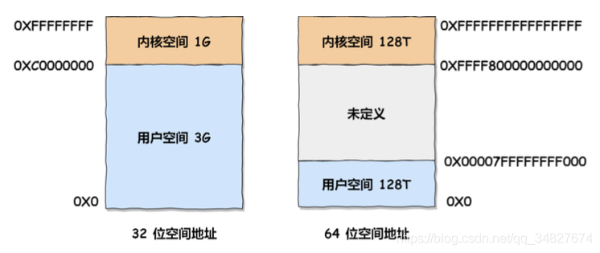
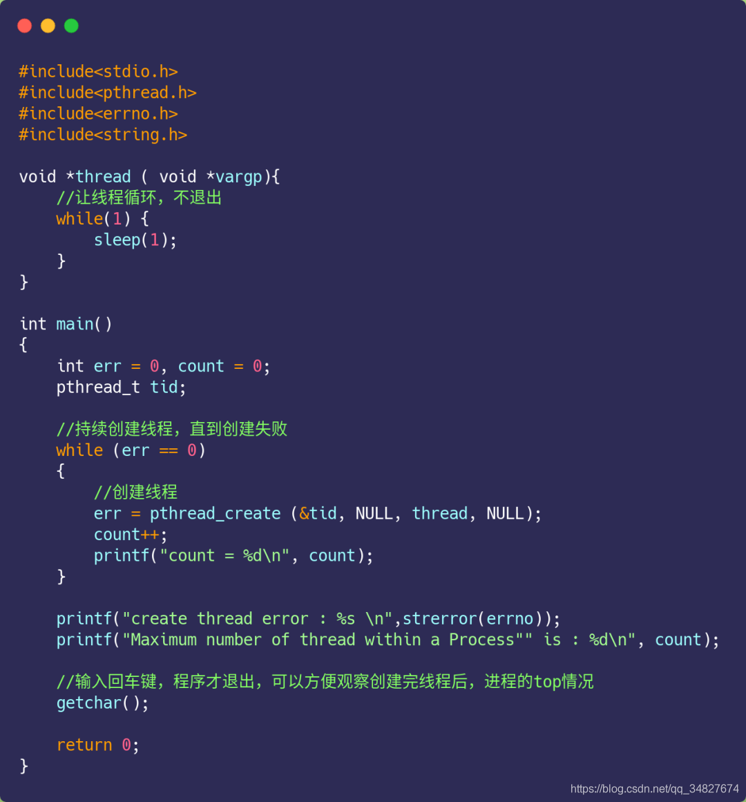
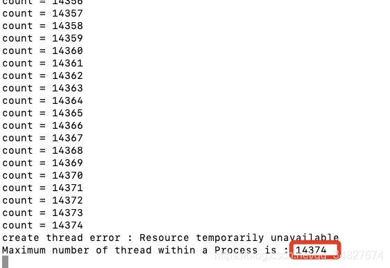
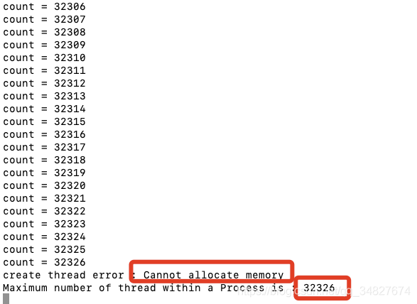
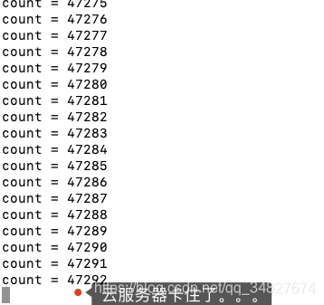
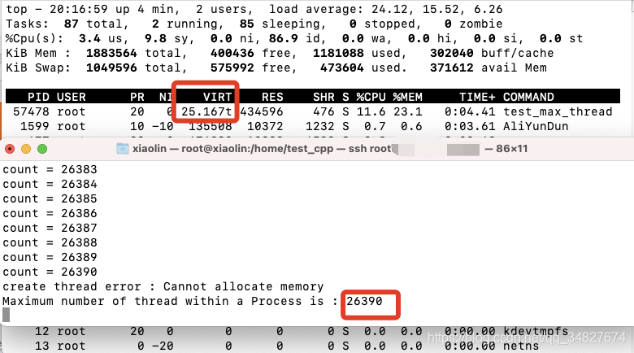

#  一个进程最多可以创建多少个线程

大家好，我是小林。

昨天有位读者问了我这么个问题：

 


大致意思就是，他看了一个面经，说虚拟内存是 2G 大小，然后他看了我的图解系统 PDF 里说虚拟内存是 4G，然后他就懵逼了。

其实他看这个面经很有问题，没有说明是什么操作系统，以及是多少位操作系统。

因为不同的操作系统和不同位数的操作系统，虚拟内存可能是不一样多。

Windows 系统我不了解，我就说说 Linux 系统。

在 Linux 操作系统中，虚拟地址空间的内部又被分为内核空间和用户空间两部分，不同位数的系统，地址 空间的范围也不同。比如最常⻅的 32 位和 64 位系统，如下所示:



通过这里可以看出:

- 32 位系统的内核空间占用 1G ，位于最高处，剩下的 3G 是用户空间;
- 64 位系统的内核空间和用户空间都是 128T ，分别占据整个内存空间的最高和最低处，剩下的中 间部分是未定义的。

------

接着，来看看读者那个面经题目： **一个进程最多可以创建多少个线程？**  

这个问题跟两个东西有关系：

-  **进程的虚拟内存空间上限** ，因为创建一个线程，操作系统需要为其分配一个栈空间，如果线程数量越多，所需的栈空间就要越大，那么虚拟内存就会占用的越多。
-  **系统参数限制** ，虽然 Linux 并没有内核参数来控制单个进程创建的最大线程个数，但是有系统级别的参数来控制整个系统的最大线程个数。

我们先看看，在进程里创建一个线程需要消耗多少虚拟内存大小？

我们可以执行 ulimit -a 这条命令，查看进程创建线程时默认分配的栈空间大小，比如我这台服务器默认分配给线程的栈空间大小为 8M。


在前面我们知道，在 32 位 Linux 系统里，一个进程的虚拟空间是 4G，内核分走了1G， **留给用户用的只有 3G** 。

那么假设创建一个线程需要占用 10M 虚拟内存，总共有 3G 虚拟内存可以使用。于是我们可以算出，最多可以创建差不多 300 个（3G/10M）左右的线程。

如果你想自己做个实验，你可以找台 32 位的 Linux 系统运行下面这个代码：



由于我手上没有 32 位的系统，我这里贴一个网上别人做的测试结果：


如果想使得进程创建上千个线程，那么我们可以调整创建线程时分配的栈空间大小，比如调整为 512k：

```text
$ ulimit -s 512
```

------

说完 32 位系统的情况，我们来看看 64 位系统里，一个进程能创建多少线程呢？

我的测试服务器的配置：

- 64 位系统；
- 2G 物理内存；
- 单核 CPU。

64 位系统意味着用户空间的虚拟内存最大值是 128T，这个数值是很大的，如果按创建一个线程需占用 10M 栈空间的情况来算，那么理论上可以创建 128T/10M 个线程，也就是 1000多万个线程，有点魔幻！

所以按 64 位系统的虚拟内存大小，理论上可以创建无数个线程。

事实上，肯定创建不了那么多线程，除了虚拟内存的限制，还有系统的限制。

比如下面这三个内核参数的大小，都会影响创建线程的上限：

-  ***/proc/sys/kernel/threads-max** *，表示系统支持的最大线程数，默认值是 `14553`；
-  ***/proc/sys/kernel/pid_max** *，表示系统全局的 PID 号数值的限制，每一个进程或线程都有 ID，ID 的值超过这个数，进程或线程就会创建失败，默认值是 `32768`；
-  ***/proc/sys/vm/max_map_count** *，表示限制一个进程可以拥有的VMA(虚拟内存区域)的数量，具体什么意思我也没搞清楚，反正如果它的值很小，也会导致创建线程失败，默认值是 `65530`。

那接下针对我的测试服务器的配置，看下一个进程最多能创建多少个线程呢？

我在这台服务器跑了前面的程序，其结果如下：



可以看到，创建了 14374 个线程后，就无法在创建了，而且报错是因为资源的限制。

前面我提到的 `threads-max` 内核参数，它是限制系统里最大线程数，默认值是 14553。

我们可以运行那个测试线程数的程序后，看下当前系统的线程数是多少，可以通过 `top -H` 查看。


左上角的 Threads 的数量显示是 14553，与 `threads-max` 内核参数的值相同，所以我们可以认为是因为这个参数导致无法继续创建线程。

那么，我们可以把 threads-max 参数设置成 `99999`:

```text
echo 99999 > /proc/sys/kernel/threads-max
```

设置完 threads-max 参数后，我们重新跑测试线程数的程序，运行后结果如下图：



可以看到，当进程创建了 32326 个线程后，就无法继续创建里，且报错是无法继续申请内存。

此时的上限个数很接近 `pid_max` 内核参数的默认值（32768），那么我们可以尝试将这个参数设置为 99999：

```text
echo 99999 > /proc/sys/kernel/pid_max
```

设置完 pid_max 参数后，继续跑测试线程数的程序，运行后结果创建线程的个数还是一样卡在了 32768 了。

当时我也挺疑惑的，明明 pid_max 已经调整大后，为什么线程个数还是上不去呢？

后面经过查阅资料发现，`max_map_count` 这个内核参数也是需要调大的，但是它的数值与最大线程数之间有什么关系，我也不太明白，只是知道它的值是会限制创建线程个数的上限。

然后，我把 max_map_count 内核参数也设置成后 99999：

```text
echo 99999 > /proc/sys/kernel/max_map_count 
```

继续跑测试线程数的程序，结果如下图：



当创建差不多 5 万个线程后，我的服务器就卡住不动了，CPU 都已经被占满了，毕竟这个是单核 CPU，所以现在是 CPU 的瓶颈了。

我只有这台服务器，如果你们有性能更强的服务器来测试的话，有兴趣的小伙伴可以去测试下。

接下来，我们换个思路测试下，把创建线程时分配的栈空间调大，比如调大为 100M，在大就会创建线程失败。

```text
ulimit -s 1024000
```

设置完后，跑测试线程的程序，其结果如下：



总共创建了 26390 个线程，然后就无法继续创建了，而且该进程的虚拟内存空间已经高达 25T，要知道这台服务器的物理内存才 2G。

为什么物理内存只有 2G，进程的虚拟内存却可以使用 25T 呢？

因为虚拟内存并不是全部都映射到物理内存的，程序是有局部性的特性，也就是某一个时间只会执行部分代码，所以只需要映射这部分程序就好。

你可以从上面那个 top 的截图看到，虽然进程虚拟空间很大，但是物理内存（RES）只有使用了 400 多M。

好了，简单总结下：

- 32 位系统，用户态的虚拟空间只有 3G，如果创建线程时分配的栈空间是 10M，那么一个进程最多只能创建 300 个左右的线程。
- 64 位系统，用户态的虚拟空间大到有 128T，理论上不会受虚拟内存大小的限制，而会受系统的参数或性能限制。
