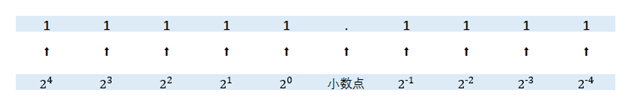
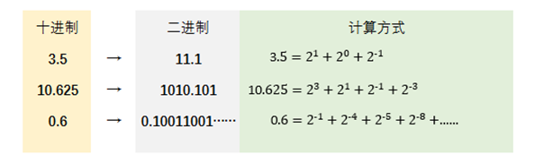
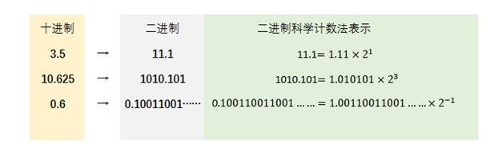
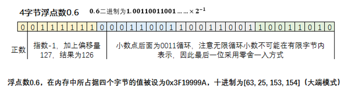
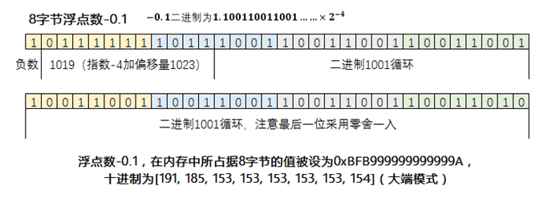
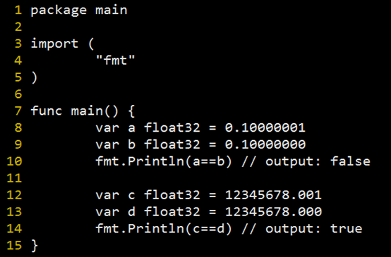

# 浮点类型（float、double）在内存中如何存储？

在编程中，浮点类型数据主要用于表示小数，例如Java或C++中的float、double类型，Golang中的float32、float64类型。我们在开始学编程的时候也经常被教育，浮点数有精度问题，不适用于比较大小或比较相等性的逻辑。任何数字在计算机中都是用0和1二进制来表示，对于float（占据4字节）和double（占据8字节）类型，又是如何使用一串0和1表示出来呢？

浮点数的存储方案是来自于IEEE 754（IEEE Standard for Floating-Point Arithmetic）标准，这一标准最早在1985年提出，基本上已经被用于所有计算机中。IEEE 754经历了几次标准更新，但是最核心的内容，即浮点数表示规则，从来没有变过。该标准一共经历了1985版，1987版，2008版，2019版等几个版本的更新。

要表示浮点数的第一步，就是让小数也能使用二进制来表示。我们知道二进制表示整数时，最低位代表2的0次方，往高位依次是2的1次方，2次方，3次方……那么对应的，二进制数小数点后面，最高位则是2的-1次方，-2次方，-3次方……如下图所示：

二进制浮点数每一位对应的十进制数值

下面举几个例子：

十进制与二进制转换

十进制数字10.625，用二进制表示为1010.101 。其实这种二进制表示小数的方法，造成了一个隐含的问题：一些本来不是无限循环的十进制小数，表示成二进制之后成了无限循环小数。比如上图中的十进制数字0.6，表示成二进制之后成了循环体为1001的无限循环小数。这就是“浮点数有精度问题”的根源之一，你在代码中声明一个变量double a = 0.6;时，计算机底层其实是无法精确存储那个无限循环二进制数的，只能存一个四舍五入（准确说应该是零舍一入，毕竟是二进制）后的近似值。

下一步，将二进制表示为以2为底的科学计数法，如图：

二进制科学计数法

对于任何数字表示成二进制科学计数法以后，一定是1点几（尾数）乘以2的多少次方（指数）。对于小于零的负数来说，就是负1点几（尾数）乘以2的多少次方（指数）。所以要存这个数，需要存储三个部分：正负号，尾数，指数。

浮点数在内存中的表示方式

具体存储方式如上图所示。最高位有1bit存储正负号，然后指数部分占据8bits（4字节）或11bits（8字节），其余部分全都用来存储尾数部分。对于指数部分，这里存储的结果是实际的指数加上偏移量之后的结果。这里设置偏移量，是为了让指数部分不出现负数，全都为大于等于0的正整数。尾数部分的存储，因为二进制的科学计数法，小数点前一定是1开头，因此我们尾数只需要存储小数点后面的部分即可。接下来依然是举例说明：

4字节浮点数0.6的存储方式

如果你在程序中声明float a = 0.6，那么实际上a变量在内存中占据的4个字节的值为0x3F19999A。其实如果你再声明一个 uint32 b = 1058642330，其实b变量所占据的4个字节的值也是0x3F19999A，因为整数在内存中就是直接按照二进制值来存储，刚好a和b两个变量在内存中的值一模一样，只不过他们的数据类型不同。

另外值得注意的是，虽然float a=0.6在内存中被存为了数字0x3F19999A，但是如果我们把4个字节看作是长度为4的byte数组，不同的计算机对这个数组有不同的存储方式。在大端模式下，这个数组为[0x3F, 0x19, 0x99, 0x9A]，即数字的高位在数组靠前位置；在小端模式下，这个数组为[0x9A, 0x99, 0x19, 0x3F]，即数字的高位在数组靠后位置，与我们正常的阅读习惯刚好反过来。

再来看一个8字节浮点数的例子：

8字节-0.1的存储方式

8字节数字-0.1，可以看到最高位为1，表示负数。后面逻辑和前文的4字节浮点数类似，只是偏移量略有区别。

浮点数的这种表示法，其实对于绝对值比较大的数来说，小数点后面的精度会比较差。对于绝对值接近0的比较小的数来说，小数点后面的精度反而会非常高。我们用一段简单的golang代码来说明一下（非常简单，非golang开发也能看懂）。

浮点数的相等性比较

我们可以看到，变量a和b的差距只有0.00000001，但是他们在内存中所存储的值依然是不同的，a和b比较会返回false。但是对于c和d来说，他们值只差了0.001，小数点后的差距比a和b的差距要大很多，c和d的判断结果依然是相等。这是由于c和d整数部分占据了4字节太多位置，导致小数部分的数值差距，在4字节内已经体现不出来了。c和d在内存中存的值是完全一样的。前文所说的零舍一入机制，加上浮点数在内存中本身的存储机制，导致了我们编程中经常被提醒的：“浮点数有精度问题”。

以上知识主要的应用场景是浮点数的序列化，在各种通信协议中经常会用到，如protobuf的序列化算法。这些知识点虽然非常基础，但相信在面试中一定能难倒不少基本功不太扎实的应聘者。