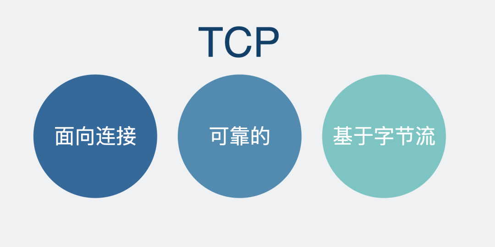
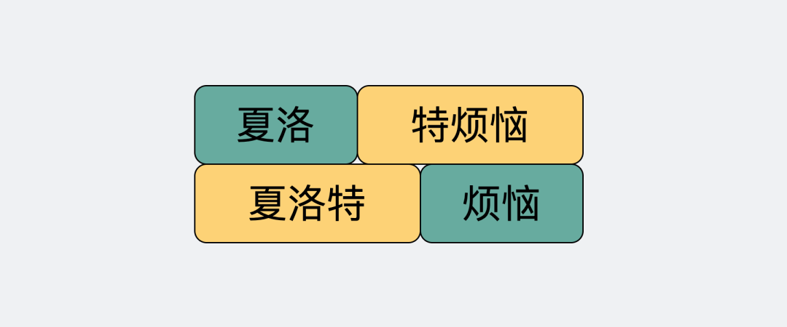
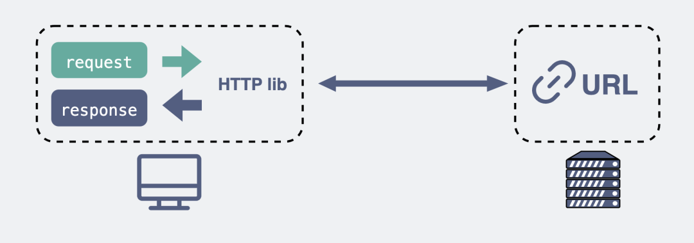
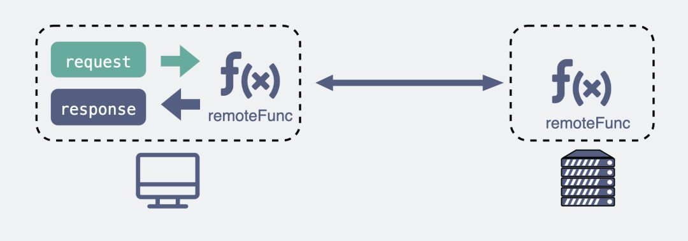
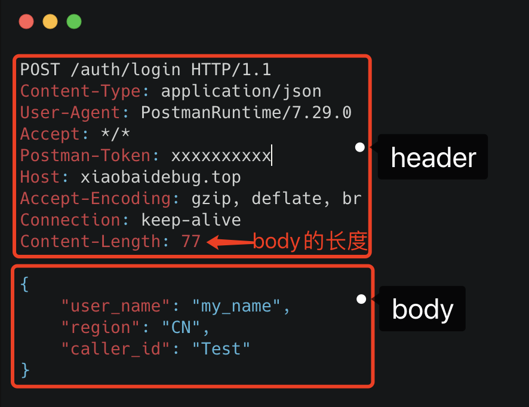

# 既然有 HTTP 协议，为什么还要有 RPC

我想起了我刚工作的时候，第一次接触RPC协议，当时就很懵， **我HTTP协议用的好好的，为什么还要用RPC协议？**  

于是就到网上去搜。

不少解释显得非常官方，我相信大家在各种平台上也都看到过，解释了又好像没解释，都在 **用一个我们不认识的概念去解释另外一个我们不认识的概念** ，懂的人不需要看，不懂的人看了还是不懂。

这种看了，又好像没看的感觉，云里雾里的很难受， **我懂** 。

为了避免大家有强烈的 **审丑疲劳** ，今天我们来尝试重新换个方式讲一讲。

## 从 TCP 聊起

作为一个程序员，假设我们需要在A电脑的进程发一段数据到B电脑的进程，我们一般会在代码里使用socket 进行编程。

这时候，我们可选项一般也就TCP和UDP二选一。TCP可靠，UDP不可靠。除非是马总这种神级程序员（早期QQ大量使用UDP），否则，只要稍微对可靠性有些要求，普通人一般无脑选TCP就对了。

类似下面这样。

```c
fd = socket(AF_INET,SOCK_STREAM,0);
```

其中`SOCK_STREAM`，是指使用 **字节流** 传输数据，说白了就是 **TCP协议** 。

在定义了socket之后，我们就可以愉快的对这个socket进行操作，比如用`bind()`绑定IP端口，用`connect()`发起建连。


在连接建立之后，我们就可以使用`send()`发送数据，`recv()`接收数据。

光这样一个纯裸的TCP连接，就可以做到收发数据了，那是不是就够了？

不行，这么用会有问题。

## 使用纯裸 TCP 会有什么问题

八股文常背，TCP是有三个特点， **面向连接** 、 **可靠** 、基于 **字节流** 。



这三个特点真的概括的 **非常精辟** ，这个八股文我们没白背。

每个特点展开都能聊一篇文章，而今天我们需要关注的是 **基于字节流** 这一点。

字节流可以理解为一个双向的通道里流淌的数据，这个 **数据** 其实就是我们常说的二进制数据，简单来说就是一大堆  **01 串** 。纯裸TCP收发的这些 01 串之间是 **没有任何边界** 的，你根本不知道到哪个地方才算一条完整消息。


正因为这个没有 **任何边界** 的特点，所以当我们选择使用TCP发送"夏洛"和"特烦恼"的时候，接收端收到的就是"夏洛特烦恼"，这时候接收端没发区分你是想要表达"夏洛"+"特烦恼"还是"夏洛特"+"烦恼"。



这就是所谓的 **粘包问题** ，之前也写过一篇专门的[文章 ](https://xiaolincoding.com/network/3_tcp/tcp_stream.html)聊过这个问题。

说这个的目的是为了告诉大家，纯裸TCP是不能直接拿来用的，你需要在这个基础上加入一些 **自定义的规则** ，用于区分 **消息边界** 。

于是我们会把每条要发送的数据都包装一下，比如加入 **消息头** ， **消息头里写清楚一个完整的包长度是多少** ，根据这个长度可以继续接收数据，截取出来后它们就是我们真正要传输的 **消息体** 。


而这里头提到的 **消息头** ，还可以放各种东西，比如消息体是否被压缩过和消息体格式之类的，只要上下游都约定好了，互相都认就可以了，这就是所谓的 **协议。**  

每个使用TCP的项目都可能会定义一套类似这样的协议解析标准，他们可能 **有区别，但原理都类似** 。

 **于是基于TCP，就衍生了非常多的协议，比如HTTP和RPC。**  

## HTTP 和 RPC

我们回过头来看网络的分层图。


 **TCP是传输层的协议** ，而基于TCP造出来的HTTP和 **各类** RPC协议，它们都只是定义了不同消息格式的 **应用层协议** 而已。

 **HTTP** 协议（ **H** yper  **T** ext  **T** ransfer  **P** rotocol），又叫做 **超文本传输协议** 。我们用的比较多，平时上网在浏览器上敲个网址就能访问网页，这里用到的就是HTTP协议。



而 **RPC** （ **R** emote  **P** rocedure  **C** all），又叫做 **远程过程调用** 。它本身并不是一个具体的协议，而是一种 **调用方式** 。

举个例子，我们平时调用一个 **本地方法** 就像下面这样。

```text
 res = localFunc(req)
```

如果现在这不是个本地方法，而是个 **远端服务器** 暴露出来的一个方法`remoteFunc`，如果我们还能像调用本地方法那样去调用它，这样就可以 **屏蔽掉一些网络细节** ，用起来更方便，岂不美哉？

```text
 res = remoteFunc(req)
```



基于这个思路，大佬们造出了非常多款式的RPC协议，比如比较有名的`gRPC`，`thrift`。

值得注意的是，虽然大部分RPC协议底层使用TCP，但实际上 **它们不一定非得使用TCP，改用UDP或者HTTP，其实也可以做到类似的功能。**  


到这里，我们回到文章标题的问题。

> 既然有HTTP协议，为什么还要有RPC？

其实，`TCP`是 **70年** 代出来的协议，而`HTTP`是 **90年代** 才开始流行的。而直接使用裸TCP会有问题，可想而知，这中间这么多年有多少自定义的协议，而这里面就有 **80年代** 出来的`RPC`。

所以我们该问的不是 **既然有HTTP协议为什么要有RPC** ，而是 **为什么有RPC还要有HTTP协议** 。

> 那既然有 RPC 了，为什么还要有HTTP呢？

现在电脑上装的各种 **联网** 软件，比如xx管家，xx卫士，它们都作为 **客户端（client）需要跟服务端（server）建立连接收发消息** ，此时都会用到应用层协议，在这种 client/server (c/s) 架构下，它们可以使用自家造的RPC协议，因为它只管连自己公司的服务器就ok了。

但有个软件不同， **浏览器（browser）** ，不管是chrome还是IE，它们不仅要能访问自家公司的 **服务器（server）** ，还需要访问其他公司的网站服务器，因此它们需要有个统一的标准，不然大家没法交流。于是，HTTP就是那个时代用于统一  **browser/server (b/s)**  的协议。

也就是说在多年以前， **HTTP主要用于b/s架构，而RPC更多用于c/s架构。但现在其实已经没分那么清了，b/s和c/s在慢慢融合。*很多软件同时支持多端，比如某度云盘，既要支持*网页版** ，还要支持 **手机端和pc端** ，如果通信协议都用HTTP的话，那服务器只用同一套就够了。而RPC就开始退居幕后，一般用于公司内部集群里，各个微服务之间的通讯。

那这么说的话， **都用HTTP得了，还用什么RPC？**  

仿佛又回到了文章开头的样子，那这就要从它们之间的区别开始说起。

## HTTP 和 RPC 有什么区别

我们来看看RPC和HTTP区别比较明显的几个点。

### 服务发现

首先要向某个服务器发起请求，你得先建立连接，而建立连接的前提是，你得知道 **IP地址和端口** 。这个找到服务对应的IP端口的过程，其实就是 **服务发现** 。

在 **HTTP** 中，你知道服务的域名，就可以通过 **DNS服务** 去解析得到它背后的IP地址，默认80端口。

而 **RPC** 的话，就有些区别，一般会有专门的 **中间服务** 去保存服务名和IP信息，比如 **consul或者etcd，甚至是redis** 。想要访问某个服务，就去这些中间服务去获得IP和端口信息。由于dns也是服务发现的一种，所以也有基于dns去做服务发现的组件，比如 **CoreDNS** 。

可以看出服务发现这一块，两者是有些区别，但不太能分高低。

### 底层连接形式

以主流的 **HTTP1.1** 协议为例，其默认在建立底层TCP连接之后会一直保持这个连接（ **keep alive** ），之后的请求和响应都会复用这条连接。

而 **RPC** 协议，也跟HTTP类似，也是通过建立TCP长链接进行数据交互，但不同的地方在于，RPC协议一般还会再建个 **连接池** ，在请求量大的时候，建立多条连接放在池内，要发数据的时候就从池里取一条连接出来， **用完放回去，下次再复用** ，可以说非常环保。


 **由于连接池有利于提升网络请求性能，所以不少编程语言的网络库里都会给HTTP加个连接池** ，比如 **go** 就是这么干的。

可以看出这一块两者也没太大区别，所以也不是关键。

### 传输的内容

基于TCP传输的消息，说到底，无非都是 **消息头header和消息体body。**  

 **header** 是用于标记一些特殊信息，其中最重要的是 **消息体长度** 。

 **body** 则是放我们真正需要传输的内容，而这些内容只能是二进制01串，毕竟计算机只认识这玩意。所以TCP传字符串和数字都问题不大，因为字符串可以转成编码再变成01串，而数字本身也能直接转为二进制。但结构体呢，我们得想个办法将它也转为二进制01串，这样的方案现在也有很多现成的，比如 **json，protobuf。**  

这个将结构体转为二进制数组的过程就叫 **序列化** ，反过来将二进制数组复原成结构体的过程叫 **反序列化** 。


对于主流的HTTP1.1，虽然它现在叫 **超文本** 协议，支持音频视频，但HTTP设计初是用于做网页 **文本** 展示的，所以它传的内容以字符串为主。header和body都是如此。在body这块，它使用 **json** 来 **序列化** 结构体数据。

我们可以随便截个图直观看下。



可以看到这里面的内容非常多的 **冗余** ，显得 **非常啰嗦** 。最明显的，像`header`里的那些信息，其实如果我们约定好头部的第几位是content-type，就 **不需要每次都真的把"content-type"这个字段都传过来** ，类似的情况其实在`body`的json结构里也特别明显。

而RPC，因为它定制化程度更高，可以采用体积更小的protobuf或其他序列化协议去保存结构体数据，同时也不需要像HTTP那样考虑各种浏览器行为，比如302重定向跳转啥的。 **因此性能也会更好一些，这也是在公司内部微服务中抛弃HTTP，选择使用RPC的最主要原因。**  


当然上面说的HTTP，其实 **特指的是现在主流使用的HTTP1.1** ，`HTTP2`在前者的基础上做了很多改进，所以 **性能可能比很多RPC协议还要好** ，甚至连`gRPC`底层都直接用的`HTTP2`。

> 那么问题又来了，为什么既然有了HTTP2，还要有RPC协议？

这个是由于 HTTP2 是2015年出来的。那时候很多公司内部的RPC协议都已经跑了好些年了，基于历史原因，一般也没必要去换了。

## 总结

- 纯裸TCP是能收发数据，但它是个 **无边界** 的数据流，上层需要定义 **消息格式** 用于定义 **消息边界** 。于是就有了各种协议，HTTP和各类RPC协议就是在TCP之上定义的应用层协议。
-  **RPC本质上不算是协议，而是一种调用方式** ，而像gRPC和thrift这样的具体实现，才是协议，它们是实现了RPC调用的协议。目的是希望程序员能像调用本地方法那样去调用远端的服务方法。同时RPC有很多种实现方式， **不一定非得基于TCP协议** 。
- 从发展历史来说， **HTTP主要用于b/s架构，而RPC更多用于c/s架构。但现在其实已经没分那么清了，b/s和c/s在慢慢融合** 。很多软件同时支持多端，所以对外一般用HTTP协议，而内部集群的微服务之间则采用RPC协议进行通讯。
- RPC其实比HTTP出现的要早，且比目前主流的HTTP1.1 **性能** 要更好，所以大部分公司内部都还在使用RPC。
-  **HTTP2.0** 在 **HTTP1.1** 的基础上做了优化，性能可能比很多RPC协议都要好，但由于是这几年才出来的，所以也不太可能取代掉RPC。
