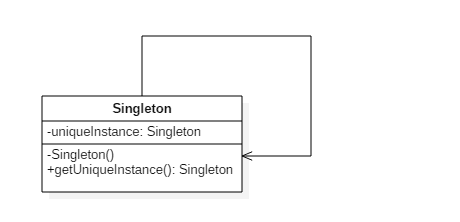
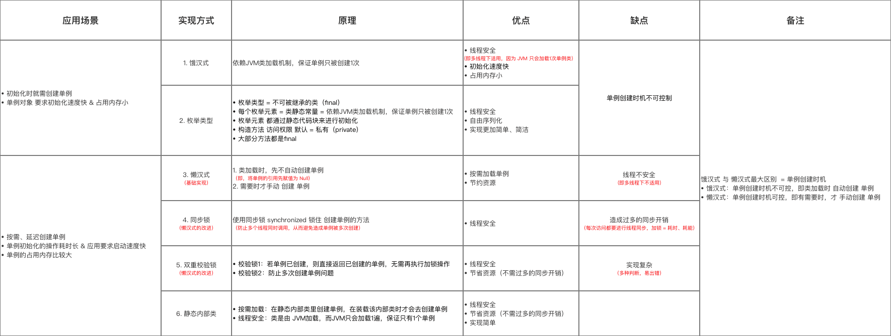

# 单例模式(Singleton pattern)

> 本文主要分析单例模式(Singleton pattern): 确保一个类只有一个实例，并提供该实例的全局访问点, 本文介绍6中常用的实现方式

## 类图

使用一个私有构造函数、一个私有静态变量以及一个公有静态函数来实现。

私有构造函数保证了不能通过构造函数来创建对象实例，只能通过公有静态函数返回唯一的私有静态变量。



## 6中实现方式

### 实现方式总结



### 懒汉式-线程不安全

以下实现中，私有静态变量 `uniqueInstance `被延迟实例化，这样做的好处是，如果没有用到该类，那么就不会实例化 `uniqueInstance`，从而节约资源。

这个实现在多线程环境下是不安全的，如果多个线程能够同时进入`if (uniqueInstance == null)`，并且此时 `uniqueInstance `为 `null`，那么会有多个线程执行 `uniqueInstance = new Singleton();` 语句，这将导致多次实例化 `uniqueInstance`。

```java
public class Singleton {

    private static Singleton uniqueInstance;

    private Singleton() {
    }

    public static Singleton getUniqueInstance() {
        if (uniqueInstance == null) {
            uniqueInstance = new Singleton();
        }
        return uniqueInstance;
    }
}
```

### 饿汉式-线程安全

线程不安全问题主要是由于 `uniqueInstance `被多次实例化，采取直接实例化 `uniqueInstance `的方式就不会产生线程不安全问题。

但是直接实例化的方式也丢失了延迟实例化带来的节约资源的好处。

```java
private static Singleton uniqueInstance = new Singleton();
```

### 懒汉式-线程安全

只需要对 `getUniqueInstance() `方法加锁，那么在一个时间点只能有一个线程能够进入该方法，从而避免了多次实例化 `uniqueInstance `的问题。

但是当一个线程进入该方法之后，其它试图进入该方法的线程都必须等待，因此性能上有一定的损耗。

```java
public static synchronized Singleton getUniqueInstance() {
    if (uniqueInstance == null) {
        uniqueInstance = new Singleton();
    }
    return uniqueInstance;
}
```

### 双重校验-线程安全

`uniqueInstance `只需要被实例化一次，之后就可以直接使用了。加锁操作只需要对实例化那部分的代码进行，只有当 `uniqueInstance `没有被实例化时，才需要进行加锁。

双重校验先判断 `uniqueInstance `是否已经被实例化，如果没有被实例化，那么才对实例化语句进行加锁。

```java
public class Singleton { 
  private static Singleton instance;
  
  private Singleton () {}
  
  public static Singleton getInstance() {
    if (instance == null) {
        synchronized(Singleton.class) { // 注意这里是类级别的锁
        if (instance == null) {       // 这里的检测避免多线程并发时多次创建对象
          instance = new Singleton();
        }
      }
    }
    return instance;
  }
}
```

考虑下面的实现，也就是只使用了一个 if 语句。在 `uniqueInstance == null `的情况下，如果两个线程同时执行 if 语句，那么两个线程就会同时进入 if 语句块内。虽然在 if 语句块内有加锁操作，但是两个线程都会执行 `uniqueInstance = new Singleton();` 这条语句，只是先后的问题，那么就会进行两次实例化，从而产生了两个实例。因此必须使用双重校验， **也就是需要使用两个 if 语句** 。

```java
 // 错误代码示例
 if (uniqueInstance == null) {
    synchronized (Singleton.class) {
        uniqueInstance = new Singleton();
    }
}
```

`uniqueInstance `采用 `volatile `关键字修饰也是很有必要的。`uniqueInstance = new Singleton();` 这段代码其实是分为三步执行。

1. 分配内存空间
2. 初始化对象
3. 将 `uniqueInstance `指向分配的内存地址

但是由于 `JVM `具有指令重排的特性，在 `Java 1.4` 及更早的版本中有可能执行顺序变为了 `1>3>2`，这在单线程情况下自然是没有问题。但如果是多线程下，有可能获得是一个还没有被初始化的实例，以致于程序出错。

使用 `volatile `可以禁止 `JVM` 的指令重排，保证在多线程环境下也能正常运行。

### 静态内部类实现

当 `Singleton `类加载时，静态内部类 `SingletonHolder `没有被加载进内存。只有当调用 `getUniqueInstance()` 方法从而触发 `SingletonHolder.INSTANCE` 时 `SingletonHolder `才会被加载，此时初始化 `INSTANCE `实例。

这种方式不仅具有延迟初始化的好处，而且由虚拟机提供了对线程安全的支持。

```java
public class Singleton {

    private Singleton() {
    }

    private static class SingletonHolder {
        private static final Singleton INSTANCE = new Singleton();
    }

    public static Singleton getUniqueInstance() {
        return SingletonHolder.INSTANCE;
    }
}
```

### 枚举实现

这是单例模式的最佳实践，它实现简单，并且在面对复杂的序列化或者反射攻击的时候，能够防止实例化多次。

```java
public enum Singleton {
    uniqueInstance;
}
```

如果不使用枚举来实现单例模式，会出现反射攻击，因为通过 `setAccessible()` 方法可以将私有构造函数的访问级别设置为 `public`，然后调用构造函数从而实例化对象。如果要防止这种攻击，需要在构造函数中添加防止实例化第二个对象的代码。

从上面的讨论可以看出，解决序列化和反射攻击很麻烦，而枚举实现不会出现这两种问题，所以说枚举实现单例模式是最佳实践。

## 使用场景

* `Logger Classes`
* `Configuration Classes`
* `Accesing resources in shared mode`
* `Factories implemented as Singletons`

## 单例模式`golang`实现

#### singleton.go

```go
package singleton

import "sync"

// Singleton 是单例模式类
type Singleton struct{}

var singleton *Singleton
var once sync.Once

// GetInstance 用于获取单例模式对象
func GetInstance() *Singleton {
    once.Do(func() {
        singleton = &Singleton{}
    })

    return singleton
}
```

#### singleton_test.go

```go
package singleton

import (
    "sync"
    "testing"
)

const parCount = 100

func TestSingleton(t *testing.T) {
    ins1 := GetInstance()
    ins2 := GetInstance()
    if ins1 != ins2 {
        t.Fatal("instance is not equal")
    }
}

func TestParallelSingleton(t *testing.T) {
    wg := sync.WaitGroup{}
    wg.Add(parCount)
    instances := [parCount]*Singleton{}
    for i := 0; i < parCount; i++ {
        go func(index int) {
            instances[index] = GetInstance()
            wg.Done()
        }(i)
    }
    wg.Wait()
    for i := 1; i < parCount; i++ {
        if instances[i] != instances[i-1] {
            t.Fatal("instance is not equal")
        }
    }
}
```

