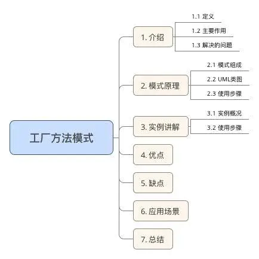
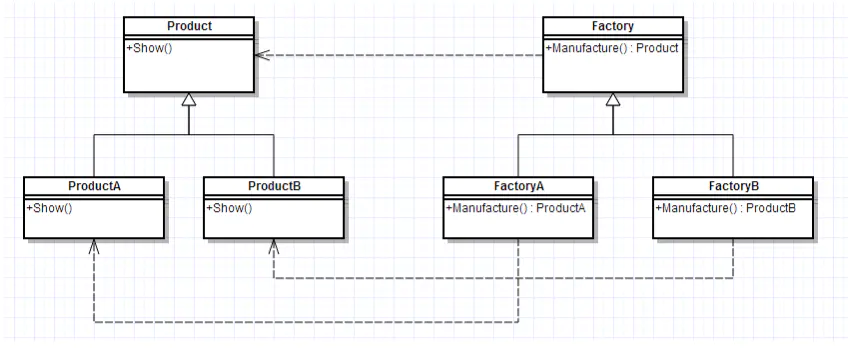

# 工厂方法模式（Factory Method）

简单工厂模式存在一系列问题：

- 工厂类集中了所有实例（产品）的创建逻辑，一旦这个工厂不能正常工作，整个系统都会受到影响；

- 违背“开放 - 关闭原则”，一旦添加新产品就不得不修改工厂类的逻辑，这样就会造成工厂逻辑过于复杂。

- 简单工厂模式由于使用了静态工厂方法，静态方法不能被继承和重写，会造成工厂角色无法形成基于继承的等级结构。

为了解决上述的问题，我们又使用了一种新的设计模式：工厂方法模式。

## 目录



## 1. 介绍

#### 1.1 定义

工厂方法模式，又称工厂模式、多态工厂模式和虚拟构造器模式，通过定义工厂父类负责定义创建对象的公共接口，而子类则负责生成具体的对象。

#### 1.2 主要作用

将类的实例化（具体产品的创建）延迟到工厂类的子类（具体工厂）中完成，即由子类来决定应该实例化（创建）哪一个类。

#### 1.3 解决的问题

工厂一旦需要生产新产品就需要修改工厂类的方法逻辑，违背了“开放 - 关闭原则”

> 1. 即 **简单工厂模式** 的缺点
> 2. 之所以可以解决简单工厂的问题，是因为工厂方法模式把具体产品的创建推迟到工厂类的子类（具体工厂）中，此时工厂类不再负责所有产品的创建，而只是给出具体工厂必须实现的接口，这样工厂方法模式在添加新产品的时候就不修改工厂类逻辑而是添加新的工厂子类，符合开放封闭原则，克服了简单工厂模式中缺点

## 2. 模式原理



#### 2.2 模式组成

|        **组成（角色）**        |              **关系**              |                        **作用**                         |
| :----------------------------: | :--------------------------------: | :-----------------------------------------------------: |
|     抽象产品（`Product`）      |           具体产品的父类           |                 描述具体产品的公共接口                  |
| 具体产品（`Concrete Product`） | 抽象产品的子类；工厂类创建的目标类 |                   描述生产的具体产品                    |
|     抽象工厂（`Creator`）      |           具体工厂的父类           |                 描述具体工厂的公共接口                  |
| 具体工厂（`Concrete Creator`） |     抽象工厂的子类；被外界调用     | 描述具体工厂；实现`FactoryMethod`工厂方法创建产品的实例 |

#### 2.3 使用步骤

**步骤1** 创建 **抽象工厂类** ，定义具体工厂的公共接口；

**步骤2** 创建 **抽象产品类** ，定义具体产品的公共接口；

**步骤3** 创建 **具体产品类**（继承抽象产品类） & 定义生产的具体产品；

**步骤4** 创建 **具体工厂类**（继承抽象工厂类），定义创建对应具体产品实例的方法；

**步骤5** 外界通过调用具体工厂类的方法，从而创建不同 **具体产品类的实例**

## 3. 实例讲解

接下来我用一个实例来对工厂方法模式进行更深一步的介绍。

#### 3.1 实例概况

- 背景：小成有一间塑料加工厂（仅生产`A`类产品）；随着客户需求的变化，客户需要生产`B`类产品；

- 冲突：改变原有塑料加工厂的配置和变化非常困难，假设下一次客户需要再发生变化，再次改变将增大非常大的成本；
- 解决方案：小成决定置办 **塑料分厂B** 来生产`B`类产品；

> 即工厂方法模式

#### 3.2 使用步骤

**步骤1：** 创建 **抽象工厂类**，定义具体工厂的公共接口

```java
abstract class Factory{
    public abstract Product Manufacture();
}
```

**步骤2：** 创建 **抽象产品类** ，定义具体产品的公共接口；

```java
abstract class Product{
    public abstract void Show();
}
```

**步骤3：** 创建 **具体产品类**（继承抽象产品类）， 定义生产的具体产品；

```java
// 具体产品A类
class  ProductA extends  Product{
    @Override
    public void Show() {
        System.out.println("生产出了产品A");
    }
}

// 具体产品B类
class  ProductB extends  Product{
    @Override
    public void Show() {
        System.out.println("生产出了产品B");
    }
}
```

**步骤4** 创建 **具体工厂类**（继承抽象工厂类），定义创建对应具体产品实例的方法；

```java
// 工厂A类 - 生产A类产品
class  FactoryA extends Factory{
    @Override
    public Product Manufacture() {
        return new ProductA();
    }
}

// 工厂B类 - 生产B类产品
class  FactoryB extends Factory{
    @Override
    public Product Manufacture() {
        return new ProductB();
    }
}
```

**步骤5** 外界通过调用具体工厂类的方法，从而创建不同 **具体产品类的实例**

```java
// 生产工作流程
public class FactoryPattern {
    public static void main(String[] args){
        // 客户要产品A
        FactoryA factoryA = new FactoryA();
        factoryA.Manufacture().Show();

        // 客户要产品B
        FactoryB factoryB = new FactoryB();
        factoryB.Manufacture().Show();
    }
}
```

结果：

```shell
生产出了产品A
生产出了产品B
```

## 4. 优点

* 更符合开-闭原则

新增一种产品时，只需要增加相应的具体产品类和相应的工厂子类即可

> 简单工厂模式需要修改工厂类的判断逻辑

* 符合单一职责原则

每个具体工厂类只负责创建对应的产品

> 简单工厂中的工厂类存在复杂的switch逻辑判断

- 不使用静态工厂方法，可以形成基于继承的等级结构。

> 简单工厂模式的工厂类使用静态工厂方法

总结：工厂模式可以说是简单工厂模式的进一步抽象和拓展，在保留了简单工厂的封装优点的同时，让扩展变得简单，让继承变得可行，增加了多态性的体现。

## 5. 缺点

* 添加新产品时，除了增加新产品类外，还要提供与之对应的具体工厂类，系统类的个数将成对增加，在一定程度上增加了系统的复杂度；同时，有更多的类需要编译和运行，会给系统带来一些额外的开销；

- 由于考虑到系统的可扩展性，需要引入抽象层，在客户端代码中均使用抽象层进行定义，增加了系统的抽象性和理解难度。

- 虽然保证了工厂方法内的对修改关闭，但对于使用工厂方法的类，如果要更换另外一种产品，仍然需要修改实例化的具体工厂类；

- 一个具体工厂只能创建一种具体产品

## 6. 应用场景

在了解了优缺点后，我总结了工厂方法模式的应用场景：

* 当一个类不知道它所需要的对象的类时

在工厂方法模式中，客户端不需要知道具体产品类的类名，只需要知道所对应的工厂即可；

* 当一个类希望通过其子类来指定创建对象时

在工厂方法模式中，对于抽象工厂类只需要提供一个创建产品的接口，而由其子类来确定具体要创建的对象，利用面向对象的多态性和里氏代换原则，在程序运行时，子类对象将覆盖父类对象，从而使得系统更容易扩展。

* 将创建对象的任务委托给多个工厂子类中的某一个，客户端在使用时可以无须关心是哪一个工厂子类创建产品子类，需要时再动态指定，可将具体工厂类的类名存储在配置文件或数据库中。

## 7. 总结

* 本文主要对 **工厂方法模式** 进行了全面介绍

## 8.工厂方法模式`golang`实现

工厂方法模式使用子类的方式延迟生成对象到子类中实现。

Go中不存在继承 所以使用匿名组合来实现

#### factorymethod.go

```go
package factorymethod

// Operator 是被封装的实际类接口
type Operator interface {
    SetA(int)
    SetB(int)
    Result() int
}

// OperatorFactory 是工厂接口
type OperatorFactory interface {
    Create() Operator
}

// OperatorBase 是Operator 接口实现的基类，封装公用方法
type OperatorBase struct {
    a, b int
}

// SetA 设置 A
func (o *OperatorBase) SetA(a int) {
    o.a = a
}

// SetB 设置 B
func (o *OperatorBase) SetB(b int) {
    o.b = b
}

// PlusOperatorFactory 是 PlusOperator 的工厂类
type PlusOperatorFactory struct{}

func (PlusOperatorFactory) Create() Operator {
    return &PlusOperator{
        OperatorBase: &OperatorBase{},
    }
}

// PlusOperator Operator 的实际加法实现
type PlusOperator struct {
    *OperatorBase
}

// Result 获取结果
func (o PlusOperator) Result() int {
    return o.a + o.b
}

// MinusOperatorFactory 是 MinusOperator 的工厂类
type MinusOperatorFactory struct{}

func (MinusOperatorFactory) Create() Operator {
    return &MinusOperator{
        OperatorBase: &OperatorBase{},
    }
}

// MinusOperator Operator 的实际减法实现
type MinusOperator struct {
    *OperatorBase
}

// Result 获取结果
func (o MinusOperator) Result() int {
    return o.a - o.b
}
```

#### factorymethod_test.go

```go
package factorymethod

import "testing"

func compute(factory OperatorFactory, a, b int) int {
    op := factory.Create()
    op.SetA(a)
    op.SetB(b)
    return op.Result()
}

func TestOperator(t *testing.T) {
    var (
        factory OperatorFactory
    )

    factory = PlusOperatorFactory{}
    if compute(factory, 1, 2) != 3 {
        t.Fatal("error with factory method pattern")
    }

    factory = MinusOperatorFactory{}
    if compute(factory, 4, 2) != 2 {
        t.Fatal("error with factory method pattern")
    }
}
```

