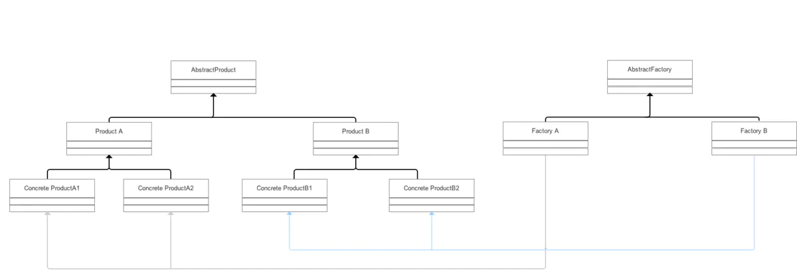

# 抽象工厂模式（Abstract Factory）

## 前言

* 工厂方法模式存在一个严重的问题：一个具体工厂只能创建一类产品；
* 而在实际过程中，一个工厂往往需要生产多类产品；
* 为了解决上述的问题，我们又使用了一种新的设计模式：抽象工厂模式。

## 目录


## 1. 介绍

#### 1.1 定义

抽象工厂模式，即 `Abstract Factory Pattern`，提供一个创建一系列相关或相互依赖对象的接口，而无须指定它们具体的类；具体的工厂负责实现具体的产品实例。 

> 抽象工厂模式与工厂方法模式最大的区别：抽象工厂中每个工厂可以创建多种类的产品；而工厂方法每个工厂只能创建一类

#### 1.2 主要作用

允许使用抽象的接口来创建一组相关产品，而不需要知道或关心实际生产出的具体产品是什么，这样就可以从具体产品中被解耦。

#### 1.3 解决的问题

每个工厂只能创建一类产品

> 即 **工厂方法模式** 的缺点

## 2. 模式原理

#### 2.1 UML类图



#### 2.2 模式组成

|        **组成（角色）**         |              **关系**              |                        **作用**                         |
| :-----------------------------: | :--------------------------------: | :-----------------------------------------------------: |
| 抽象产品族（`AbstractProduct`） |           抽象产品的父类           |                 描述抽象产品的公共接口                  |
|      抽象产品（`Product`）      |           具体产品的父类           |                 描述具体产品的公共接口                  |
| 具体产品（`Concrete Product`）  | 抽象产品的子类；工厂类创建的目标类 |                   描述生产的具体产品                    |
|      抽象工厂（`Creator`）      |           具体工厂的父类           |                 描述具体工厂的公共接口                  |
| 具体工厂（`Concrete Creator`）  |     抽象工厂的子类；被外界调用     | 描述具体工厂；实现`FactoryMethod`工厂方法创建产品的实例 |

如何理解抽象产品族、抽象产品和具体产品的区别呢？请看下图


#### 2.3 使用步骤

 **步骤1：** 创建 **抽象工厂类** ，定义具体工厂的公共接口；
 **步骤2：** 创建 **抽象产品族类**  ，定义抽象产品的公共接口；
 **步骤3：** 创建 **抽象产品类**  （继承抽象产品族类），定义具体产品的公共接口；
 **步骤4：** 创建 **具体产品类** （继承抽象产品类） , 定义生产的具体产品；
 **步骤5：** 创建 **具体工厂类** （继承抽象工厂类），定义创建对应具体产品实例的方法；
 **步骤6：** 客户端通过实例化具体的工厂类，并调用其创建不同目标产品的方法创建不同具体产品类的实例

## 3. 实例讲解

接下来我用一个实例来对抽象工厂模式进行更深一步的介绍。

#### 3.1 实例概况

- 背景：小成有两间塑料加工厂（`A`厂仅生产容器类产品；`B`厂仅生产模具类产品）；随着客户需求的变化，`A`厂所在地的客户需要也模具类产品，`B`厂所在地的客户也需要容器类产品；

- 冲突：没有资源（资金+租位）在当地分别开设多一家注塑分厂

- 解决方案：在原有的两家塑料厂里增设生产需求的功能，即`A`厂能生产容器+模具产品；`B`厂间能生产模具+容器产品。

> 即抽象工厂模式

#### 3.2 使用步骤

**步骤1：** 创建 **抽象工厂类**，定义具体工厂的公共接口

```java
abstract class Factory{
    public abstract Product ManufactureContainer();
    public abstract Product ManufactureMould();
}
```

**步骤2：** 创建 **抽象产品族类** ，定义具体产品的公共接口；

```java
abstract class AbstractProduct{
    public abstract void Show();
}
```

**步骤3：** 创建 **抽象产品类** ，定义具体产品的公共接口；

```java
// 容器产品抽象类
abstract class ContainerProduct extends AbstractProduct{
    @Override
    public abstract void Show();
}

// 模具产品抽象类
abstract class MouldProduct extends AbstractProduct{
    @Override
    public abstract void Show();
}

```

**步骤4：** 创建 **具体产品类**（继承抽象产品类）， 定义生产的具体产品；

```java
// 容器产品A类
class ContainerProductA extends ContainerProduct{
    @Override
    public void Show() {
        System.out.println("生产出了容器产品A");
    }
}

// 容器产品B类
class ContainerProductB extends ContainerProduct{
    @Override
    public void Show() {
        System.out.println("生产出了容器产品B");
    }
}

// 模具产品A类
class MouldProductA extends MouldProduct{

    @Override
    public void Show() {
        System.out.println("生产出了模具产品A");
    }
}

// 模具产品B类
class MouldProductB extends MouldProduct{

    @Override
    public void Show() {
        System.out.println("生产出了模具产品B");
    }
}
```

**步骤5：** 创建 **具体工厂类**（继承抽象工厂类），定义创建对应具体产品实例的方法；

```java
// A厂 - 生产模具+容器产品
class FactoryA extends Factory{

    @Override
    public Product ManufactureContainer() {
        return new ContainerProductA();
    }

    @Override
    public Product ManufactureMould() {
        return new MouldProductA();
    }
}

// B厂 - 生产模具+容器产品
class FactoryB extends Factory{

    @Override
    public Product ManufactureContainer() {
        return new ContainerProductB();
    }

    @Override
    public Product ManufactureMould() {
        return new MouldProductB();
    }
}
```

**步骤6：** 客户端通过实例化具体的工厂类，并调用其创建不同目标产品的方法创建不同具体产品类的实例

```java
//生产工作流程
public class AbstractFactoryPattern {
    public static void main(String[] args){
        FactoryA factoryA = new FactoryA();
        FactoryB factoryB = new FactoryB();
        // A厂当地客户需要容器产品A
        factoryA.ManufactureContainer().Show();
        // A厂当地客户需要模具产品A
        factoryA.ManufactureMould().Show();

        // B厂当地客户需要容器产品B
        factoryB.ManufactureContainer().Show();
        // B厂当地客户需要模具产品B
        factoryB.ManufactureMould().Show();

    }
}

```

结果：

```shell
生产出了容器产品A
生产出了容器产品B
生产出了模具产品A
生产出了模具产品B
```

## 4. 优点

* 抽象工厂模式将具体产品的创建延迟到具体工厂的子类中，这样将对象的创建封装起来，可以减少客户端与具体产品类之间的依赖，从而使系统耦合度低，这样更有利于后期的维护和扩展；

- 更符合开-闭原则
  新增一种产品类时，只需要增加相应的具体产品类和相应的工厂子类即可

> 简单工厂模式需要修改工厂类的判断逻辑

- 符合单一职责原则
  每个具体工厂类只负责创建对应的产品

> 简单工厂中的工厂类存在复杂的switch逻辑判断

- 不使用静态工厂方法，可以形成基于继承的等级结构。

> 简单工厂模式的工厂类使用静态工厂方法

## 5. 缺点

抽象工厂模式很难支持新种类产品的变化。

这是因为抽象工厂接口中已经确定了可以被创建的产品集合，如果需要添加新产品，此时就必须去修改抽象工厂的接口，这样就涉及到抽象工厂类的以及所有子类的改变，这样也就违背了“开发——封闭”原则。

> 对于新的产品族符合开-闭原则；对于新的产品种类不符合开-闭原则，这一特性称为开-闭原则的倾斜性。

## 6. 应用场景

在了解了优缺点后，我总结了工厂方法模式的应用场景：

- 一个系统不要求依赖产品类实例如何被创建、组合和表达，这点也是所有工厂模式应用的前提。

- 这个系统有多个系列产品，而系统中只消费其中某一系列产品

- 系统要求提供一个产品类的库，所有产品以同样的接口出现，客户端不需要依赖具体实现。

## 7. 总结

- 本文主要对 **抽象工厂模式** 进行了全面介绍

## 8. 抽象工厂模式的`golang`实现

抽象工厂模式用于生成产品族的工厂，所生成的对象是有关联的。

如果抽象工厂退化成生成的对象无关联则成为工厂函数模式。

比如本例子中使用RDB和XML存储订单信息，抽象工厂分别能生成相关的主订单信息和订单详情信息。
如果业务逻辑中需要替换使用的时候只需要改动工厂函数相关的类就能替换使用不同的存储方式了。工厂函数模式。

#### abstractfactory.go

```go
package abstractfactory

import "fmt"

// OrderMainDAO 为订单主记录
type OrderMainDAO interface {
    SaveOrderMain()
}

// OrderDetailDAO 为订单详情纪录
type OrderDetailDAO interface {
    SaveOrderDetail()
}

// DAOFactory DAO 抽象模式工厂接口
type DAOFactory interface {
    CreateOrderMainDAO() OrderMainDAO
    CreateOrderDetailDAO() OrderDetailDAO
}

// RDBMainDAP 为关系型数据库的OrderMainDAO实现
type RDBMainDAO struct{}

// SaveOrderMain ...
func (*RDBMainDAO) SaveOrderMain() {
    fmt.Print("rdb main save\n")
}

// RDBDetailDAO 为关系型数据库的OrderDetailDAO实现
type RDBDetailDAO struct{}

// SaveOrderDetail ...
func (*RDBDetailDAO) SaveOrderDetail() {
    fmt.Print("rdb detail save\n")
}

// RDBDAOFactory 是RDB 抽象工厂实现
type RDBDAOFactory struct{}

func (*RDBDAOFactory) CreateOrderMainDAO() OrderMainDAO {
    return &RDBMainDAO{}
}

func (*RDBDAOFactory) CreateOrderDetailDAO() OrderDetailDAO {
    return &RDBDetailDAO{}
}

// XMLMainDAO XML存储
type XMLMainDAO struct{}

// SaveOrderMain ...
func (*XMLMainDAO) SaveOrderMain() {
    fmt.Print("xml main save\n")
}

// XMLDetailDAO XML存储
type XMLDetailDAO struct{}

// SaveOrderDetail ...
func (*XMLDetailDAO) SaveOrderDetail() {
    fmt.Print("xml detail save")
}

// XMLDAOFactory 是RDB 抽象工厂实现
type XMLDAOFactory struct{}

func (*XMLDAOFactory) CreateOrderMainDAO() OrderMainDAO {
    return &XMLMainDAO{}
}

func (*XMLDAOFactory) CreateOrderDetailDAO() OrderDetailDAO {
    return &XMLDetailDAO{}
}
```

#### abstractfactory_test.go

```go
package abstractfactory

func getMainAndDetail(factory DAOFactory) {
    factory.CreateOrderMainDAO().SaveOrderMain()
    factory.CreateOrderDetailDAO().SaveOrderDetail()
}

func ExampleRdbFactory() {
    var factory DAOFactory
    factory = &RDBDAOFactory{}
    getMainAndDetail(factory)
    // Output:
    // rdb main save
    // rdb detail save
}

func ExampleXmlFactory() {
    var factory DAOFactory
    factory = &XMLDAOFactory{}
    getMainAndDetail(factory)
    // Output:
    // xml main save
    // xml detail save
}
```

