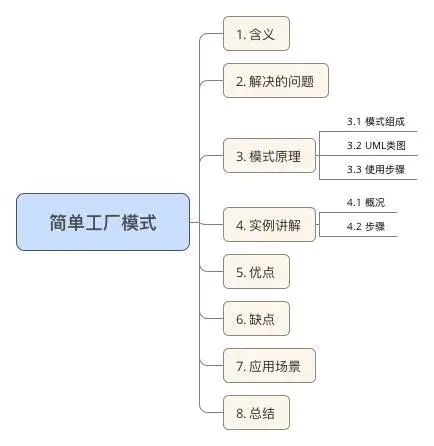
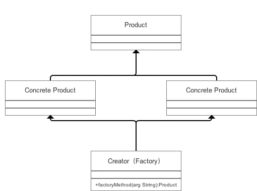

# 简单工厂模式（Simple Factory Pattern）

## 目录



## 1. 含义

- 简单工厂模式又叫静态方法模式（因为工厂类定义了一个静态方法）
- 现实生活中，工厂是负责生产产品的；同样在设计模式中，简单工厂模式我们可以理解为负责生产对象的一个类，称为“工厂类”。

## 2. 解决的问题

将“类实例化的操作”与“使用对象的操作”分开，让使用者不用知道具体参数就可以实例化出所需要的“产品”类，从而避免了在客户端代码中显式指定，实现了解耦。

> 即使用者可直接消费产品而不需要知道其生产的细节

## 3. 模式原理

#### 3.1 模式组成

|         组成（角色）         |              **关系**              |                   **作用**                   |
| :--------------------------: | :--------------------------------: | :------------------------------------------: |
|     抽象产品（Product）      |           具体产品的父类           |              描述产品的公共接口              |
| 具体产品（Concrete Product） | 抽象产品的子类；工厂类创建的目标类 |              描述生产的具体产品              |
|       工厂（Creator）        |             被外界调用             | 根据传入不同参数从而创建不同具体产品类的实例 |

#### 3.2 UML类图



#### 3.3 使用步骤

- 创建 **抽象产品类** & 定义具体产品的公共接口；
- 创建 **具体产品类**（继承抽象产品类） & 定义生产的具体产品；
- 创建 **工厂类**，通过创建静态方法根据传入不同参数从而创建不同具体产品类的实例；
- 外界通过调用工厂类的静态方法，**传入不同参数** 从而创建不同 **具体产品类的实例**

## 4. 实例

接下来我用一个实例来对简单工厂模式进行更深一步的介绍。

#### 4.1 实例概况

- 背景：小成有一个塑料生产厂，用来做塑料加工生意
- 目的：最近推出了3个产品，小成希望使用 **简单工厂模式** 实现3款产品的生产

#### 4.2 使用步骤

实现代码如下：

**步骤1.**  创建抽象产品类，定义具体产品的公共接口

```java
abstract class Product{
    public abstract void Show();
}
```

**步骤2.**  创建具体产品类（继承抽象产品类），定义生产的具体产品

```java

// 具体产品类A
class  ProductA extends  Product{

    @Override
    public void Show() {
        System.out.println("生产出了产品A");
    }
}

// 具体产品类B
class  ProductB extends  Product{

    @Override
    public void Show() {
        System.out.println("生产出了产品C");
    }
}

// 具体产品类C
class  ProductC extends  Product{

    @Override
    public void Show() {
        System.out.println("生产出了产品C");
    }
}
```

**步骤3.**  创建工厂类，通过创建静态方法从而根据传入不同参数创建不同具体产品类的实例

```java
class  Factory {
    public static Product Manufacture(String ProductName){
        // 工厂类里用switch语句控制生产哪种商品；
        // 使用者只需要调用工厂类的静态方法就可以实现产品类的实例化。
        switch (ProductName){
            case "A":
                return new ProductA();
            case "B":
                return new ProductB();
            case "C":
                return new ProductC();
            default:
                return null;
        }
    }
}
```


**步骤4.**  外界通过调用工厂类的静态方法，传入不同参数从而创建不同具体产品类的实例

```java
// 工厂产品生产流程
public class SimpleFactoryPattern {
    public static void main(String[] args){
        Factory factory = new Factory();

        // 客户要产品A
        try {
		// 调用工厂类的静态方法 & 传入不同参数从而创建产品实例
            factory.Manufacture("A").Show();
        }catch (NullPointerException e){
            System.out.println("没有这一类产品");
        }

        // 客户要产品B
        try {
            factory.Manufacture("B").Show();
        }catch (NullPointerException e){
            System.out.println("没有这一类产品");
        }

        // 客户要产品C
        try {
            factory.Manufacture("C").Show();
        }catch (NullPointerException e){
            System.out.println("没有这一类产品");
        }

        // 客户要产品D
        try {
            factory.Manufacture("D").Show();
        }catch (NullPointerException e){
            System.out.println("没有这一类产品");
        }
    }
}

```

**结果输出：**

```java
生产出了产品A
生产出了产品C
生产出了产品C
没有这一类产品
```

## 5. 优点

- 将创建实例的工作与使用实例的工作分开，使用者不必关心类对象如何创建，实现了解耦；

- 把初始化实例时的工作放到工厂里进行，使代码更容易维护。 更符合面向对象的原则 & 面向接口编程，而不是面向实现编程。

## 6. 缺点

- 工厂类集中了所有实例（产品）的创建逻辑，一旦这个工厂不能正常工作，整个系统都会受到影响；

- 违背“开放 - 关闭原则”，一旦添加新产品就不得不修改工厂类的逻辑，这样就会造成工厂逻辑过于复杂。

- 简单工厂模式由于使用了静态工厂方法，静态方法不能被继承和重写，会造成工厂角色无法形成基于继承的等级结构。

  ## 7. 应用场景

在了解了优缺点后，我们知道了简单工厂模式的应用场景：

- 客户如果只知道传入工厂类的参数，对于如何创建对象的逻辑不关心时；

- 当工厂类负责创建的对象（具体产品）比较少时。

## 8. 总结

- 本文主要对 **简单工厂模式** 进行了全面介绍

## 9.简单工厂模式`golang`实现

#### simple.go代码

```go
package simplefactory

import "fmt"

// API is interface
type API interface {
    Say(name string) string
}

// NewAPI return Api instance by type
func NewAPI(t int) API {
    if t == 1 {
        return &hiAPI{}
    } else if t == 2 {
        return &helloAPI{}
    }
    return nil
}

// hiAPI is one of API implement
type hiAPI struct{}

// Say hi to name
func (*hiAPI) Say(name string) string {
    return fmt.Sprintf("Hi, %s", name)
}

// HelloAPI is another API implement
type helloAPI struct{}

// Say hello to name
func (*helloAPI) Say(name string) string {
    return fmt.Sprintf("Hello, %s", name)
}
```

#### simple_test.go代码

```go
package simplefactory

import "testing"

// TestType1 test get hiapi with factory
func TestType1(t *testing.T) {
    api := NewAPI(1)
    s := api.Say("Tom")
    if s != "Hi, Tom" {
        t.Fatal("Type1 test fail")
    }
}

func TestType2(t *testing.T) {
    api := NewAPI(2)
    s := api.Say("Tom")
    if s != "Hello, Tom" {
        t.Fatal("Type2 test fail")
    }
}
```

