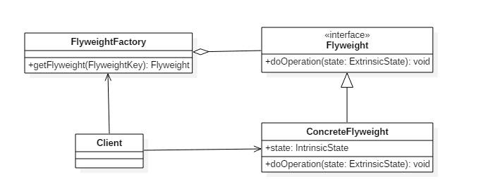

# 享元模式(Flyweight Pattern)

## 意图

利用共享的方式来支持大量细粒度的对象，这些对象一部分内部状态是相同的。

## 类图

- `Flyweight`: 享元对象
- `IntrinsicState`: 内部状态，享元对象共享内部状态
- `ExtrinsicState`: 外部状态，每个享元对象的外部状态不同



## 实现

```java
public interface Flyweight {
    void doOperation(String extrinsicState);
}
```

```java
public class ConcreteFlyweight implements Flyweight {

    private String intrinsicState;

    public ConcreteFlyweight(String intrinsicState) {
        this.intrinsicState = intrinsicState;
    }

    @Override
    public void doOperation(String extrinsicState) {
        System.out.println("Object address: " + System.identityHashCode(this));
        System.out.println("IntrinsicState: " + intrinsicState);
        System.out.println("ExtrinsicState: " + extrinsicState);
    }
}
```

```java
public class FlyweightFactory {

    private HashMap<String, Flyweight> flyweights = new HashMap<>();

    Flyweight getFlyweight(String intrinsicState) {
        if (!flyweights.containsKey(intrinsicState)) {
            Flyweight flyweight = new ConcreteFlyweight(intrinsicState);
            flyweights.put(intrinsicState, flyweight);
        }
        return flyweights.get(intrinsicState);
    }
}
```

```java
public class Client {
    public static void main(String[] args) {
        FlyweightFactory factory = new FlyweightFactory();
        Flyweight flyweight1 = factory.getFlyweight("aa");
        Flyweight flyweight2 = factory.getFlyweight("aa");
        flyweight1.doOperation("x");
        flyweight2.doOperation("y");
    }
}
```

```shell
Object address: 1163157884
IntrinsicState: aa
ExtrinsicState: x
Object address: 1163157884
IntrinsicState: aa
ExtrinsicState: y
```

## 享元模式的`golang`实现

享元模式从对象中剥离出不发生改变且多个实例需要的重复数据，独立出一个享元，使多个对象共享，从而节省内存以及减少对象数量。

#### flyweight.go

```go
package flyweight

import "fmt"

type ImageFlyweightFactory struct {
    maps map[string]*ImageFlyweight
}

var imageFactory *ImageFlyweightFactory

func GetImageFlyweightFactory() *ImageFlyweightFactory {
    if imageFactory == nil {
        imageFactory = &ImageFlyweightFactory{
            maps: make(map[string]*ImageFlyweight),
        }
    }
    return imageFactory
}

func (f *ImageFlyweightFactory) Get(filename string) *ImageFlyweight {
    image := f.maps[filename]
    if image == nil {
        image = NewImageFlyweight(filename)
        f.maps[filename] = image
    }

    return image
}

type ImageFlyweight struct {
    data string
}

func NewImageFlyweight(filename string) *ImageFlyweight {
    // Load image file
    data := fmt.Sprintf("image data %s", filename)
    return &ImageFlyweight{
        data: data,
    }
}

func (i *ImageFlyweight) Data() string {
    return i.data
}

type ImageViewer struct {
    *ImageFlyweight
}

func NewImageViewer(filename string) *ImageViewer {
    image := GetImageFlyweightFactory().Get(filename)
    return &ImageViewer{
        ImageFlyweight: image,
    }
}

func (i *ImageViewer) Display() {
    fmt.Printf("Display: %s\n", i.Data())
}
```

#### flyweight_test.go

```go
package flyweight

import "testing"

func ExampleFlyweight() {
    viewer := NewImageViewer("image1.png")
    viewer.Display()
    // Output:
    // Display: image data image1.png
}

func TestFlyweight(t *testing.T) {
    viewer1 := NewImageViewer("image1.png")
    viewer2 := NewImageViewer("image1.png")

    if viewer1.ImageFlyweight != viewer2.ImageFlyweight {
        t.Fail()
    }
}
```

