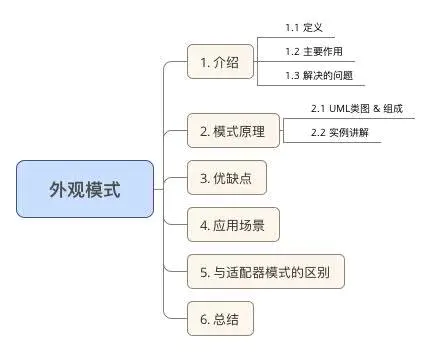
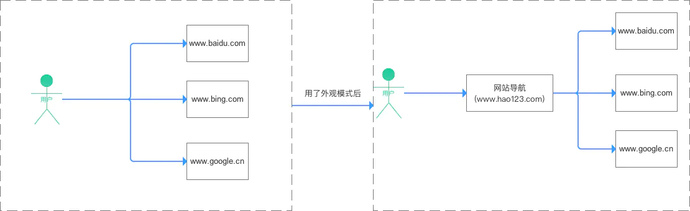
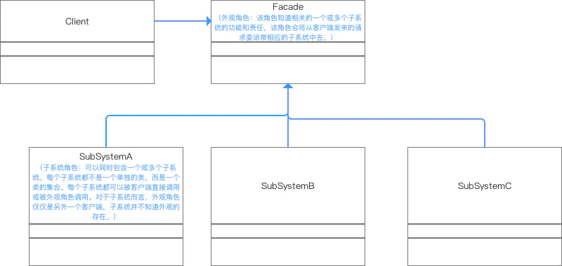

# 外观模式（Facade Pattern）

## 目录



## 1. 介绍

#### 1.1 定义

定义了一个高层、统一的接口，外部与通过这个统一的接口对子系统中的一群接口进行访问。

> 通过创建一个统一的外观类，用来包装子系统中一个 / 多个复杂的类，客户端可通过调用外观类的方法来调用内部子系统中所有方法

如下图：


给个网站的导航例子你就懂了：以前我需要在搜索栏逐个搜索网站地址；有了网站导航（用了外观模式）后，就方便很多了



#### 1.2 主要作用

- 实现客户类与子系统类的松耦合
- 降低原有系统的复杂度
- 提高了客户端使用的便捷性，使得客户端无须关心子系统的工作细节，通过外观角色即可调用相关功能。

> 1. 引入外观角色之后，用户只需要与外观角色交互；
> 2. 用户与子系统之间的复杂逻辑关系由外观角色来实现

#### 1.3 解决的问题

- 避免了系统与系统之间的高耦合度
- 使得复杂的子系统用法变得简单

## 2. 模式原理

#### 2.1 UML类图 & 组成



#### 2.2 实例讲解

接下来我用一个实例来对建造者模式进行更深一步的介绍。

**a. 实例概况**

- 背景：小成的爷爷已经80岁了，一个人在家生活：每次都需要打开灯、打开电视、打开空调；睡觉时关闭灯、关闭电视、关闭空调；
- 冲突：行动不方便，走过去关闭那么多电器很麻烦，代码如下：

1.电器类：

```java
// 灯类
public class SubSystemA_Light {  
     public void on(){  
        System.out.println("打开了灯....");  
    }  
      
     public void off(){  
        System.out.println("关闭了灯....");  
    }  
}  

// 电视类
public class SubSystemB_Television {  
     public void on(){  
        System.out.println("打开了电视....");  
    }  
      
     public void off(){  
        System.out.println("关闭了电视....");  
    }  
}  

// 空调类
public class SubSystemC_Aircondition {  
     public void on(){  
        System.out.println("打开了电视....");  
    }  
      
     public void off(){  
        System.out.println("关闭了电视....");  
    }  
}  
```

2. 客户端调用：小成爷爷使用电器情况

```java

public class Facade_Pattern{ 
      public static void main(String[] args){
        {
            SubSystemA_Light light = new SubSystemA_Light();
            SubSystemB_Television television = new SubSystemB_Television();
            SubSystemC_Aircondition aircondition = new SubSystemC_Aircondition();

            // 起床后开电器
            System.out.prinln("起床了")；
            light.on()；
            television.on();
            aircondition.on()；
            System.out.prinln("可以看电视了")；

           // 睡觉时关电器
            System.out.prinln("睡觉了")；
            light.off()；
            television.off();
            aircondition.off()；
            System.out.prinln("可以睡觉了")；
        }
    }
```

结果

```shell
起床了
打开了灯
打开了电视
打开了空调
可以看电视了

睡觉了
关闭了灯
关闭了电视
关闭了空调
可以睡觉了
```

从上面可以看出，在不使用外观模式的情况下，小成爷爷需要对每个电器都进行操作，非常不方便

> 客户端与三个子系统都发生了耦合，使得客户端程序依赖于子系统

## 解决方案

小成买了一个智能家具控制器（外观对象/统一接口）给他爷爷，他爷爷只需要一键就能打开/关闭 灯、电视机、空调

> 1. 即用外观模式来为所有子系统设计一个统一的接口
> 2. 客户端只需要调用外观类中的方法就可以了，简化了客户端的操作

1. 电器类同上
2. 外观类：智能遥控器

```java
public class Facade{
      SubSystemA_Light light；
      SubSystemB_Television television ；
      SubSystemC_Aircondition aircondition；
   
      // 传参
    public Facade(SubSystemA_Light light,SubSystemB_Television television,SubSystemC_Aircondition aircondition){  
        this.light = light;  
        this.television  = television ;  
        this.aircondition =aircondition;  
    }  
      // 起床后一键开电器
      public void on{
            System.out.prinln("起床了")； 
            light.on()； 
            television.on(); 
            aircondition.on()；
        }

     public void off{
         // 睡觉时一键关电器
         System.out.prinln("睡觉了")； 
         light.off()； 
         television.off(); 
         aircondition.off()； 
     }
}
```

3. 客户端调用：爷爷使用智能遥控器的时候

```java
public class Facade_Pattern{ 
      public static void main(String[] args){
        {
            //实例化电器类
            SubSystemA_Light light = new SubSystemA_Light();
            SubSystemB_Television television = new SubSystemB_Television();
            SubSystemC_Aircondition aircondition = new SubSystemC_Aircondition();
            
            //传参
            Facade facade = new Facade(light,television,aircondition);
            
            //客户端直接与外观对象进行交互
            facade.on;
            System.out.prinln("可以看电视了")； 
            facade.off;
            System.out.prinln("可以睡觉了")； 
```

结果

```shell
起床了
打开了灯
打开了电视
打开了空调
可以看电视了

睡觉了
关闭了灯
关闭了电视
关闭了空调
可以睡觉了
```

## 3. 优缺点

在全面解析完后，我来分析下其优缺点：

#### 3.1 优点

* 降低了客户类与子系统类的耦合度，实现了子系统与客户之间的松耦合关系

> 1. 只是提供了一个访问子系统的统一入口，并不影响用户直接使用子系统类
> 2. 减少了与子系统的关联对象，实现了子系统与客户之间
>    的松耦合关系，松耦合使得子系统的组件变化不会影响到它的客户。

* 外观模式对客户屏蔽了子系统组件，从而简化了接口，减少了客户处理的对象数目并使子系统的使用更加简单。

> 1. 引入外观角色之后，用户只需要与外观角色交互；
> 2. 用户与子系统之间的复杂逻辑关系由外观角色来实现

* 降低原有系统的复杂度和系统中的编译依赖性，并简化了系统在不同平台之间的移植过程

> 因为编译一个子系统一般不需要编译所有其他的子系统。一个子系统的修改对其他子系统没有任何影响，而且子系统内部变化也不会影响到外观对象。

#### 3.2 缺点

- 在不引入抽象外观类的情况下，增加新的子系统可能需要修改外观类或客户端的源代码，违背了“开闭原则”

- 不能很好地限制客户使用子系统类，如果对客户访问子系统类做太多的限制则减少了可变性和灵活性。

## 4. 应用场景

- 要为一个复杂的子系统对外提供一个简单的接口
- 提供子系统的独立性
- 客户程序与多个子系统之间存在很大的依赖性

> 引入外观类将子系统与客户以及其他子系统解耦，可以提高子系统的独立性和可移植性。

- 在层次化结构中，可以使用外观模式定义系统中每一层的入口

>  层与层之间不直接产生联系，而通过外观类建立联系，降低层之间的耦合度。

## 5. 与适配器模式的区别

- 外观模式的实现核心主要是——由外观类去保存各个子系统的引用，实现由一个统一的外观类去包装多个子系统类，然而客户端只需要引用这个外观类，然后由外观类来调用各个子系统中的方法。

* 这样的实现方式非常类似适配器模式，然而外观模式与适配器模式不同的是： **适配器模式是将一个对象包装起来以改变其接口，而外观是将一群对象 ”包装“起来以简化其接口。它们的意图是不一样的，适配器是将接口转换为不同接口，而外观模式是提供一个统一的接口来简化接口** 。

## 6. 总结

- 本文主要对 **外观模式** 进行了全面介绍

## 7.外观模式`golang`实现

API 为facade 模块的外观接口，大部分代码使用此接口简化对facade类的访问。

facade模块同时暴露了a和b 两个Module 的NewXXX和interface，其它代码如果需要使用细节功能时可以直接调用。

#### facade.go

```go
package facade

import "fmt"

func NewAPI() API {
    return &apiImpl{
        a: NewAModuleAPI(),
        b: NewBModuleAPI(),
    }
}

//API is facade interface of facade package
type API interface {
    Test() string
}

//facade implement
type apiImpl struct {
    a AModuleAPI
    b BModuleAPI
}

func (a *apiImpl) Test() string {
    aRet := a.a.TestA()
    bRet := a.b.TestB()
    return fmt.Sprintf("%s\n%s", aRet, bRet)
}

//NewAModuleAPI return new AModuleAPI
func NewAModuleAPI() AModuleAPI {
    return &aModuleImpl{}
}

//AModuleAPI ...
type AModuleAPI interface {
    TestA() string
}

type aModuleImpl struct{}

func (*aModuleImpl) TestA() string {
    return "A module running"
}

//NewBModuleAPI return new BModuleAPI
func NewBModuleAPI() BModuleAPI {
    return &bModuleImpl{}
}

//BModuleAPI ...
type BModuleAPI interface {
    TestB() string
}

type bModuleImpl struct{}

func (*bModuleImpl) TestB() string {
    return "B module running"
}
```

#### facade_test.go

```go
package facade

import "testing"

var expect = "A module running\nB module running"

// TestFacadeAPI ...
func TestFacadeAPI(t *testing.T) {
    api := NewAPI()
    ret := api.Test()
    if ret != expect {
        t.Fatalf("expect %s, return %s", expect, ret)
    }
}
```

