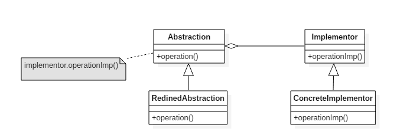

# 桥接模式(Bridge pattern)

## 意图

将抽象与实现分离开来，使它们可以独立变化。

## 类图

- Abstraction: 定义抽象类的接口
- Implementor: 定义实现类接口



## 实现

RemoteControl 表示遥控器，指代 Abstraction。

TV 表示电视，指代 Implementor。

桥接模式将遥控器和电视分离开来，从而可以独立改变遥控器或者电视的实现。

```java
public abstract class TV {
    public abstract void on();
    public abstract void off();
    public abstract void tuneChannel();
}
```

```java
public class Sony extends TV {
    @Override
    public void on() {
        System.out.println("Sony.on()");
    }

    @Override
    public void off() {
        System.out.println("Sony.off()");
    }

    @Override
    public void tuneChannel() {
        System.out.println("Sony.tuneChannel()");
    }
}
```

```java
public class RCA extends TV {
    @Override
    public void on() {
        System.out.println("RCA.on()");
    }

    @Override
    public void off() {
        System.out.println("RCA.off()");
    }

    @Override
    public void tuneChannel() {
        System.out.println("RCA.tuneChannel()");
    }
}
```

```java
public abstract class RemoteControl {
    protected TV tv;

    public RemoteControl(TV tv) {
        this.tv = tv;
    }

    public abstract void on();

    public abstract void off();

    public abstract void tuneChannel();
}
```

```java
public class ConcreteRemoteControl1 extends RemoteControl {
    public ConcreteRemoteControl1(TV tv) {
        super(tv);
    }

    @Override
    public void on() {
        System.out.println("ConcreteRemoteControl1.on()");
        tv.on();
    }

    @Override
    public void off() {
        System.out.println("ConcreteRemoteControl1.off()");
        tv.off();
    }

    @Override
    public void tuneChannel() {
        System.out.println("ConcreteRemoteControl1.tuneChannel()");
        tv.tuneChannel();
    }
}
```

```java
public class ConcreteRemoteControl2 extends RemoteControl {
    public ConcreteRemoteControl2(TV tv) {
        super(tv);
    }

    @Override
    public void on() {
        System.out.println("ConcreteRemoteControl2.on()");
        tv.on();
    }

    @Override
    public void off() {
        System.out.println("ConcreteRemoteControl2.off()");
        tv.off();
    }

    @Override
    public void tuneChannel() {
        System.out.println("ConcreteRemoteControl2.tuneChannel()");
        tv.tuneChannel();
    }
}
```

```java
public class Client {
    public static void main(String[] args) {
        RemoteControl remoteControl1 = new ConcreteRemoteControl1(new RCA());
        remoteControl1.on();
        remoteControl1.off();
        remoteControl1.tuneChannel();
    }
}
```

## 桥接模式的`golang`实现

桥接模式分离抽象部分和实现部分。使得两部分独立扩展。

桥接模式类似于策略模式，区别在于策略模式封装一系列算法使得算法可以互相替换。

策略模式使抽象部分和实现部分分离，可以独立变化。

#### bridge.go

```go
package bridge

import "fmt"

type AbstractMessage interface {
    SendMessage(text, to string)
}

type MessageImplementer interface {
    Send(text, to string)
}

type MessageSMS struct{}

func ViaSMS() MessageImplementer {
    return &MessageSMS{}
}

func (*MessageSMS) Send(text, to string) {
    fmt.Printf("send %s to %s via SMS", text, to)
}

type MessageEmail struct{}

func ViaEmail() MessageImplementer {
    return &MessageEmail{}
}

func (*MessageEmail) Send(text, to string) {
    fmt.Printf("send %s to %s via Email", text, to)
}

type CommonMessage struct {
    method MessageImplementer
}

func NewCommonMessage(method MessageImplementer) *CommonMessage {
    return &CommonMessage{
        method: method,
    }
}

func (m *CommonMessage) SendMessage(text, to string) {
    m.method.Send(text, to)
}

type UrgencyMessage struct {
    method MessageImplementer
}

func NewUrgencyMessage(method MessageImplementer) *UrgencyMessage {
    return &UrgencyMessage{
        method: method,
    }
}

func (m *UrgencyMessage) SendMessage(text, to string) {
    m.method.Send(fmt.Sprintf("[Urgency] %s", text), to)
}
```

#### bridge_test.go

```go
package bridge

func ExampleCommonSMS() {
    m := NewCommonMessage(ViaSMS())
    m.SendMessage("have a drink?", "bob")
    // Output:
    // send have a drink? to bob via SMS
}

func ExampleCommonEmail() {
    m := NewCommonMessage(ViaEmail())
    m.SendMessage("have a drink?", "bob")
    // Output:
    // send have a drink? to bob via Email
}

func ExampleUrgencySMS() {
    m := NewUrgencyMessage(ViaSMS())
    m.SendMessage("have a drink?", "bob")
    // Output:
    // send [Urgency] have a drink? to bob via SMS
}

func ExampleUrgencyEmail() {
    m := NewUrgencyMessage(ViaEmail())
    m.SendMessage("have a drink?", "bob")
    // Output:
    // send [Urgency] have a drink? to bob via Email
}
```

