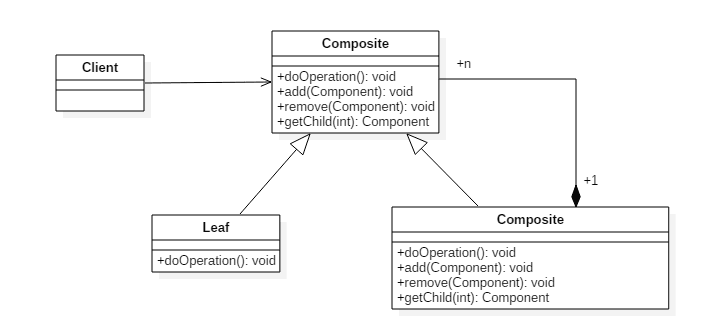

# 组合模式(Composite Pattern)

## 意图

将对象组合成树形结构来表示“整体/部分”层次关系，允许用户以相同的方式处理单独对象和组合对象。

## 类图

组件(Component)类是组合类(Composite)和叶子类(Leaf)的父类，可以把组合类看成是树的中间节点。

组合对象拥有一个或者多个组件对象，因此组合对象的操作可以委托给组件对象去处理，而组件对象可以是另一个组合对象或者叶子对象。



## 实现

```java
public abstract class Component {
    protected String name;

    public Component(String name) {
        this.name = name;
    }

    public void print() {
        print(0);
    }

    abstract void print(int level);

    abstract public void add(Component component);

    abstract public void remove(Component component);
}
```

```java
public class Composite extends Component {

    private List<Component> child;

    public Composite(String name) {
        super(name);
        child = new ArrayList<>();
    }

    @Override
    void print(int level) {
        for (int i = 0; i < level; i++) {
            System.out.print("--");
        }
        System.out.println("Composite:" + name);
        for (Component component : child) {
            component.print(level + 1);
        }
    }

    @Override
    public void add(Component component) {
        child.add(component);
    }

    @Override
    public void remove(Component component) {
        child.remove(component);
    }
}
```

```java
public class Leaf extends Component {
    public Leaf(String name) {
        super(name);
    }

    @Override
    void print(int level) {
        for (int i = 0; i < level; i++) {
            System.out.print("--");
        }
        System.out.println("left:" + name);
    }

    
    @Override
    public void add(Component component) {
        // 牺牲透明性换取单一职责原则，这样就不用考虑是叶子节点还是组合节点
        throw new UnsupportedOperationException(); 
    }

    @Override
    public void remove(Component component) {
        throw new UnsupportedOperationException();
    }
}
```

```java
public class Client {
    public static void main(String[] args) {
        Composite root = new Composite("root");
        Component node1 = new Leaf("1");
        Component node2 = new Composite("2");
        Component node3 = new Leaf("3");
        root.add(node1);
        root.add(node2);
        root.add(node3);
        Component node21 = new Leaf("21");
        Component node22 = new Composite("22");
        node2.add(node21);
        node2.add(node22);
        Component node221 = new Leaf("221");
        node22.add(node221);
        root.print();
    }
}
```

## 组合模式的`golang`实现

组合模式统一对象和对象集，使得使用相同接口使用对象和对象集。

组合模式常用于树状结构，用于统一叶子节点和树节点的访问，并且可以用于应用某一操作到所有子节点。

#### composite.go

```go
package composite

import "fmt"

type Component interface {
    Parent() Component
    SetParent(Component)
    Name() string
    SetName(string)
    AddChild(Component)
    Print(string)
}

const (
    LeafNode = iota
    CompositeNode
)

func NewComponent(kind int, name string) Component {
    var c Component
    switch kind {
    case LeafNode:
        c = NewLeaf()
    case CompositeNode:
        c = NewComposite()
    }

    c.SetName(name)
    return c
}

type component struct {
    parent Component
    name   string
}

func (c *component) Parent() Component {
    return c.parent
}

func (c *component) SetParent(parent Component) {
    c.parent = parent
}

func (c *component) Name() string {
    return c.name
}

func (c *component) SetName(name string) {
    c.name = name
}

func (c *component) AddChild(Component) {}

func (c *component) Print(string) {}

type Leaf struct {
    component
}

func NewLeaf() *Leaf {
    return &Leaf{}
}

func (c *Leaf) Print(pre string) {
    fmt.Printf("%s-%s\n", pre, c.Name())
}

type Composite struct {
    component
    childs []Component
}

func NewComposite() *Composite {
    return &Composite{
        childs: make([]Component, 0),
    }
}

func (c *Composite) AddChild(child Component) {
    child.SetParent(c)
    c.childs = append(c.childs, child)
}

func (c *Composite) Print(pre string) {
    fmt.Printf("%s+%s\n", pre, c.Name())
    pre += " "
    for _, comp := range c.childs {
        comp.Print(pre)
    }
}
```

#### composite_test.go

```go
package composite

func ExampleComposite() {
    root := NewComponent(CompositeNode, "root")
    c1 := NewComponent(CompositeNode, "c1")
    c2 := NewComponent(CompositeNode, "c2")
    c3 := NewComponent(CompositeNode, "c3")

    l1 := NewComponent(LeafNode, "l1")
    l2 := NewComponent(LeafNode, "l2")
    l3 := NewComponent(LeafNode, "l3")

    root.AddChild(c1)
    root.AddChild(c2)
    c1.AddChild(c3)
    c1.AddChild(l1)
    c2.AddChild(l2)
    c2.AddChild(l3)

    root.Print("")
    // Output:
    // +root
    //  +c1
    //   +c3
    //   -l1
    //  +c2
    //   -l2
    //   -l3
}
```

