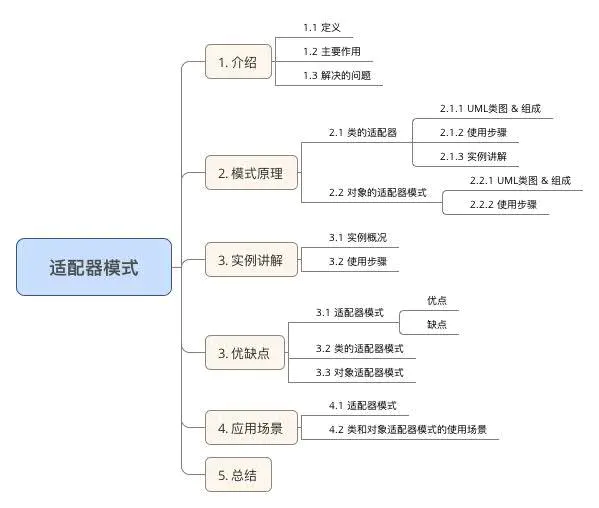
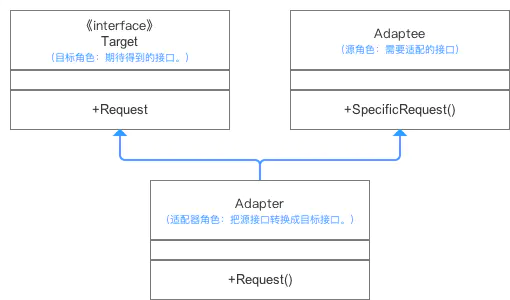
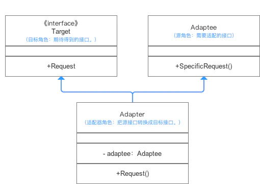

# 适配器模式（Adapter Pattern）

## 目录



## 1. 介绍

### 1.1 模式说明

定义一个包装类，用于包装不兼容接口的对象

> 1. 包装类 = 适配器Adapter；
> 2. 被包装对象 = 适配者Adaptee = 被适配的类

### 1.2 主要作用

把一个类的接口变换成客户端所期待的另一种接口，从而使原本接口不匹配而无法一起工作的两个类能够在一起工作。

> 适配器模式的形式分为：类的适配器模式 & 对象的适配器模式

#### 1.3 解决的问题

原本由于接口不兼容而不能一起工作的那些类可以在一起工作

## 2. 模式原理

#### 2.1 类的适配器模式

类的适配器模式是把适配的类的API转换成为目标类的API。

**2.1.1**  UML类图 & 组成



在上图中可以看出：

* 冲突：`Target`期待调用`Request`方法，而`Adaptee`并没有（这就是所谓的不兼容了）。

* 解决方案：为使`Target`能够使用`Adaptee`类里的`SpecificRequest`方法，故提供一个中间环节`Adapter`类 **（继承Adaptee & 实现Target接口）** ，把`Adaptee`的`API`与`Target`的`API`衔接起来（适配）。

> `Adapter`与`Adaptee`是继承关系，这决定了这个适配器模式是类的

**2.1.2**  使用步骤（代码解析）

**步骤1：**  创建 **Target接口**；

```java
public interface Target {
 
    // 这是源类Adapteee没有的方法
    public void Request(); 
}
```

**步骤2：**  创建 **源类（Adaptee）** ；

```java
public class Adaptee {   
    public void SpecificRequest(){
    }
}
```

**步骤3：**  创建 **适配器类（Adapter）**

```java
// 适配器Adapter继承自Adaptee，同时又实现了目标(Target)接口。
public class Adapter extends Adaptee implements Target {

    // 目标接口要求调用Request()这个方法名，但源类Adaptee没有方法Request()
    // 因此适配器补充上这个方法名
    // 但实际上Request()只是调用源类Adaptee的SpecificRequest()方法的内容
    // 所以适配器只是将SpecificRequest()方法作了一层封装，封装成Target可以调用的Request()而已
    @Override
    public void Request() {
        this.SpecificRequest();
    }

}
```

**步骤4：** 定义具体使用目标类，并通过Adapter类调用所需要的方法从而实现目标

```java
public class AdapterPattern {
    public static void main(String[] args){
        Target mAdapter = new Adapter()；
        mAdapter.Request（）;
    }
}
```

**2.1.3 实例讲解**

接下来我用一个实例来对类的适配器模式进行更深一步的介绍。

**a. 实例概况**

- 背景：小成买了一个进口的电视机
- 冲突：进口电视机要求电压（110V）与国内插头标准输出电压（220V）不兼容
- 解决方案：设置一个适配器将插头输出的220V转变成110V

> 即适配器模式中的类的适配器模式

**b. 使用步骤**

**步骤1：** 创建 **Target接口（期待得到的插头）** ：能输出110V（将220V转换成110V）

```java
 public interface Target {
    // 将220V转换输出110V（原有插头（Adaptee）没有的）
    public void Convert_110v();
}
```

**步骤2：** 创建源类（原有的插头） ；

```java
class PowerPort220V{
    // 原有插头只能输出220V
    public void Output_220v(){
    }
}
```

**步骤3：** 创建适配器类（Adapter）

```java
class Adapter220V extends PowerPort220V implements Target{
    // 期待的插头要求调用Convert_110v()，但原有插头没有
    // 因此适配器补充上这个方法名
    // 但实际上Convert_110v()只是调用原有插头的Output_220v()方法的内容
    // 所以适配器只是将Output_220v()作了一层封装，封装成Target可以调用的Convert_110v()而已

    @Override
    public void Convert_110v(){
      this.Output_220v;
    }
}
```

**步骤4：** 定义具体使用目标类，并通过Adapter类调用所需要的方法从而实现目标（不需要通过原有插头）

```java
//进口机器类
class ImportedMachine {

    @Override
    public void Work() {
        System.out.println("进口机器正常运行");
    }
}


// 通过Adapter类从而调用所需要的方法
public class AdapterPattern {
    public static void main(String[] args){

        Target mAdapter220V = new Adapter220V();
        ImportedMachine mImportedMachine = new ImportedMachine();
       
        // 用户拿着进口机器插上适配器（调用Convert_110v()方法）
        // 再将适配器插上原有插头（Convert_110v()方法内部调用Output_220v()方法输出220V）
        // 适配器只是个外壳，对外提供110V，但本质还是220V进行供电
        mAdapter220V.Convert_110v();
        mImportedMachine.Work();
    }
}

```

#### 2.2 对象的适配器模式

与类的适配器模式相同，对象的适配器模式也是把适配的类的API转换成为目标类的API。

> 与类的适配器模式不同的是，对象的适配器模式不是使用继承关系连接到Adaptee类，而是使用委派关系连接到Adaptee类。

**2.2.1** UML类图



在上图中可以看出：

* 冲突：Target期待调用Request方法，而Adaptee并没有（这就是所谓的不兼容了）。

* 解决方案：为使Target能够使用Adaptee类里的SpecificRequest方法，故提供一个中间环节Adapter类 **（包装了一个Adaptee的实例）** ，把Adaptee的API与Target的API衔接起来（适配）。

> Adapter与Adaptee是委派关系，这决定了适配器模式是对象的。

**2.2.2** 使用步骤（代码解析）

**步骤1：** 创建 **Target接口**；

```java
public interface Target {
    // 这是源类Adapteee没有的方法
    public void Request(); 
}
```

**步骤2：** 创建 **源类（Adaptee）** ；

```java
public class Adaptee {  
    public void SpecificRequest(){
    }
}
```

**步骤3：** 创建 **适配器类（Adapter）**（不适用继承而是委派）

```java
class Adapter implements Target{  
    // 直接关联被适配类  
    private Adaptee adaptee;  
    
    // 可以通过构造函数传入具体需要适配的被适配类对象  
    public Adapter (Adaptee adaptee) {  
        this.adaptee = adaptee;  
    }  
    
    @Override
    public void Request() {  
        // 这里是使用委托的方式完成特殊功能  
        this.adaptee.SpecificRequest();  
    }  
}  
```

**步骤4：** 定义具体使用目标类，并通过Adapter类调用所需要的方法从而实现目标

```java
public class AdapterPattern {
    public static void main(String[] args){
        // 需要先创建一个被适配类的对象作为参数  
        Target mAdapter = new Adapter(new Adaptee())；
        mAdapter.Request();
    }
}
```

## 3. 优缺点

#### 3.1 适配器模式

**优点**

* 更好的复用性

系统需要使用现有的类，而此类的接口不符合系统的需要。那么通过适配器模式就可以让这些功能得到更好的复用。

* 透明、简单

客户端可以调用同一接口，因而对客户端来说是透明的。这样做更简单 & 更直接

* 更好的扩展性

在实现适配器功能的时候，可以调用自己开发的功能，从而自然地扩展系统的功能。

* 解耦性

将目标类和适配者类解耦，通过引入一个适配器类重用现有的适配者类，而无需修改原有代码

* 符合开放-关闭原则

同一个适配器可以把适配者类和它的子类都适配到目标接口；可以为不同的目标接口实现不同的适配器，而不需要修改待适配类

**缺点**

* 过多的使用适配器，会让系统非常零乱，不易整体进行把握

#### 3.2 类的适配器模式

**优点**

- 使用方便，代码简化
  仅仅引入一个对象，并不需要额外的字段来引用Adaptee实例

**缺点**

- 高耦合，灵活性低
  使用对象继承的方式，是静态的定义方式

#### 3.3 对象的适配器模式

**优点**

- 灵活性高、低耦合
  采用 “对象组合”的方式，是动态组合方式

**缺点**

- 使用复杂
  需要引入对象实例

> 特别是需要重新定义Adaptee行为时需要重新定义Adaptee的子类，并将适配器组合适配

## 4. 应用场景

#### 4.1 适配器的使用场景

* 系统需要复用现有类，而该类的接口不符合系统的需求，可以使用适配器模式使得原本由于接口不兼容而不能一起工作的那些类可以一起工作
* 多个组件功能类似，但接口不统一且可能会经常切换时，可使用适配器模式，使得客户端可以以统一的接口使用它们

#### 4.2 类和对象适配器模式的使用场景

1. 灵活使用时：选择对象的适配器模式
   类适配器使用对象继承的方式，是静态的定义方式；而对象适配器使用对象组合的方式，是动态组合的方式。

2. 需要同时配源类和其子类：选择对象的适配器

   * 对于类适配器，由于适配器直接继承了Adaptee，使得适配器不能和Adaptee的子类一起工作，因为继承是静态的关系，当适配器继承了Adaptee后，就不可能再去处理  Adaptee的子类了；

   * 对于对象适配器，一个适配器可以把多种不同的源适配到同一个目标。换言之，同一个适配器可以把源类和它的子类都适配到目标接口。因为对象适配器采用的是对象组合的关系，只要对象类型正确，是不是子类都无所谓。

3. 需要重新定义Adaptee的部分行为：选择类适配器

   * 对于类适配器，适配器可以重定义Adaptee的部分行为，相当于子类覆盖父类的部分实现方法。

   * 对于对象适配器，要重定义Adaptee的行为比较困难，这种情况下，需要定义Adaptee的子类来实现重定义，然后让适配器组合子类。虽然重定义Adaptee的行为比较困难，但是想要增加一些新的行为则方便的很，而且新增加的行为可同时适用于所有的源。

4. 仅仅希望使用方便时：选择类适配器

   - 对于类适配器，仅仅引入了一个对象，并不需要额外的引用来间接得到Adaptee。

   - 对于对象适配器，需要额外的引用来间接得到Adaptee。

### 总结

建议尽量使用对象的适配器模式，多用合成/聚合、少用继承。

> 当然，具体问题具体分析，根据需要来选用合适的实现方式

## 5. 总结

- 本文主要对**适配器模式**进行了全面介绍;

## 6.适配器模式`golang`实现

适配器模式用于转换一种接口适配另一种接口。

实际使用中Adaptee一般为接口，并且使用工厂函数生成实例。

在Adapter中匿名组合Adaptee接口，所以Adapter类也拥有SpecificRequest实例方法，又因为Go语言中非入侵式接口特征，其实Adapter也适配Adaptee接口。

#### adapter.go

```go
package adapter

//Target 是适配的目标接口
type Target interface {
    Request() string
}

//Adaptee 是被适配的目标接口
type Adaptee interface {
    SpecificRequest() string
}

//NewAdaptee 是被适配接口的工厂函数
func NewAdaptee() Adaptee {
    return &adapteeImpl{}
}

//AdapteeImpl 是被适配的目标类
type adapteeImpl struct{}

//SpecificRequest 是目标类的一个方法
func (*adapteeImpl) SpecificRequest() string {
    return "adaptee method"
}

//NewAdapter 是Adapter的工厂函数
func NewAdapter(adaptee Adaptee) Target {
    return &adapter{
        Adaptee: adaptee,
    }
}

//Adapter 是转换Adaptee为Target接口的适配器
type adapter struct {
    Adaptee
}

//Request 实现Target接口
func (a *adapter) Request() string {
    return a.SpecificRequest()
}
```

#### adapter_test.go

```go
package adapter

import "testing"

var expect = "adaptee method"

func TestAdapter(t *testing.T) {
    adaptee := NewAdaptee()
    target := NewAdapter(adaptee)
    res := target.Request()
    if res != expect {
        t.Fatalf("expect: %s, actual: %s", expect, res)
    }
}
```

