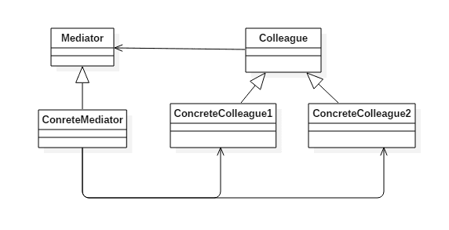
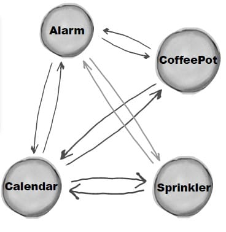
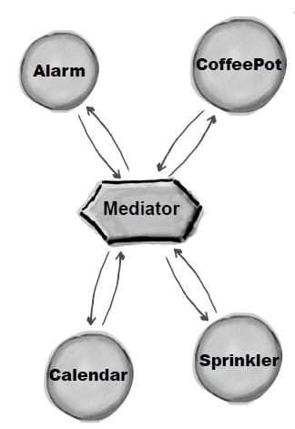

# 中介者模式(Mediator Pattern)

## 意图

集中相关对象之间复杂的沟通和控制方式。

## 类图

- Mediator: 中介者，定义一个接口用于与各同事(Colleague)对象通信。
- Colleague: 同事，相关对象



## 实现

Alarm(闹钟)、CoffeePot(咖啡壶)、Calendar(日历)、Sprinkler(喷头)是一组相关的对象，在某个对象的事件产生时需要去操作其它对象，形成了下面这种依赖结构:



使用中介者模式可以将复杂的依赖结构变成星形结构:



```java
public abstract class Colleague {
    public abstract void onEvent(Mediator mediator);
}
public class Alarm extends Colleague {

    @Override
    public void onEvent(Mediator mediator) {
        mediator.doEvent("alarm");
    }

    public void doAlarm() {
        System.out.println("doAlarm()");
    }
}
public class CoffeePot extends Colleague {
    @Override
    public void onEvent(Mediator mediator) {
        mediator.doEvent("coffeePot");
    }

    public void doCoffeePot() {
        System.out.println("doCoffeePot()");
    }
}
public class Calender extends Colleague {
    @Override
    public void onEvent(Mediator mediator) {
        mediator.doEvent("calender");
    }

    public void doCalender() {
        System.out.println("doCalender()");
    }
}
public class Sprinkler extends Colleague {
    @Override
    public void onEvent(Mediator mediator) {
        mediator.doEvent("sprinkler");
    }

    public void doSprinkler() {
        System.out.println("doSprinkler()");
    }
}
public abstract class Mediator {
    public abstract void doEvent(String eventType);
}
public class ConcreteMediator extends Mediator {
    private Alarm alarm;
    private CoffeePot coffeePot;
    private Calender calender;
    private Sprinkler sprinkler;

    public ConcreteMediator(Alarm alarm, CoffeePot coffeePot, Calender calender, Sprinkler sprinkler) {
        this.alarm = alarm;
        this.coffeePot = coffeePot;
        this.calender = calender;
        this.sprinkler = sprinkler;
    }

    @Override
    public void doEvent(String eventType) {
        switch (eventType) {
            case "alarm":
                doAlarmEvent();
                break;
            case "coffeePot":
                doCoffeePotEvent();
                break;
            case "calender":
                doCalenderEvent();
                break;
            default:
                doSprinklerEvent();
        }
    }

    public void doAlarmEvent() {
        alarm.doAlarm();
        coffeePot.doCoffeePot();
        calender.doCalender();
        sprinkler.doSprinkler();
    }

    public void doCoffeePotEvent() {
        // ...
    }

    public void doCalenderEvent() {
        // ...
    }

    public void doSprinklerEvent() {
        // ...
    }
}
public class Client {
    public static void main(String[] args) {
        Alarm alarm = new Alarm();
        CoffeePot coffeePot = new CoffeePot();
        Calender calender = new Calender();
        Sprinkler sprinkler = new Sprinkler();
        Mediator mediator = new ConcreteMediator(alarm, coffeePot, calender, sprinkler);
        // 闹钟事件到达，调用中介者就可以操作相关对象
        alarm.onEvent(mediator);
    }
}

```

```shell
doAlarm()
doCoffeePot()
doCalender()
doSprinkler()
```

## 中介者模式`golang`实现

中介者模式封装对象之间互交，使依赖变的简单，并且使复杂互交简单化，封装在中介者中。

例子中的中介者使用单例模式生成中介者。

中介者的change使用switch判断类型。

#### mediator.go

```go
package mediator

import (
    "fmt"
    "strings"
)

type CDDriver struct {
    Data string
}

func (c *CDDriver) ReadData() {
    c.Data = "music,image"

    fmt.Printf("CDDriver: reading data %s\n", c.Data)
    GetMediatorInstance().changed(c)
}

type CPU struct {
    Video string
    Sound string
}

func (c *CPU) Process(data string) {
    sp := strings.Split(data, ",")
    c.Sound = sp[0]
    c.Video = sp[1]

    fmt.Printf("CPU: split data with Sound %s, Video %s\n", c.Sound, c.Video)
    GetMediatorInstance().changed(c)
}

type VideoCard struct {
    Data string
}

func (v *VideoCard) Display(data string) {
    v.Data = data
    fmt.Printf("VideoCard: display %s\n", v.Data)
    GetMediatorInstance().changed(v)
}

type SoundCard struct {
    Data string
}

func (s *SoundCard) Play(data string) {
    s.Data = data
    fmt.Printf("SoundCard: play %s\n", s.Data)
    GetMediatorInstance().changed(s)
}

type Mediator struct {
    CD    *CDDriver
    CPU   *CPU
    Video *VideoCard
    Sound *SoundCard
}

var mediator *Mediator

func GetMediatorInstance() *Mediator {
    if mediator == nil {
        mediator = &Mediator{}
    }
    return mediator
}

func (m *Mediator) changed(i interface{}) {
    switch inst := i.(type) {
    case *CDDriver:
        m.CPU.Process(inst.Data)
    case *CPU:
        m.Sound.Play(inst.Sound)
        m.Video.Display(inst.Video)
    }
}
```

#### mediator_test.go

```go
package mediator

import "testing"

func TestMediator(t *testing.T) {
    mediator := GetMediatorInstance()
    mediator.CD = &CDDriver{}
    mediator.CPU = &CPU{}
    mediator.Video = &VideoCard{}
    mediator.Sound = &SoundCard{}

    //Tiggle
    mediator.CD.ReadData()

    if mediator.CD.Data != "music,image" {
        t.Fatalf("CD unexpect data %s", mediator.CD.Data)
    }

    if mediator.CPU.Sound != "music" {
        t.Fatalf("CPU unexpect sound data %s", mediator.CPU.Sound)
    }

    if mediator.CPU.Video != "image" {
        t.Fatalf("CPU unexpect video data %s", mediator.CPU.Video)
    }

    if mediator.Video.Data != "image" {
        t.Fatalf("VidoeCard unexpect data %s", mediator.Video.Data)
    }

    if mediator.Sound.Data != "music" {
        t.Fatalf("SoundCard unexpect data %s", mediator.Sound.Data)
    }
}

```

