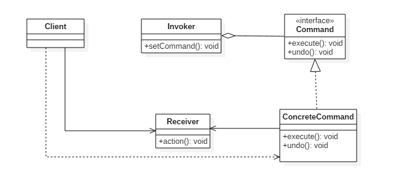
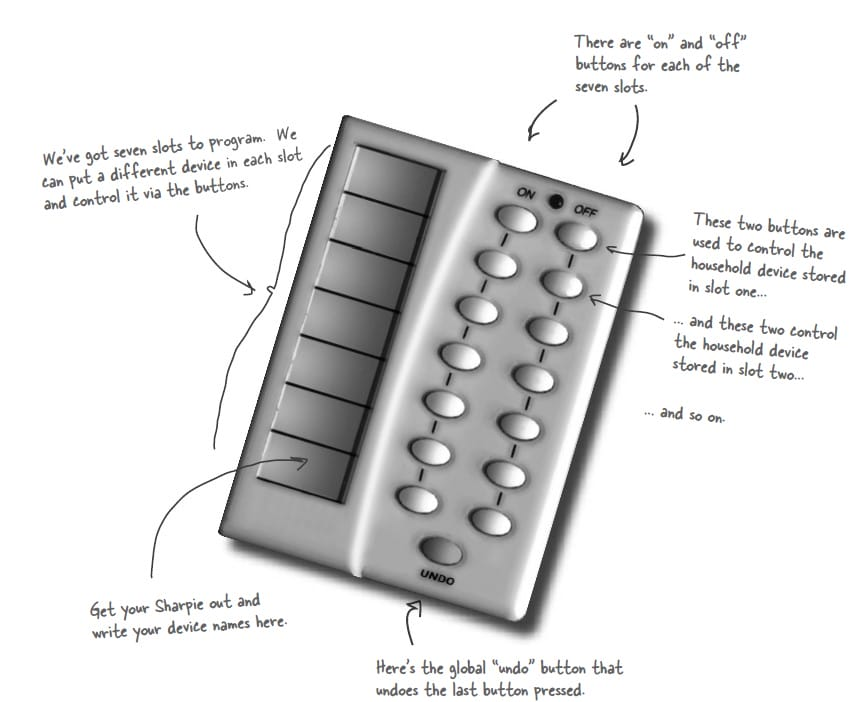

# 命令模式(Command Pattern)

## 意图

将命令封装成对象中，以便使用命令来参数化其它对象，或者将命令对象放入队列中进行排队，或者将命令对象的操作记录到日志中，以及支持可撤销的操作。

## 类图

- `Command`: 命令
- `Receiver`: 命令接收者，也就是命令真正的执行者
- `Invoker`: 通过它来调用命令
- `Client`: 可以设置命令与命令的接收者



## 实现

设计一个遥控器，可以控制电灯开关。



```java
public interface Command {
    void execute();
}
public class LightOnCommand implements Command {
    Light light;

    public LightOnCommand(Light light) {
        this.light = light;
    }

    @Override
    public void execute() {
        light.on();
    }
}
public class LightOffCommand implements Command {
    Light light;

    public LightOffCommand(Light light) {
        this.light = light;
    }

    @Override
    public void execute() {
        light.off();
    }
}
public class Light {

    public void on() {
        System.out.println("Light is on!");
    }

    public void off() {
        System.out.println("Light is off!");
    }
}
/**
 * 遥控器
 */
public class Invoker {
    private Command[] onCommands;
    private Command[] offCommands;
    private final int slotNum = 7;

    public Invoker() {
        this.onCommands = new Command[slotNum];
        this.offCommands = new Command[slotNum];
    }

    public void setOnCommand(Command command, int slot) {
        onCommands[slot] = command;
    }

    public void setOffCommand(Command command, int slot) {
        offCommands[slot] = command;
    }

    public void onButtonWasPushed(int slot) {
        onCommands[slot].execute();
    }

    public void offButtonWasPushed(int slot) {
        offCommands[slot].execute();
    }
}
public class Client {
    public static void main(String[] args) {
        Invoker invoker = new Invoker();
        Light light = new Light();
        Command lightOnCommand = new LightOnCommand(light);
        Command lightOffCommand = new LightOffCommand(light);
        invoker.setOnCommand(lightOnCommand, 0);
        invoker.setOffCommand(lightOffCommand, 0);
        invoker.onButtonWasPushed(0);
        invoker.offButtonWasPushed(0);
    }
}
```

## 命令模式`golang`实现

命令模式本质是把某个对象的方法调用封装到对象中，方便传递、存储、调用。

示例中把主板单中的启动(`start`)方法和重启(`reboot`)方法封装为命令对象，再传递到主机(`box`)对象中。于两个按钮进行绑定:

- 第一个机箱(`box1`)设置按钮1(`button1`) 为开机按钮2(`button2`)为重启。
- 第二个机箱(`box1`)设置按钮2(`button2`) 为开机按钮1(`button1`)为重启。

从而得到配置灵活性。

除了配置灵活外，使用命令模式还可以用作：

- 批处理
- 任务队列
- undo, redo

等把具体命令封装到对象中使用的场合

#### command.go

```go
package command

import "fmt"

type Command interface {
    Execute()
}

type StartCommand struct {
    mb *MotherBoard
}

func NewStartCommand(mb *MotherBoard) *StartCommand {
    return &StartCommand{
        mb: mb,
    }
}

func (c *StartCommand) Execute() {
    c.mb.Start()
}

type RebootCommand struct {
    mb *MotherBoard
}

func NewRebootCommand(mb *MotherBoard) *RebootCommand {
    return &RebootCommand{
        mb: mb,
    }
}

func (c *RebootCommand) Execute() {
    c.mb.Reboot()
}

type MotherBoard struct{}

func (*MotherBoard) Start() {
    fmt.Print("system starting\n")
}

func (*MotherBoard) Reboot() {
    fmt.Print("system rebooting\n")
}

type Box struct {
    button1 Command
    button2 Command
}

func NewBox(button1, button2 Command) *Box {
    return &Box{
        button1: button1,
        button2: button2,
    }
}

func (b *Box) PressButton1() {
    b.button1.Execute()
}

func (b *Box) PressButton2() {
    b.button2.Execute
}
```

#### command_test.go

```go
package command

func ExampleCommand() {
    mb := &MotherBoard{}
    startCommand := NewStartCommand(mb)
    rebootCommand := NewRebootCommand(mb)

    box1 := NewBox(startCommand, rebootCommand)
    box1.PressButton1()
    box1.PressButton2()

    box2 := NewBox(rebootCommand, startCommand)
    box2.PressButton1()
    box2.PressButton2()
    // Output:
    // system starting
    // system rebooting
    // system rebooting
    // system starting
}
```

