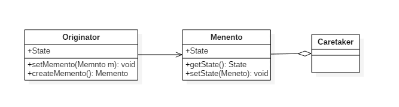

# 备忘录模式(Memento Pattern)

## 意图

在不违反封装的情况下获得对象的内部状态，从而在需要时可以将对象恢复到最初状态。

## 类图

- `Originator`: 原始对象
- `Caretaker`: 负责保存好备忘录
- `Menento`: 备忘录，存储原始对象的的状态。备忘录实际上有两个接口，一个是提供给 `Caretaker `的窄接口: 它只能将备忘录传递给其它对象；一个是提供给 `Originator `的宽接口，允许它访问到先前状态所需的所有数据。理想情况是只允许 `Originator `访问本备忘录的内部状态。



## 实现

以下实现了一个简单计算器程序，可以输入两个值，然后计算这两个值的和。备忘录模式允许将这两个值存储起来，然后在某个时刻用存储的状态进行恢复。

```java
/**
 * Originator Interface
 */
public interface Calculator {

    // Create Memento
    PreviousCalculationToCareTaker backupLastCalculation();

    // setMemento
    void restorePreviousCalculation(PreviousCalculationToCareTaker memento);

    int getCalculationResult();

    void setFirstNumber(int firstNumber);

    void setSecondNumber(int secondNumber);
}
/**
 * Originator Implementation
 */
public class CalculatorImp implements Calculator {

    private int firstNumber;
    private int secondNumber;

    @Override
    public PreviousCalculationToCareTaker backupLastCalculation() {
        // create a memento object used for restoring two numbers
        return new PreviousCalculationImp(firstNumber, secondNumber);
    }

    @Override
    public void restorePreviousCalculation(PreviousCalculationToCareTaker memento) {
        this.firstNumber = ((PreviousCalculationToOriginator) memento).getFirstNumber();
        this.secondNumber = ((PreviousCalculationToOriginator) memento).getSecondNumber();
    }

    @Override
    public int getCalculationResult() {
        // result is adding two numbers
        return firstNumber + secondNumber;
    }

    @Override
    public void setFirstNumber(int firstNumber) {
        this.firstNumber = firstNumber;
    }

    @Override
    public void setSecondNumber(int secondNumber) {
        this.secondNumber = secondNumber;
    }
}
/**
 * Memento Interface to Originator
 *
 * This interface allows the originator to restore its state
 */
public interface PreviousCalculationToOriginator {
    int getFirstNumber();
    int getSecondNumber();
}
/**
 *  Memento interface to CalculatorOperator (Caretaker)
 */
public interface PreviousCalculationToCareTaker {
    // no operations permitted for the caretaker
}
/**
 * Memento Object Implementation
 * <p>
 * Note that this object implements both interfaces to Originator and CareTaker
 */
public class PreviousCalculationImp implements PreviousCalculationToCareTaker,
        PreviousCalculationToOriginator {

    private int firstNumber;
    private int secondNumber;

    public PreviousCalculationImp(int firstNumber, int secondNumber) {
        this.firstNumber = firstNumber;
        this.secondNumber = secondNumber;
    }

    @Override
    public int getFirstNumber() {
        return firstNumber;
    }

    @Override
    public int getSecondNumber() {
        return secondNumber;
    }
}
/**
 * CareTaker object
 */
public class Client {

    public static void main(String[] args) {
        // program starts
        Calculator calculator = new CalculatorImp();

        // assume user enters two numbers
        calculator.setFirstNumber(10);
        calculator.setSecondNumber(100);

        // find result
        System.out.println(calculator.getCalculationResult());

        // Store result of this calculation in case of error
        PreviousCalculationToCareTaker memento = calculator.backupLastCalculation();

        // user enters a number
        calculator.setFirstNumber(17);

        // user enters a wrong second number and calculates result
        calculator.setSecondNumber(-290);

        // calculate result
        System.out.println(calculator.getCalculationResult());

        // user hits CTRL + Z to undo last operation and see last result
        calculator.restorePreviousCalculation(memento);

        // result restored
        System.out.println(calculator.getCalculationResult());
    }
}
```

```java
110
-273
110
```

## 备忘录模式`golang`实现

备忘录模式用于保存程序内部状态到外部，又不希望暴露内部状态的情形。

程序内部状态使用窄接口船体给外部进行存储，从而不暴露程序实现细节。

备忘录模式同时可以离线保存内部状态，如保存到数据库，文件等。

#### memento.go

```go
package memento

import "fmt"

type Memento interface{}

type Game struct {
    hp, mp int
}

type gameMemento struct {
    hp, mp int
}

func (g *Game) Play(mpDelta, hpDelta int) {
    g.mp += mpDelta
    g.hp += hpDelta
}

func (g *Game) Save() Memento {
    return &gameMemento{
        hp: g.hp,
        mp: g.mp,
    }
}

func (g *Game) Load(m Memento) {
    gm := m.(*gameMemento)
    g.mp = gm.mp
    g.hp = gm.hp
}

func (g *Game) Status() {
    fmt.Printf("Current HP:%d, MP:%d\n", g.hp, g.mp)
}
```

#### memento_test.go

```go
package memento

func ExampleGame() {
    game := &Game{
        hp: 10,
        mp: 10,
    }

    game.Status()
    progress := game.Save()

    game.Play(-2, -3)
    game.Status()

    game.Load(progress)
    game.Status()

    // Output:
    // Current HP:10, MP:10
    // Current HP:7, MP:8
    // Current HP:10, MP:10
}
```

