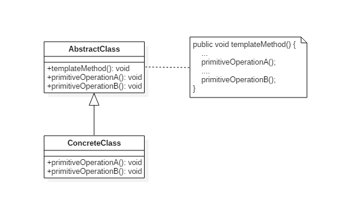
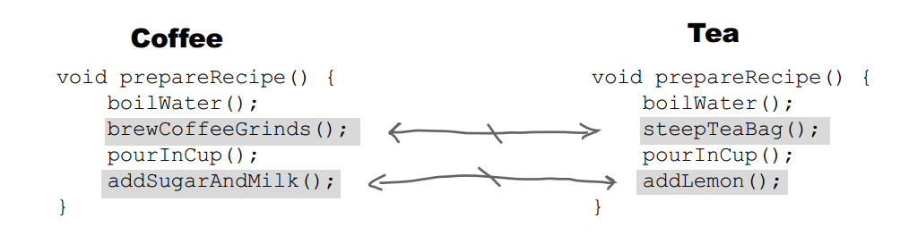

# 模板方法模式(Template Method Pattern)

## 意图

定义算法框架，并将一些步骤的实现延迟到子类。

通过模板方法，子类可以重新定义算法的某些步骤，而不用改变算法的结构。

## 类图



##  实现

冲咖啡和冲茶都有类似的流程，但是某些步骤会有点不一样，要求复用那些相同步骤的代码。



```java
public abstract class CaffeineBeverage {

    final void prepareRecipe() {
        boilWater();
        brew();
        pourInCup();
        addCondiments();
    }

    abstract void brew();

    abstract void addCondiments();

    void boilWater() {
        System.out.println("boilWater");
    }

    void pourInCup() {
        System.out.println("pourInCup");
    }
}
public class Coffee extends CaffeineBeverage {
    @Override
    void brew() {
        System.out.println("Coffee.brew");
    }

    @Override
    void addCondiments() {
        System.out.println("Coffee.addCondiments");
    }
}
public class Tea extends CaffeineBeverage {
    @Override
    void brew() {
        System.out.println("Tea.brew");
    }

    @Override
    void addCondiments() {
        System.out.println("Tea.addCondiments");
    }
}
public class Client {
    public static void main(String[] args) {
        CaffeineBeverage caffeineBeverage = new Coffee();
        caffeineBeverage.prepareRecipe();
        System.out.println("-----------");
        caffeineBeverage = new Tea();
        caffeineBeverage.prepareRecipe();
    }
}
```

```java
boilWater
Coffee.brew
pourInCup
Coffee.addCondiments
-----------
boilWater
Tea.brew
pourInCup
Tea.addCondiments
```

## 模板方法模式`golang`实现

模版方法模式使用继承机制，把通用步骤和通用方法放到父类中，把具体实现延迟到子类中实现。使得实现符合开闭原则。

如实例代码中通用步骤在父类中实现（`准备`、`下载`、`保存`、`收尾`）下载和保存的具体实现留到子类中，并且提供 `保存`方法的默认实现。

因为`Golang`不提供继承机制，需要使用匿名组合模拟实现继承。

此处需要注意：因为父类需要调用子类方法，所以子类需要匿名组合父类的同时，父类需要持有子类的引用。

#### templatemethod.go

```go
package templatemethod

import "fmt"

type Downloader interface {
    Download(uri string)
}

type template struct {
    implement
    uri string
}

type implement interface {
    download()
    save()
}

func newTemplate(impl implement) *template {
    return &template{
        implement: impl,
    }
}

func (t *template) Download(uri string) {
    t.uri = uri
    fmt.Print("prepare downloading\n")
    t.implement.download()
    t.implement.save()
    fmt.Print("finish downloading\n")
}

func (t *template) save() {
    fmt.Print("default save\n")
}

type HTTPDownloader struct {
    *template
}

func NewHTTPDownloader() Downloader {
    downloader := &HTTPDownloader{}
    template := newTemplate(downloader)
    downloader.template = template
    return downloader
}

func (d *HTTPDownloader) download() {
    fmt.Printf("download %s via http\n", d.uri)
}

func (*HTTPDownloader) save() {
    fmt.Printf("http save\n")
}

type FTPDownloader struct {
    *template
}

func NewFTPDownloader() Downloader {
    downloader := &FTPDownloader{}
    template := newTemplate(downloader)
    downloader.template = template
    return downloader
}

func (d *FTPDownloader) download() {
    fmt.Printf("download %s via ftp\n", d.uri)
}
```

#### templatemethod_test.go

```go
package templatemethod

func ExampleHTTPDownloader() {
    var downloader Downloader = NewHTTPDownloader()

    downloader.Download("http://example.com/abc.zip")
    // Output:
    // prepare downloading
    // download http://example.com/abc.zip via http
    // http save
    // finish downloading
}

func ExampleFTPDownloader() {
    var downloader Downloader = NewFTPDownloader()

    downloader.Download("ftp://example.com/abc.zip")
    // Output:
    // prepare downloading
    // download ftp://example.com/abc.zip via ftp
    // default save
    // finish downloading
}
```

