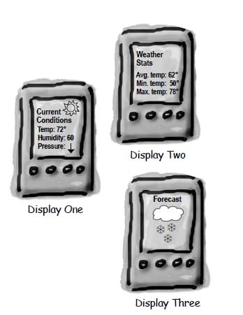

# 观察者模式(Observer Pattern)

## 意图

定义对象之间的一对多依赖，当一个对象状态改变时，它的所有依赖都会收到通知并且自动更新状态。

主题(`Subject`)是被观察的对象，而其所有依赖者(`Observer`)称为观察者。


##  类图

主题(`Subject`)具有注册和移除观察者、并通知所有观察者的功能，主题是通过维护一张观察者列表来实现这些操作的。

观察者(`Observer`)的注册功能需要调用主题的 `registerObserver()` 方法。


## 实现

天气数据布告板会在天气信息发生改变时更新其内容，布告板有多个，并且在将来会继续增加。



#### obserser.go

```java
public interface Subject {
    void resisterObserver(Observer o);

    void removeObserver(Observer o);

    void notifyObserver();
}
public class WeatherData implements Subject {
    private List<Observer> observers;
    private float temperature;
    private float humidity;
    private float pressure;

    public WeatherData() {
        observers = new ArrayList<>();
    }

    public void setMeasurements(float temperature, float humidity, float pressure) {
        this.temperature = temperature;
        this.humidity = humidity;
        this.pressure = pressure;
        notifyObserver();
    }

    @Override
    public void resisterObserver(Observer o) {
        observers.add(o);
    }

    @Override
    public void removeObserver(Observer o) {
        int i = observers.indexOf(o);
        if (i >= 0) {
            observers.remove(i);
        }
    }

    @Override
    public void notifyObserver() {
        for (Observer o : observers) {
            o.update(temperature, humidity, pressure);
        }
    }
}
public interface Observer {
    void update(float temp, float humidity, float pressure);
}
public class StatisticsDisplay implements Observer {

    public StatisticsDisplay(Subject weatherData) {
        weatherData.resisterObserver(this);
    }

    @Override
    public void update(float temp, float humidity, float pressure) {
        System.out.println("StatisticsDisplay.update: " + temp + " " + humidity + " " + pressure);
    }
}
public class CurrentConditionsDisplay implements Observer {

    public CurrentConditionsDisplay(Subject weatherData) {
        weatherData.resisterObserver(this);
    }

    @Override
    public void update(float temp, float humidity, float pressure) {
        System.out.println("CurrentConditionsDisplay.update: " + temp + " " + humidity + " " + pressure);
    }
}
public class WeatherStation {
    public static void main(String[] args) {
        WeatherData weatherData = new WeatherData();
        CurrentConditionsDisplay currentConditionsDisplay = new CurrentConditionsDisplay(weatherData);
        StatisticsDisplay statisticsDisplay = new StatisticsDisplay(weatherData);

        weatherData.setMeasurements(0, 0, 0);
        weatherData.setMeasurements(1, 1, 1);
    }
}

```

```java
CurrentConditionsDisplay.update: 0.0 0.0 0.0
StatisticsDisplay.update: 0.0 0.0 0.0
CurrentConditionsDisplay.update: 1.0 1.0 1.0
StatisticsDisplay.update: 1.0 1.0 1.0
```

## 观察者模式`golang`实现

#### obserser.go

```go
package observer

import "fmt"

type Subject struct {
    observers []Observer
    context   string
}

func NewSubject() *Subject {
    return &Subject{
        observers: make([]Observer, 0),
    }
}

func (s *Subject) Attach(o Observer) {
    s.observers = append(s.observers, o)
}

func (s *Subject) notify() {
    for _, o := range s.observers {
        o.Update(s)
    }
}

func (s *Subject) UpdateContext(context string) {
    s.context = context
    s.notify()
}

type Observer interface {
    Update(*Subject)
}

type Reader struct {
    name string
}

func NewReader(name string) *Reader {
    return &Reader{
        name: name,
    }
}

func (r *Reader) Update(s *Subject) {
    fmt.Printf("%s receive %s\n", r.name, s.context)
}
```

#### obserser_test.go

```go
package observer

func ExampleObserver() {
    subject := NewSubject()
    reader1 := NewReader("reader1")
    reader2 := NewReader("reader2")
    reader3 := NewReader("reader3")
    subject.Attach(reader1)
    subject.Attach(reader2)
    subject.Attach(reader3)

    subject.UpdateContext("observer mode")
    // Output:
    // reader1 receive observer mode
    // reader2 receive observer mode
    // reader3 receive observer mode
}
```

