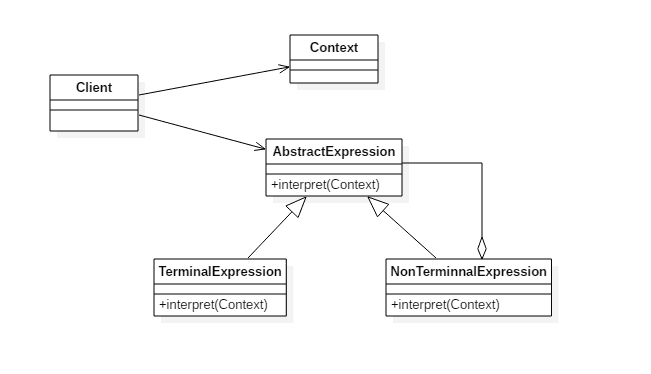

# 解释器模式(Interpreter Pattern)

## 意图

为语言创建解释器，通常由语言的语法和语法分析来定义。

## 类图

- `TerminalExpression`: 终结符表达式，每个终结符都需要一个 `TerminalExpression`
- `Context`: 上下文，包含解释器之外的一些全局信息



## 实现

以下是一个规则检验器实现，具有 `and `和 `or `规则，通过规则可以构建一颗解析树，用来检验一个文本是否满足解析树定义的规则。

例如一颗解析树为 `D And (A Or (B C))`，文本 `D A` 满足该解析树定义的规则。

这里的 `Context `指的是 `String`。

```java
public abstract class Expression {
    public abstract boolean interpret(String str);
}
public class TerminalExpression extends Expression {

    private String literal = null;

    public TerminalExpression(String str) {
        literal = str;
    }

    public boolean interpret(String str) {
        StringTokenizer st = new StringTokenizer(str);
        while (st.hasMoreTokens()) {
            String test = st.nextToken();
            if (test.equals(literal)) {
                return true;
            }
        }
        return false;
    }
}
public class AndExpression extends Expression {

    private Expression expression1 = null;
    private Expression expression2 = null;

    public AndExpression(Expression expression1, Expression expression2) {
        this.expression1 = expression1;
        this.expression2 = expression2;
    }

    public boolean interpret(String str) {
        return expression1.interpret(str) && expression2.interpret(str);
    }
}
public class OrExpression extends Expression {
    private Expression expression1 = null;
    private Expression expression2 = null;

    public OrExpression(Expression expression1, Expression expression2) {
        this.expression1 = expression1;
        this.expression2 = expression2;
    }

    public boolean interpret(String str) {
        return expression1.interpret(str) || expression2.interpret(str);
    }
}
public class Client {

    /**
     * 构建解析树
     */
    public static Expression buildInterpreterTree() {
        // Literal
        Expression terminal1 = new TerminalExpression("A");
        Expression terminal2 = new TerminalExpression("B");
        Expression terminal3 = new TerminalExpression("C");
        Expression terminal4 = new TerminalExpression("D");
        // B C
        Expression alternation1 = new OrExpression(terminal2, terminal3);
        // A Or (B C)
        Expression alternation2 = new OrExpression(terminal1, alternation1);
        // D And (A Or (B C))
        return new AndExpression(terminal4, alternation2);
    }

    public static void main(String[] args) {
        Expression define = buildInterpreterTree();
        String context1 = "D A";
        String context2 = "A B";
        System.out.println(define.interpret(context1));
        System.out.println(define.interpret(context2));
    }
}
```

```java
true
false
```

## 解析器模式`golang`实现

解释器模式定义一套语言文法，并设计该语言解释器，使用户能使用特定文法控制解释器行为。

解释器模式的意义在于，它分离多种复杂功能的实现，每个功能只需关注自身的解释。

对于调用者不用关心内部的解释器的工作，只需要用简单的方式组合命令就可以。

#### interpreter.go

```go
package interpreter

import (
    "strconv"
    "strings"
)

type Node interface {
    Interpret() int
}

type ValNode struct {
    val int
}

func (n *ValNode) Interpret() int {
    return n.val
}

type AddNode struct {
    left, right Node
}

func (n *AddNode) Interpret() int {
    return n.left.Interpret() + n.right.Interpret()
}

type MinNode struct {
    left, right Node
}

func (n *MinNode) Interpret() int {
    return n.left.Interpret() - n.right.Interpret()
}

type Parser struct {
    exp   []string
    index int
    prev  Node
}

func (p *Parser) Parse(exp string) {
    p.exp = strings.Split(exp, " ")

    for {
        if p.index >= len(p.exp) {
            return
        }
        switch p.exp[p.index] {
        case "+":
            p.prev = p.newAddNode()
        case "-":
            p.prev = p.newMinNode()
        default:
            p.prev = p.newValNode()
        }
    }
}

func (p *Parser) newAddNode() Node {
    p.index++
    return &AddNode{
        left:  p.prev,
        right: p.newValNode(),
    }
}

func (p *Parser) newMinNode() Node {
    p.index++
    return &MinNode{
        left:  p.prev,
        right: p.newValNode(),
    }
}

func (p *Parser) newValNode() Node {
    v, _ := strconv.Atoi(p.exp[p.index])
    p.index++
    return &ValNode{
        val: v,
    }
}

func (p *Parser) Result() Node {
    return p.prev
}
```

#### interpreter_test.go

```go
package interpreter

import "testing"

func TestInterpreter(t *testing.T) {
    p := &Parser{}
    p.Parse("1 + 2 + 3 - 4 + 5 - 6")
    res := p.Result().Interpret()
    expect := 1
    if res != expect {
        t.Fatalf("expect %d got %d", expect, res)
    }
}
```

