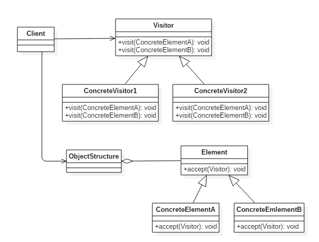

# 访问者模式(Visitor Pattern)

## 意图

为一个对象结构(比如组合结构)增加新能力。

## 类图

- `Visitor`: 访问者，为每一个 `ConcreteElement `声明一个 visit 操作
- `ConcreteVisitor`: 具体访问者，存储遍历过程中的累计结果
- `ObjectStructure`: 对象结构，可以是组合结构，或者是一个集合。



## 实现

```java
public interface Element {
    void accept(Visitor visitor);
}
class CustomerGroup {

    private List<Customer> customers = new ArrayList<>();

    void accept(Visitor visitor) {
        for (Customer customer : customers) {
            customer.accept(visitor);
        }
    }

    void addCustomer(Customer customer) {
        customers.add(customer);
    }
}
public class Customer implements Element {

    private String name;
    private List<Order> orders = new ArrayList<>();

    Customer(String name) {
        this.name = name;
    }

    String getName() {
        return name;
    }

    void addOrder(Order order) {
        orders.add(order);
    }

    public void accept(Visitor visitor) {
        visitor.visit(this);
        for (Order order : orders) {
            order.accept(visitor);
        }
    }
}
public class Order implements Element {

    private String name;
    private List<Item> items = new ArrayList();

    Order(String name) {
        this.name = name;
    }

    Order(String name, String itemName) {
        this.name = name;
        this.addItem(new Item(itemName));
    }

    String getName() {
        return name;
    }

    void addItem(Item item) {
        items.add(item);
    }

    public void accept(Visitor visitor) {
        visitor.visit(this);

        for (Item item : items) {
            item.accept(visitor);
        }
    }
}
public class Item implements Element {

    private String name;

    Item(String name) {
        this.name = name;
    }

    String getName() {
        return name;
    }

    public void accept(Visitor visitor) {
        visitor.visit(this);
    }
}
public interface Visitor {
    void visit(Customer customer);

    void visit(Order order);

    void visit(Item item);
}
public class GeneralReport implements Visitor {

    private int customersNo;
    private int ordersNo;
    private int itemsNo;

    public void visit(Customer customer) {
        System.out.println(customer.getName());
        customersNo++;
    }

    public void visit(Order order) {
        System.out.println(order.getName());
        ordersNo++;
    }

    public void visit(Item item) {
        System.out.println(item.getName());
        itemsNo++;
    }

    public void displayResults() {
        System.out.println("Number of customers: " + customersNo);
        System.out.println("Number of orders:    " + ordersNo);
        System.out.println("Number of items:     " + itemsNo);
    }
}
public class Client {
    public static void main(String[] args) {
        Customer customer1 = new Customer("customer1");
        customer1.addOrder(new Order("order1", "item1"));
        customer1.addOrder(new Order("order2", "item1"));
        customer1.addOrder(new Order("order3", "item1"));

        Order order = new Order("order_a");
        order.addItem(new Item("item_a1"));
        order.addItem(new Item("item_a2"));
        order.addItem(new Item("item_a3"));
        Customer customer2 = new Customer("customer2");
        customer2.addOrder(order);

        CustomerGroup customers = new CustomerGroup();
        customers.addCustomer(customer1);
        customers.addCustomer(customer2);

        GeneralReport visitor = new GeneralReport();
        customers.accept(visitor);
        visitor.displayResults();
    }
}
```

```java
customer1
order1
item1
order2
item1
order3
item1
customer2
order_a
item_a1
item_a2
item_a3
Number of customers: 2
Number of orders:    4
Number of items:     6
```

## 访问者模式`golang`实现

访问者模式可以给一系列对象透明的添加功能，并且把相关代码封装到一个类中。

对象只要预留访问者接口`Accept`则后期为对象添加功能的时候就不需要改动对象。

#### visitor.go

```go
package visitor

import "fmt"

type Customer interface {
    Accept(Visitor)
}

type Visitor interface {
    Visit(Customer)
}

type EnterpriseCustomer struct {
    name string
}

type CustomerCol struct {
    customers []Customer
}

func (c *CustomerCol) Add(customer Customer) {
    c.customers = append(c.customers, customer)
}

func (c *CustomerCol) Accept(visitor Visitor) {
    for _, customer := range c.customers {
        customer.Accept(visitor)
    }
}

func NewEnterpriseCustomer(name string) *EnterpriseCustomer {
    return &EnterpriseCustomer{
        name: name,
    }
}

func (c *EnterpriseCustomer) Accept(visitor Visitor) {
    visitor.Visit(c)
}

type IndividualCustomer struct {
    name string
}

func NewIndividualCustomer(name string) *IndividualCustomer {
    return &IndividualCustomer{
        name: name,
    }
}

func (c *IndividualCustomer) Accept(visitor Visitor) {
    visitor.Visit(c)
}

type ServiceRequestVisitor struct{}

func (*ServiceRequestVisitor) Visit(customer Customer) {
    switch c := customer.(type) {
    case *EnterpriseCustomer:
        fmt.Printf("serving enterprise customer %s\n", c.name)
    case *IndividualCustomer:
        fmt.Printf("serving individual customer %s\n", c.name)
    }
}

// only for enterprise
type AnalysisVisitor struct{}

func (*AnalysisVisitor) Visit(customer Customer) {
    switch c := customer.(type) {
    case *EnterpriseCustomer:
        fmt.Printf("analysis enterprise customer %s\n", c.name)
    }
}
```

#### visitor_test.go

```go
package visitor

func ExampleRequestVisitor() {
    c := &CustomerCol{}
    c.Add(NewEnterpriseCustomer("A company"))
    c.Add(NewEnterpriseCustomer("B company"))
    c.Add(NewIndividualCustomer("bob"))
    c.Accept(&ServiceRequestVisitor{})
    // Output:
    // serving enterprise customer A company
    // serving enterprise customer B company
    // serving individual customer bob
}

func ExampleAnalysis() {
    c := &CustomerCol{}
    c.Add(NewEnterpriseCustomer("A company"))
    c.Add(NewIndividualCustomer("bob"))
    c.Add(NewEnterpriseCustomer("B company"))
    c.Accept(&AnalysisVisitor{})
    // Output:
    // analysis enterprise customer A company
    // analysis enterprise customer B company
}
```

