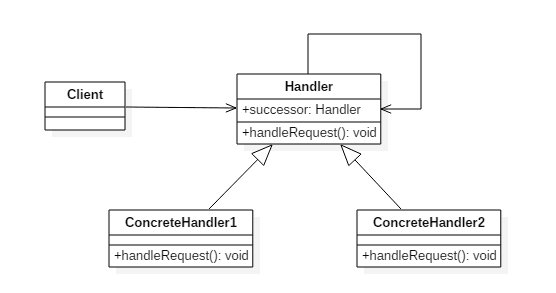

# 责任链模式(Chain Of Responsibility Pattern)

## 意图

使多个对象都有机会处理请求，从而避免请求的发送者和接收者之间的耦合关系。将这些对象连成一条链，并沿着这条链发送该请求，直到有一个对象处理它为止。

## 类图

- `Handler`: 定义处理请求的接口，并且实现后继链(`successor`)



## 实现

```java
public abstract class Handler {
    protected Handler successor;

    public Handler(Handler successor) {
        this.successor = successor;
    }

    protected abstract void handleRequest(Request request);
}
public class ConcreteHandler1 extends Handler {
    public ConcreteHandler1(Handler successor) {
        super(successor);
    }

    @Override
    protected void handleRequest(Request request) {
        if (request.getType() == RequestType.type1) {
            System.out.println(request.getName() + " is handle by ConcreteHandler1");
            return;
        }
        if (successor != null) {
            successor.handleRequest(request);
        }
    }
}
public class ConcreteHandler2 extends Handler{
    public ConcreteHandler2(Handler successor) {
        super(successor);
    }

    @Override
    protected void handleRequest(Request request) {
        if (request.getType() == RequestType.type2) {
            System.out.println(request.getName() + " is handle by ConcreteHandler2");
            return;
        }
        if (successor != null) {
            successor.handleRequest(request);
        }
    }
}
public class Request {
    private RequestType type;
    private String name;

    public Request(RequestType type, String name) {
        this.type = type;
        this.name = name;
    }

    public RequestType getType() {
        return type;
    }

    public String getName() {
        return name;
    }
}
public enum RequestType {
    type1, type2
}
public class Client {
    public static void main(String[] args) {
        Handler handler1 = new ConcreteHandler1(null);
        Handler handler2 = new ConcreteHandler2(handler1);
        Request request1 = new Request(RequestType.type1, "request1");
        handler2.handleRequest(request1);
        Request request2 = new Request(RequestType.type2, "request2");
        handler2.handleRequest(request2);
    }
}
```

```java
request1 is handle by ConcreteHandler1
request2 is handle by ConcreteHandler2
```

## 责任链模式`golang`实现

职责链模式用于分离不同职责，并且动态组合相关职责。

`Golang`实现职责链模式时候，因为没有继承的支持，使用链对象包涵职责的方式，即：

- 链对象包含当前职责对象以及下一个职责链。
- 职责对象提供接口表示是否能处理对应请求。
- 职责对象提供处理函数处理相关职责。

同时可在职责链类中实现职责接口相关函数，使职责链对象可以当做一般职责对象是用。

#### chain.go

```go
package chain

import "fmt"

type Manager interface {
    HaveRight(money int) bool
    HandleFeeRequest(name string, money int) bool
}

type RequestChain struct {
    Manager
    successor *RequestChain
}

func (r *RequestChain) SetSuccessor(m *RequestChain) {
    r.successor = m
}

func (r *RequestChain) HandleFeeRequest(name string, money int) bool {
    if r.Manager.HaveRight(money) {
        return r.Manager.HandleFeeRequest(name, money)
    }
    if r.successor != nil {
        return r.successor.HandleFeeRequest(name, money)
    }
    return false
}

func (r *RequestChain) HaveRight(money int) bool {
    return true
}

type ProjectManager struct{}

func NewProjectManagerChain() *RequestChain {
    return &RequestChain{
        Manager: &ProjectManager{},
    }
}

func (*ProjectManager) HaveRight(money int) bool {
    return money < 500
}

func (*ProjectManager) HandleFeeRequest(name string, money int) bool {
    if name == "bob" {
        fmt.Printf("Project manager permit %s %d fee request\n", name, money)
        return true
    }
    fmt.Printf("Project manager don't permit %s %d fee request\n", name, money)
    return false
}

type DepManager struct{}

func NewDepManagerChain() *RequestChain {
    return &RequestChain{
        Manager: &DepManager{},
    }
}

func (*DepManager) HaveRight(money int) bool {
    return money < 5000
}

func (*DepManager) HandleFeeRequest(name string, money int) bool {
    if name == "tom" {
        fmt.Printf("Dep manager permit %s %d fee request\n", name, money)
        return true
    }
    fmt.Printf("Dep manager don't permit %s %d fee request\n", name, money)
    return false
}

type GeneralManager struct{}

func NewGeneralManagerChain() *RequestChain {
    return &RequestChain{
        Manager: &GeneralManager{},
    }
}

func (*GeneralManager) HaveRight(money int) bool {
    return true
}

func (*GeneralManager) HandleFeeRequest(name string, money int) bool {
    if name == "ada" {
        fmt.Printf("General manager permit %s %d fee request\n", name, money)
        return true
    }
    fmt.Printf("General manager don't permit %s %d fee request\n", name, money)
    return false
}
```

#### chain_test.go

```go
package chain

func ExampleChain() {
    c1 := NewProjectManagerChain()
    c2 := NewDepManagerChain()
    c3 := NewGeneralManagerChain()

    c1.SetSuccessor(c2)
    c2.SetSuccessor(c3)

    var c Manager = c1

    c.HandleFeeRequest("bob", 400)
    c.HandleFeeRequest("tom", 1400)
    c.HandleFeeRequest("ada", 10000)
    c.HandleFeeRequest("floar", 400)
    // Output:
    // Project manager permit bob 400 fee request
    // Dep manager permit tom 1400 fee request
    // General manager permit ada 10000 fee request
    // Project manager don't permit floar 400 fee request

}
```

