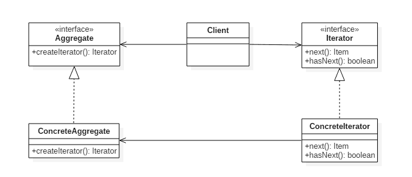

# 迭代器模式(Iterator Pattern)

## 意图

提供一种顺序访问聚合对象元素的方法，并且不暴露聚合对象的内部表示。

## 类图

- `Aggregate `是聚合类，其中` createIterator()` 方法可以产生一个 Iterator；
- Iterator 主要定义了 `hasNext()` 和 `next()` 方法。
- `Client `组合了 `Aggregate`，为了迭代遍历 `Aggregate`，也需要组合 `Iterator`。



##  实现

```java
public interface Aggregate {
    Iterator createIterator();
}
public class ConcreteAggregate implements Aggregate {

    private Integer[] items;

    public ConcreteAggregate() {
        items = new Integer[10];
        for (int i = 0; i < items.length; i++) {
            items[i] = i;
        }
    }

    @Override
    public Iterator createIterator() {
        return new ConcreteIterator<Integer>(items);
    }
}
public interface Iterator<Item> {
    Item next();

    boolean hasNext();
}
public class ConcreteIterator<Item> implements Iterator {

    private Item[] items;
    private int position = 0;

    public ConcreteIterator(Item[] items) {
        this.items = items;
    }

    @Override
    public Object next() {
        return items[position++];
    }

    @Override
    public boolean hasNext() {
        return position < items.length;
    }
}
public class Client {
    public static void main(String[] args) {
        Aggregate aggregate = new ConcreteAggregate();
        Iterator<Integer> iterator = aggregate.createIterator();
        while (iterator.hasNext()) {
            System.out.println(iterator.next());
        }
    }
}
```

## 迭代器模式`golang`实现

送代器模式用于使用相同方式送代不同类型集合或者隐藏集合类型的具体实现。

可以使用送代器模式使遍历同时应用送代策略，如请求新对象、过滤、处理对象等。

#### iterator.go

```go
package iterator

import "fmt"

type Aggregate interface {
    Iterator() Iterator
}

type Iterator interface {
    First()
    IsDone() bool
    Next() interface{}
}

type Numbers struct {
    start, end int
}

func NewNumbers(start, end int) *Numbers {
    return &Numbers{
        start: start,
        end:   end,
    }
}

func (n *Numbers) Iterator() Iterator {
    return &NumbersIterator{
        numbers: n,
        next:    n.start,
    }
}

type NumbersIterator struct {
    numbers *Numbers
    next    int
}

func (i *NumbersIterator) First() {
    i.next = i.numbers.start
}

func (i *NumbersIterator) IsDone() bool {
    return i.next > i.numbers.end
}

func (i *NumbersIterator) Next() interface{} {
    if !i.IsDone() {
        next := i.next
        i.next++
        return next
    }
    return nil
}

func IteratorPrint(i Iterator) {
    for i.First(); !i.IsDone(); {
        c := i.Next()
        fmt.Printf("%#v\n", c)
    }
}
```

#### iterator_test.go

```go
package iterator

func ExampleIterator() {
    var aggregate Aggregate
    aggregate = NewNumbers(1, 10)

    IteratorPrint(aggregate.Iterator())
    // Output:
    // 1
    // 2
    // 3
    // 4
    // 5
    // 6
    // 7
    // 8
    // 9
    // 10
}
```

