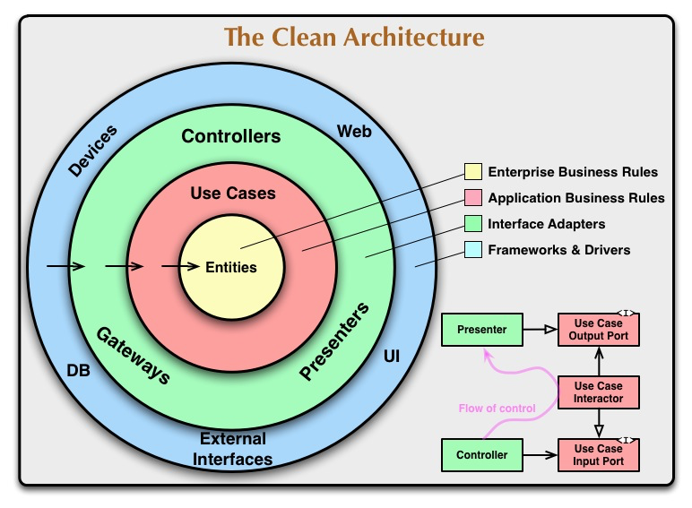
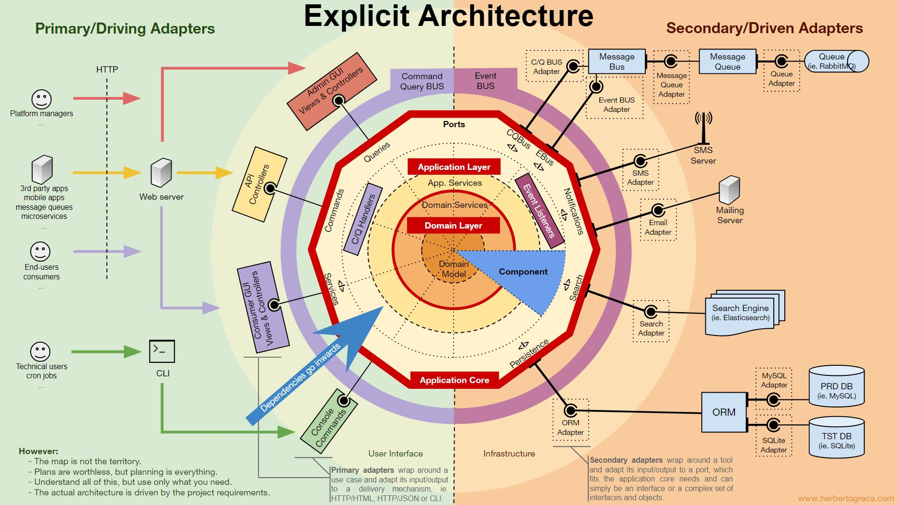

# 六边形架构

## 参考文档

1. [Hexagonal Architecture in Go](https://medium.com/@matiasvarela/hexagonal-architecture-in-go-cfd4e436faa3)([对应代码仓库](https://github.com/matiasvarela/minesweeper-hex-arch-sample))
2. [为 Gopher 打造 DDD 系列：领域模型-六边形架构](https://mp.weixin.qq.com/s/eggKfDHkSJDpidzufSrdaQ)
3. [领域驱动设计 DDD,六边形架构，洋葱架构，整洁架构，CQRS的整合架构](https://mp.weixin.qq.com/s/h_sffHiaWZEg5qxbJymPSw)
4. [端口和适配器架构——DDD好帮手：ThoughtWorks中国](https://zhuanlan.zhihu.com/p/77311830)

参考架构如下：

* 领域驱动设计四层架构
* 整洁架构
* 六边形架构

## DDD四层架构示意图

## 整洁架构示意图

## 六边形架构示意图

六边形架构又称"端口适配器架构"，实际上也是一种分层架构，只不过由上下或者左右变成了内部与外部。在六边形架构中，不同的客户通过平等的方式与内部业务系统(领域模型)交互